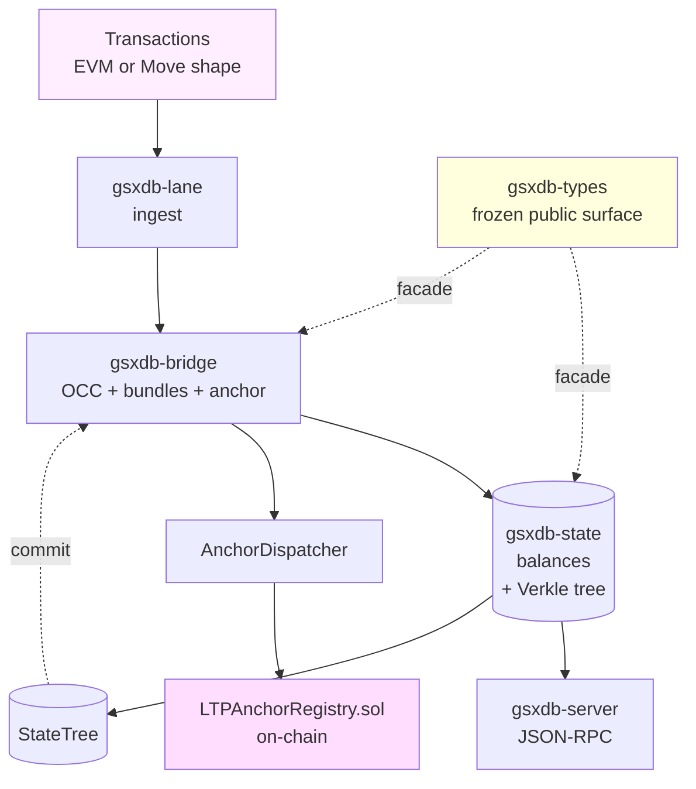

# gsx-db architecture

One-page system overview. For deep details see
[`docs/architecture/`](./docs/architecture/) and
[`docs/spec/`](./docs/spec/).

## What gsx-db is

A storage + execution substrate that ingests EVM- or Move-shaped
transactions, runs them through a CE-MVCC OCC parallel scheduler,
commits the result to a Verkle-shaped state tree, and dispatches
cross-chain anchors to the Solidity `LTPAnchorRegistry`. Built for
the GSX DAG L1; usable standalone as a parallel-execution substrate.

The substrate is **substrate, not chain** — consensus runs upstream
(`gsx-dag` / `gsxbft`); the cross-chain attestation pipeline runs
downstream (`gsx-lattice-protocol`). gsx-db owns the boxed-out
execution + state + anchor surface in the diagram below.

## High-level shape

## Load-bearing invariants

These are non-negotiable. Code that weakens them does not ship.

1. **Lane separation.** `gsxdb-lane` (ingest) cannot directly mutate
   `gsxdb-state` (authoritative state). All mutations go through
   `gsxdb-bridge` via the capability-typed `BridgeToken`. Enforced
   by `scripts/check-lane-separation.sh` + `deny.toml`. Spec:
   [`docs/spec/lane-separation.md`](./docs/spec/lane-separation.md).
2. **Proposition 1 (dual-VM consistency).** At every checkpoint,
   `EVM balanceOf(addr) == Move Coin.value(addr)` for every
   address. Enforced by a 10,000-case proptest. Spec:
   [`docs/spec/dual-vm-projectors.md`](./docs/spec/dual-vm-projectors.md).
3. **Cross-parity.** Solidity `LTPAnchorRegistry` and Rust
   `gsxdb-bridge::anchor` accept and reject the same inputs in
   the same way. Pinned by the S11.5 differential test (16
   Rust-signed vectors verified via Solidity `recoverSigner`).
   Spec: [`docs/spec/anchor-log.md`](./docs/spec/anchor-log.md);
   IQ: [`docs/iq/IQ-7-anchor-parity.md`](./docs/iq/IQ-7-anchor-parity.md).

## Crate responsibilities

| Crate | Owns | Stable for downstream? |
|---|---|---|
| [`gsxdb-types`](./crates/gsxdb-types) | Re-export facade. The frozen public surface. | ✅ |
| [`gsxdb-state`](./crates/gsxdb-state) | Canonical balance map, Verkle state tree, snapshots, DAG store, metrics | ⚠ internal |
| [`gsxdb-bridge`](./crates/gsxdb-bridge) | The only writer to `gsxdb-state`. OCC executor, intent bundles, anchor pipeline, ECDSA signer, recovery, L2 sync | ⚠ internal |
| [`gsxdb-lane`](./crates/gsxdb-lane) | Transaction ingest, lane-separation type-system gate | ⚠ internal |
| [`gsxdb-server`](./crates/gsxdb-server) | HTTP server binary: `/health`, `/metrics`, `/v1/rpc` | binary |

## Storage backends

- **Phase-1 / dev** — `redb` for the balance store + block store.
  Pure Rust, single-file, no external dependencies.
- **Production target** — RocksDB behind a feature flag (planned;
  the trait surface is in place via `BalanceStore` and
  `BlockStore`).

## Cryptography

- **State-tree commitments.** BLAKE3 (default) or
  banderwagon + IPA polynomial commitments (`production-verkle`).
  IQ-6: [`docs/iq/IQ-6-verkle-commitment.md`](./docs/iq/IQ-6-verkle-commitment.md).
- **Anchor verifier.** Four schemes (Blake3Mac, ECDSA secp256k1,
  ML-DSA-65 hybrid, Sp1ZkProof). ECDSA + Blake3Mac wired in
  v0.1.0-pre; hybrid wired behind `production-pqc`; Sp1 verifier is
  scaffold-only pending Track 1.3 toolchain decision.

## Execution model

`gsxdb-bridge::occ` is a CE-MVCC OCC (Aptos Block-STM style)
parallel executor. Speculative parallel execution + sequential
validation + clear-and-retry loop with a cap of `2n+4` iterations.
Bundles (`Intent::Call`) execute atomically within a single OCC
tx-index via save-and-restore on revert.

Spec: [`docs/spec/ce-mvcc-occ.md`](./docs/spec/ce-mvcc-occ.md).
Exit gate: `parallel_equals_sequential` proptest at 10k cases.

## Anchor pipeline

`AnchorDispatcher` maintains a per-chain `(AnchorLog,
VerifierConfig)` map. `dispatch` (Blake3-MAC chains) and
`dispatch_with_signer` (ECDSA chains via `EcdsaSecp256k1Signer`)
write to the log; `parity_check(height)` reads across all
registered chains and surfaces `Agreed { state_root }` or
`Disagreed { divergent, missing }`.

Spec: [`docs/spec/anchor-log.md`](./docs/spec/anchor-log.md).
IQ: [`docs/iq/IQ-7-anchor-parity.md`](./docs/iq/IQ-7-anchor-parity.md).

## Recovery

`gsxdb-bridge::recovery` replays the block log to rebuild state
deterministically. `RedbBlockStore` persists blocks across restart
(S8.5). Snapshots (`StateSnapshot` in `gsxdb-state::snapshot`) are
file-based capture+restore with byte-idempotent encoding.

Spec: [`docs/spec/recovery.md`](./docs/spec/recovery.md).

## What this repo does NOT own

- **Consensus.** Lives in `gsx-dag` (Mysticeti-C certificate DAG).
- **Cross-chain attestation.** Lives in `gsx-lattice-protocol`
  (corridor super-nodes, LTP attestation pipeline).
- **Wallet / explorer UIs.** Downstream products consume this via
  `gsxdb-types` + the JSON-RPC surface.

## Going deeper

| Topic | Where to look |
|---|---|
| Topology (today + target) | [`docs/architecture/deployment-topology.md`](./docs/architecture/deployment-topology.md) |
| Request lifecycle | [`docs/architecture/request-lifecycle.md`](./docs/architecture/request-lifecycle.md) |
| Validator rings | [`docs/architecture/validator-rings.md`](./docs/architecture/validator-rings.md) |
| Data flow | [`docs/architecture/data-flow.md`](./docs/architecture/data-flow.md) |
| Engineering standards | [`docs/architecture/engineering-standards.md`](./docs/architecture/engineering-standards.md) |
| Investigation Questions (design decisions) | [`docs/iq/`](./docs/iq/) |
| Subsystem specs | [`docs/spec/`](./docs/spec/) |
| Audit ledgers | [`docs/audit/`](./docs/audit/) |
| API schemas | [`docs/api/`](./docs/api/) |
