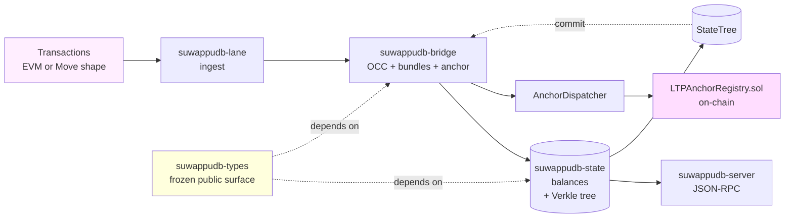

# suwappu-db

> Storage + execution substrate for the [Suwappu Labs](https://github.com/Suwappu-Labs).

[](https://github.com/Suwappu-Labs/suwappu-db/actions/workflows/ci.yml)
[](https://github.com/Suwappu-Labs/suwappu-db/actions/workflows/security.yml)
[](./LICENSE)
[](https://github.com/Suwappu-Labs/suwappu-db/releases)
[](./Cargo.toml)

A dual-VM (EVM + Move) database with Verkle-rooted state commitments and
cross-chain LTP anchors. Built for the Suwappu DAG L1; usable standalone as
a parallel-execution state substrate.

> **Building a wallet, indexer, parallel verifier, or chain-listener?**
> Skip ahead to **[INTEGRATORS.md](./INTEGRATORS.md)** — front-door API,
> stability promises, worked example, and a Docker quickstart.

## What it is

- **Dual-VM execution.** EVM-shaped and Move-shaped transactions
  reduce to the same canonical state change. Proposition 1 (`EVM
  balanceOf == Move Coin.value` at every checkpoint) is verified by
  a 10,000-case property test on every PR.
- **Verkle-rooted state.** 256-ary trie with banderwagon + IPA
  polynomial commitments (`production-verkle`). Per-step witness
  format today; compact multipoint witnesses are an explicit
  follow-on (see [IQ-6](./docs/iq/IQ-6-verkle-commitment.md)).
- **Cross-chain anchors.** Solidity `LTPAnchorRegistry` accepts the
  same EIP-191 ECDSA payload the Rust producer signs. Differential
  test verifies 16 Rust-signed vectors recover correctly via
  Solidity `recoverSigner`.

## Architecture



Five crates: `suwappudb-lane` (ingest) → `suwappudb-bridge` (the only writer
to `suwappudb-state`; owns OCC + bundles + anchors) → `suwappudb-state`
(canonical balance map + Verkle tree) → `suwappudb-server` (JSON-RPC).
`suwappudb-types` re-exports the frozen public surface for downstream
consumers. The Solidity `LTPAnchorRegistry` is the cross-chain
verifier; `contracts/abi/*.abi.json` ships the published ABIs.

## Quickstart

```sh
git clone https://github.com/Suwappu-Labs/suwappu-db
cd suwappu-db
cargo test --workspace
cargo run --release --bin suwappudb-server
# In another shell:
curl http://localhost:8660/health
curl -d '{"jsonrpc":"2.0","method":"suwappu_getStateRoot","params":[],"id":1}' \
     http://localhost:8660/v1/rpc
```

Container alternative:

```sh
docker pull ghcr.io/globalsettlementnetwork/suwappu-db:v0.1.0-pre
docker run --rm -p 8660:8660 ghcr.io/globalsettlementnetwork/suwappu-db:v0.1.0-pre
```

## Why use this

- **Provable dual-VM parity.** The `Anchor`, `AuthScheme`, EIP-191
  payload, and Solidity ABI are *frozen*; everything else is gated by
  10,000-case proptests. No silent breaking changes.
- **Verkle-shaped state.** The trie shape, traversal, and proof
  format are Verkle-aligned even when BLAKE3 is the active
  commitment scheme — swap the scheme to banderwagon-IPA via a
  Cargo feature, no schema migration.
- **Cross-impl auditability.** Rust and Solidity verifiers consume
  byte-identical payloads. Three accepted divergences are explicitly
  documented in [`docs/audit/pass-b-2026-05-16.md`](./docs/audit/pass-b-2026-05-16.md).
- **HSM-only key custody profile.** Deployment-tooling-enforced,
  with attestation-handshake runtime rejection of
  non-HSM-backed peers. See [`docs/spec/key-custody.md`](./docs/spec/key-custody.md).

## Status

| Sprint | Scope | Status |
|---|---|---|
| S1–S8 | Phase-1 substrate (lane separation, OCC, bundles, state tree, anchor log, block-store) | ✅ Closed |
| S8.5 | Redb-backed `RedbBlockStore` | ✅ Closed |
| S9 | Real Aptos Move VM (`production-move-executor`) | ✅ Closed |
| S10 | Real Verkle + IPA witnesses (`production-verkle`) | ✅ Closed |
| S11 | Solidity `LTPAnchorRegistry` + ECDSA parity | ✅ Closed |
| S12 | DAG store + snapshots + telemetry + shadow E2E | ✅ Closed |

Current release: **`v0.1.0-pre`** (Phase-1 launch readiness).
Pre-1.0, minor bumps may include breaking changes; see
[INTEGRATORS.md "Stability promises"](./INTEGRATORS.md#stability-promises).

## Feature flags

| Feature | Crate | What it enables |
|---|---|---|
| `production-move-executor` | `suwappudb-state` | Real Aptos `move-vm-runtime`. Pulls ~100 crates from aptos-core git pin. |
| `production-verkle` | `suwappudb-state` | banderwagon + ipa-multipoint Verkle commitments. |
| `production-pqc` | `suwappudb-bridge` | ML-DSA-65 hybrid verifier (PQ post-launch). |

Defaults compile only the phase-1 substrate (BLAKE3 state-tree, mock
Move executor, ECDSA-only anchor verifier).

## Documentation map

| Doc | Use it for |
|---|---|
| [INTEGRATORS.md](./INTEGRATORS.md) | Wallet / indexer / parallel-verifier integration — start here |
| [CONTRIBUTING.md](./CONTRIBUTING.md) | DCO sign-off, branch naming, PR workflow |
| [SECURITY.md](./SECURITY.md) | Private vulnerability disclosure |
| [ARCHITECTURE.md](./ARCHITECTURE.md) | One-page system overview |
| [CHANGELOG.md](./CHANGELOG.md) | Per-release deltas |
| [MAINTAINERS.md](./MAINTAINERS.md) | Who owns what + review hints |
| [GOVERNANCE.md](./GOVERNANCE.md) | How decisions get made |
| [docs/spec/](./docs/spec/) | Subsystem deep specs (anchor, state-tree, OCC, recovery, …) |
| [docs/architecture/](./docs/architecture/) | Topology, deployment, request lifecycle |
| [docs/iq/](./docs/iq/) | Investigation Questions (design decisions, e.g. IQ-3 / IQ-6 / IQ-7) |
| [docs/audit/](./docs/audit/) | Pass A / B / C verdict ledgers |
| [contracts/README.md](./contracts/README.md) | Solidity side: build, deploy, parity model |

## Workspace

| Crate | Purpose | Downstream-stable? |
|---|---|---|
| [`suwappudb-types`](./crates/suwappudb-types) | Frozen public-type surface — re-exports the stable subset | ✅ Yes — depend on this |
| [`suwappudb-state`](./crates/suwappudb-state) | Canonical balance store + Verkle tree | ⚠ Internal — use via `suwappudb-types` |
| [`suwappudb-bridge`](./crates/suwappudb-bridge) | OCC executor + intent bundles + anchor pipeline | ⚠ Internal — use via `suwappudb-types` |
| [`suwappudb-lane`](./crates/suwappudb-lane) | Transaction ingest lane | ⚠ Internal |
| [`suwappudb-server`](./crates/suwappudb-server) | JSON-RPC binary | Binary, not a library |

## Supply chain / Security

This repo ships a checked-in **CycloneDX** Software Bill of Materials so
integrators can audit the dependency surface without building the tree:

- [`sbom/suwappu-db.cdx.json`](./sbom/suwappu-db.cdx.json) — workspace-level
  aggregate (195 components: the five `suwappudb-*` crates plus their resolved
  crates.io dependencies, each as `pkg:cargo/<name>@<version>`).
- Per-crate SBOMs alongside it: `sbom/suwappudb-{types,state,bridge,lane,server}.cdx.json`.

Regenerate from `Cargo.lock` (no full build required) with the trusted cargo
toolchain:

```sh
cargo install --locked cargo-cyclonedx
cargo cyclonedx --format json --all --spec-version 1.5
# emits one <crate>.cdx.json per member; the committed
# sbom/suwappu-db.cdx.json is the path-normalized workspace aggregate.
```

Two CI workflows back this up (both SHA-pinned to full commit hashes):

- [`.github/workflows/sbom.yml`](./.github/workflows/sbom.yml) — regenerates the
  CycloneDX SBOM via `anchore/sbom-action` and attaches it as a release asset on
  `release: published` (plus `workflow_dispatch`).
- [`.github/workflows/scorecard.yml`](./.github/workflows/scorecard.yml) —
  **OpenSSF Scorecard** on a weekly schedule and pushes to `main`, writing SARIF
  to the **Security** tab.

These complement the existing `cargo-deny`, `cargo-audit`, and `gitleaks` gates
(see [`.github/workflows/`](./.github/workflows/) and [SECURITY.md](./SECURITY.md)).
The org's GitHub Actions billing is currently disabled, so the two workflows
above are **present and SHA-pinned but do not run yet** — they activate once
billing is enabled; the checked-in SBOM is the value-today artifact. No OpenSSF
Scorecard badge is published until a real Scorecard run exists to back it. This
is dependency transparency and OSS scanning, **not** a third-party audit or a
SOC 2 attestation.

## License

[Apache-2.0](./LICENSE). Third-party attribution lives in
[NOTICE](./NOTICE).

The Suwappu stack spans three repositories with non-uniform licenses —
`suwappu-db` (this repo) and `suwappu-dag` are Apache-2.0; `suwappu-lattice-protocol`
is Elastic License 2.0 (non-commercial-redistribution clause). If
your product wires all three, consult the lattice-protocol terms
separately. Full posture in [INTEGRATORS.md](./INTEGRATORS.md#cross-repo-license-posture).

## Reporting issues

- **Bugs / feature requests:** [GitHub Issues](https://github.com/Suwappu-Labs/suwappu-db/issues) — structured templates.
- **Security vulnerabilities:** private disclosure per [SECURITY.md](./SECURITY.md). Do not open public issues for vulns.
- **PRs:** sign off with `git commit -s` (DCO); follow
  [CONTRIBUTING.md](./CONTRIBUTING.md).
