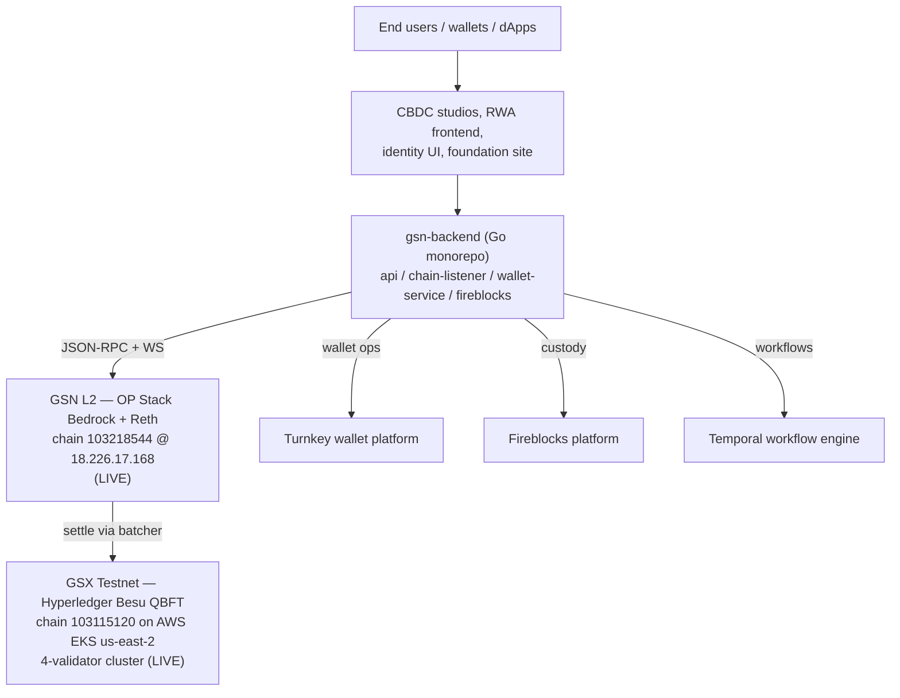

# GSN ecosystem audit + production-readiness reality check

For: backend engineer joining cold.
Status: phase-1 substrate + S9–S12 partial, two production chains live.
Date: 2026-05-12.

This document is honest, not optimistic. Read it before promising
anything to anyone.

---

## TL;DR

You have **34 repositories** in `GlobalSettlementNetwork`. **Two
production chains are already running** (GSX Testnet on Besu, GSN L2
on OP Stack + Reth). **`gsx-db` is not powering either of them yet.**

What `gsx-db` currently is:

- A workspace of 4 Rust crates (`gsxdb-state`, `gsxdb-bridge`,
  `gsxdb-lane`, `gsxdb-server`) with 259 passing tests
- The S9–S12 launch-readiness work has *partial* implementations:
  Verkle is a placeholder (no real IPA), the Move VM is a trait with
  a mock impl, the Solidity `LTPAnchorRegistry` contract **does not
  exist anywhere in any repo**, and the "shadow testnet" test runs
  in-memory only
- A real JSON-RPC server (`gsxdb-server`) exposes `gsx_*` methods
- A real L2 syncer (`gsxdb-bridge::sync::l2`) can read balance/nonce
  from the live op-reth at `18.226.17.168:8545`

What "production-ready DAG L1" actually requires (and what's
missing): see §6.

What you can ship this week: **a shadow / cross-validation deployment
against the live GSN L2**. See §7.

---

## 1. The full ecosystem (34 repos)

### Chain-stack candidates

| Repo | Lang | Size | Role | Status |
|---|---|---|---|---|
| **`gsx-db`** (this) | Rust | 2 MB | State + execution substrate | Phase-1 closed; S9–S12 partial |
| `gsxbft-consensus-only-demo` | Rust | 76 KB | MonadBFT consensus (pipelined HotStuff, Ed25519+BLS) | Recent commits (May 11); has `BlockBuilder` trait + Engine API client |
| `gsx-bft` | (docs only) | 40 MB | gh-pages branch — rendered docs | Documentation site |
| `gsx-execution-client` | C++ | 36 MB | Monad-derived execution client | Monad codebase, GSX-rebranded |
| `gsx-revm` | Rust | 623 KB | Monad-derived REVM with staking precompile (`0x1000`) | Single crate `gsx-revm` |
| `alloy-gsx-evm` | Rust | 45 KB | Alloy integration wrapping `monad-revm` | Crate published name `alloy-monad-evm` |
| `gsx-foundry` | Rust | 49 MB | Forge variant for GSX EVM | Heavy, in-progress |
| `gsx-std` | Solidity | 14 KB | "GSXBFT Standard Library" (Monad std lib renamed) | Stub-ish |
| `Mysticeti` | Rust | 904 KB | Sui's DAG consensus, with ARCHITECTURE.md + INTEGRATION.md | Sitting; unclear if active |

### Production rails (live)

| Repo | Lang | Role | Status |
|---|---|---|---|
| `gsx-testnet-PoA-runbook` | (IaC) | 4-validator Besu QBFT cluster on AWS EKS | **LIVE** — chain ID 103115120, us-east-2 |
| `op-stack-reth` | HCL | OP Stack rollup, Reth + op-node + Besu L1 | **LIVE** — chain ID 103218544, RPC at `18.226.17.168:8545` |

GSN L2's deploy config (`op-stack-reth/deploy-config-gsx.json`) wires
chain `103218544` (L2) on top of chain `103115120` (L1). Governance
token symbol is GSX.

### Application + backend

| Repo | Lang | Role |
|---|---|---|
| `gsn-backend` | Go (+Python) | Monorepo: `api/`, `chain-listener/`, `wallet-service/`, `fireblocks-service/` |
| `gsn-go-sdk` | Go | Backend SDK |
| `gsn-contract-builder` | Go | SDK for building contract calls |
| `contracts` | Solidity | Foundry project: `rwa/`, `stablecoin/`, `tokens/`, `payment/`, `onchainid/`, `interop/`. Top-level `Bridge.sol`, `MyToken.sol`. **No `LTPAnchorRegistry.sol`** |
| `Lattice-Transfer-Protocol` | Python | LTP reference impl (commit + lattice + materialize phases) |
| `ltpv2` | Python | LTPv2 / "Entanglement-Transfer-Protocol" copy |
| `Entanglement-Transfer-Protocol` | (public) | Public-facing LTP repo |

### Frontends + identity + CBDC

| Repo | Role |
|---|---|
| `gsx-website-2026` | Marketing site |
| `gsx-foundation-website` | Foundation site |
| `canton-gsxid` | Identity service frontend (Next.js + Daml/Canton) |
| `gsx-identity` | Identity primitives |
| `cbdc-studio` | CBDC issuance studio |
| `cbdc-admin`, `cbdc-banking`, `cbdc-user` | CBDC platform per-role apps |
| `gsx-stablecoin-studio-fe` | Stablecoin studio frontend |
| `gsx-rwa-frontend` | RWA sandbox frontend |
| `canton-app`, `canton-demo`, `gsx-canton-offramping-onramping` | Canton/Daml integrations |
| `rapid-routing` | Payment routing prototype |
| `gsx-foundry-staking` | Staking contracts (Foundry) |
| `gitbook`, `gitbook-get-started-docs`, `gitbook-external-developer-documentation` | Gitbook docs |
| `safedockercompose` | Docker compose hardening |
| `optimism` | Optimism fork |
| `op-stack-reth` | (see above) |
| `gsx-multicloud` | **1 KB skeleton — only `environments/testnet/` empty dir** |

---

## 2. Actual production architecture today



**Neither chain uses `gsx-db`.** Both are stock implementations of
Besu / OP Stack. `gsx-db` is being developed as a parallel substrate
with its own substrate model + invariants, but it's not in the
critical path yet.

---

## 3. What's in `gsx-db` right now (as of 2026-05-12)

### Workspace

```
crates/
├── gsxdb-state/      — canonical state, BalanceSlot, BalanceStore,
│                       StateTree (BLAKE3), DAG store, snapshots,
│                       address shape mapping, nonce semantics,
│                       Move VM trait, Verkle placeholder, metrics
├── gsxdb-bridge/     — capability gate, OCC, bundles, anchors (mock
│                       + RPC L1 reader), recovery, L2 syncer to
│                       op-reth, telemetry timers
├── gsxdb-lane/       — placeholder for untrusted ingest
└── gsxdb-server/     — NEW: Axum HTTP server exposing gsx_getBalance,
                        gsx_getCoinValue, gsx_getStateRoot
```

### Test counts (`cargo test --workspace`)

| Crate / target | Tests |
|---|---|
| `gsxdb-state` lib | 101 |
| `gsxdb-state` tests/state_tree | 6 |
| `gsxdb-bridge` lib | 112 |
| `gsxdb-bridge` tests/block_executor | 4 |
| `gsxdb-bridge` tests/cross_parity | 5 |
| `gsxdb-bridge` tests/cross_vm_bundles | 4 |
| `gsxdb-bridge` tests/cross_vm_parity | 6 |
| `gsxdb-bridge` tests/e2e_shadow_testnet | 4 |
| `gsxdb-bridge` tests/persistent_e2e | 4 |
| `gsxdb-bridge` tests/recovery | 3 |
| `gsxdb-bridge` tests/solidity_anchor_parity | 8 |
| `gsxdb-lane` lib | 2 |
| **Total** | **259** |

### What each S9–S12 milestone actually contains

| Sprint | What's in code | Reality |
|---|---|---|
| **S9** (real Move VM) | `MoveExecutor` trait + `MockMoveExecutor` impl. `production-move-executor` feature gate references `AptosMoveExecutor` — not implemented. | **Trait only. No real Move bytecode execution.** |
| **S10** (real Verkle) | `tree/verkle.rs` with `GroupElement` newtype (32 bytes) behind `production-verkle` feature. No elliptic-curve arithmetic. | **Placeholder. BLAKE3 still in use.** |
| **S11** (Solidity LTPAnchorRegistry + ECDSA) | `tests/solidity_anchor_parity.rs` defines Keccak256-MAC fixtures matching a hypothetical Solidity contract. `anchor/l1_reader.rs` has Mock + RPC backends. | **`LTPAnchorRegistry.sol` does not exist in any repo I audited.** Searched `contracts` — found `Bridge.sol` + `MyToken.sol` only. |
| **S12** (DAG + snapshots + telemetry + shadow E2E) | `state/dag.rs` (multi-parent block store), `state/snapshot.rs` (export/import), `bridge/telemetry.rs` (timers), `tests/e2e_shadow_testnet.rs` | **All in-memory. "Shadow testnet" test does NOT connect to the live op-reth at 18.226.17.168.** |

### What DOES work end-to-end right now

- `gsxdb-bridge::sync::l2::L2StateSyncer` makes real `eth_getBalance` /
  `eth_getTransactionCount` RPC calls against any JSON-RPC endpoint
- `gsxdb-bridge::anchor::l1_reader` has a `RpcL1AnchorReader` that
  hits a real RPC endpoint (just doesn't have a real contract to read
  from yet)
- `gsxdb-server` runs an Axum HTTP server on a configurable port
  with `gsx_getBalance`, `gsx_getCoinValue`, `gsx_getStateRoot`
- All 8 phase-1 invariants verified at 10k cases (S1–S8)

---

## 4. The MonadBFT consensus layer (already exists, decoupled)

`gsxbft-consensus-only-demo` is the most mature consensus piece. It's
deliberately decoupled from execution:

```text
            ┌──────────────────────────┐
            │  Consensus (MonadBFT)    │
            │  pipelined HotStuff      │
            │  Ed25519 + BLS12-381     │
            └────────────┬─────────────┘
                         │
                BlockBuilder trait
                         │
            ┌────────────┴─────────────┐
            │  EngineApiBlockBuilder   │
            └────────────┬─────────────┘
                         │
              Engine API (JSON-RPC)
                         │
            ┌────────────┴─────────────┐
            │  Execution (Reth/Geth/   │
            │  gsx-revm/gsx-db)        │
            └──────────────────────────┘
```

**To wire `gsx-db` into MonadBFT consensus, you implement
`BlockBuilder` against `gsxdb-bridge::BlockExecutor`.** That's one
trait impl on the gsx-db side.

The consensus crate already has:

- `consensus/` — protocol state machine
- `crypto/` — Ed25519 + BLS aggregate signatures
- `engine_api/` — JSON-RPC client to talk to any Engine-API-compatible execution
- `network/` — p2p layer
- `storage/` — consensus-state persistence
- WAL persistence for crash recovery

---

## 5. The Solidity contracts story

The IQs and gsx-db code reference `LTPAnchorRegistry.sol` as the
on-chain anchor target. **No such contract exists in any
GlobalSettlementNetwork repo.** I searched.

What `contracts/` actually has:

```
contracts/src/
├── Bridge.sol             — top level
├── MyToken.sol            — top level
├── interop/               — cross-chain interop primitives
├── onchainid/             — on-chain identity
├── payment/               — payment rails
├── rwa/                   — GSXClaimTopicsRegistry, GSXCompliance,
│                            GSXIdentityRegistry, GSXIdentityRegistryLedger,
│                            GSXRWA, GSXRWAFactory, GSXTrustedIssuersRegistry
├── stablecoin/            — GSXComptroller, GSXStable*, GSXStableFactory
│                            (full ERC-20 stablecoin family)
└── tokens/                — ERC20ExtendedUpgradeable, ERC3009Upgradeable,
                             ERC712* (signing primitives)
```

`Lattice-Transfer-Protocol` (Python) is a **reference protocol
specification**, not an on-chain contract. It defines the
commit-lattice-materialize phases conceptually.

**Gap:** to actually anchor gsx-db state roots on-chain, someone has
to write `LTPAnchorRegistry.sol`. The Rust side (S11) has parity
fixtures ready, but there's nothing to verify against.

---

## 6. What "production-ready DAG L1" actually requires

Honest checklist. Rows marked **MISSING** are blockers; rows marked
**PARTIAL** have started but aren't done.

| Layer | Status | What's missing |
|---|---|---|
| State substrate | ✅ in `gsx-db` | (working) |
| State commitment (Verkle) | **PARTIAL** | Real IPA over banderwagon. Current: BLAKE3 placeholder |
| EVM execution | exists in `gsx-revm` | Wiring gsx-revm ↔ gsxdb-bridge |
| Move VM execution | **MISSING** | Pick dialect (Aptos? Sui?), integrate runtime |
| Consensus (DAG/BFT) | exists in `gsxbft-consensus-only-demo` | Wiring: implement `BlockBuilder` for gsx-db |
| Networking (p2p) | partially in consensus repo | Validator gossip, sync protocol |
| Anchor contract on L1 | **MISSING** | `LTPAnchorRegistry.sol` doesn't exist |
| ECDSA anchor signing | **PARTIAL** | Solidity contract to verify against doesn't exist |
| Validator set + slashing | **MISSING** | Set management, rotation, slashing for divergent anchors |
| Genesis configuration | **MISSING** for new L1 | Chain ID, initial validator set, genesis state |
| JSON-RPC layer | partial (`gsxdb-server`) | `eth_*` methods (not just `gsx_*`) for wallet compatibility |
| Mempool | **MISSING** | Pending tx queue, eviction policy |
| Fee market / gas | **MISSING** | Gas accounting, priority fees |
| Persistent state storage | ✅ redb works | RocksDB swap for prod scale (IQ-1) |
| Persistent block storage | ✅ `RedbBlockStore` | (working) |
| Snapshots / checkpoints | **PARTIAL** | `snapshot.rs` exists; not integrated with replay |
| DAG block storage | **PARTIAL** | `dag.rs` exists; not integrated with execution |
| Telemetry / monitoring | **PARTIAL** | Timers exist; Prometheus exporter not wired to `gsxdb-server` |
| Reorg handling | **MISSING** | Linear chain only in `recovery::replay` |
| Reorg handling at DAG level | **MISSING** | DagStore exists but no fork-choice rule |
| Wallet RPC compatibility | **MISSING** | No `eth_sendRawTransaction`, etc. |
| L1 ↔ L2 bridge | partial (`Bridge.sol`) | Not LTP-style |
| Genesis state import | **MISSING** | Bootstrapping flow |
| Deployment infra | **MISSING** | `gsx-multicloud` is 1 KB |
| Audit | **MISSING** | No third-party security review of any of this |

**To actually launch a "DAG L1": expect months, not days.** The
substrate work that's done is meaningful, but it's substrate only.

---

## 7. Three integration options — pick one

### Option A — Shadow / cross-validation against live GSN L2 (doable this week)

**Goal:** run `gsx-db` as a read-only replica of the live OP rollup.
Validate that gsx-db's state matches op-reth's for a set of addresses,
publish parity metrics, expose `gsx_*` queries.

**What you do:**

1. Configure `gsxdb-bridge::sync::l2::L2SyncConfig` with
   `rpc_url = "http://18.226.17.168:8545"` and a list of addresses
   (e.g., the CBDC issuance accounts, the RWA registry, the GSX gov
   token holders).
2. Run `gsxdb-server` on a public-ish endpoint with the syncer in a
   background task that polls every N seconds.
3. Cross-check: for each tracked address, fetch balance via gsx-db
   and via op-reth, report divergence as a Prometheus metric.
4. Expose `gsx_getStateRoot` so an auditor can compare snapshots over
   time.

**What this proves:** gsx-db's state model works against real on-chain
data. It's not a chain yet, but it's a useful cross-validation layer.

**Effort:** 1–2 weeks for an engineer who already knows Rust + ops.

**Why this is the right first move:** every other option depends on
infrastructure that doesn't exist (`LTPAnchorRegistry.sol`, real
Verkle, real Move VM, consensus wiring). This one is shippable on
top of what's actually there today.

### Option B — Wire MonadBFT consensus + gsx-revm + gsx-db into a minimal L1 devnet (weeks–months)

**Goal:** a single-node or 4-node devnet that produces blocks via
MonadBFT consensus, executes them via `gsx-revm`, persists state via
`gsx-db`. No production claims; just "the pieces fit."

**What you do:**

1. In `gsx-db`: implement `gsxbft_consensus_only::BlockBuilder` over
   `gsxdb_bridge::BlockExecutor`. This is the integration point.
2. Wire `gsx-revm` into `gsxdb-bridge::vm::executor` (replace
   `MockEvm`). The trait already exists; this is plumbing.
3. Set up genesis: chain ID, validator set (Ed25519+BLS keys for
   MonadBFT), initial state.
4. Run 1 node locally; verify block production end-to-end. Then 4
   nodes for BFT.
5. Stand up basic Prometheus + Grafana via the existing telemetry
   timers.

**What this proves:** the substrate + execution + consensus stack
works end-to-end. Still not production — missing Move VM, real
anchors, RPC compat, mempool, fee market. But it's a real chain.

**Effort:** 1–3 months for a small team.

### Option C — Full production L1 launch (quarters)

Everything in option B plus:

- Real Verkle (S10 properly done)
- Real Move VM (S9 properly done — and pick a dialect first)
- `LTPAnchorRegistry.sol` written, audited, deployed
- ECDSA anchor signing
- Validator-set management, rotation, slashing
- Mempool with eviction
- Fee market (gas accounting, priority fees, base fee)
- `eth_*` RPC compatibility for wallet interop
- Reorg handling at DAG level (fork-choice rule)
- Third-party security audit (probably two)
- Infrastructure-as-code in `gsx-multicloud` (currently 1 KB)
- Public testnet → mainnet rollout plan
- Runbooks for ops (incidents, key rotation, upgrades)
- Genesis ceremony

**Effort:** 6–12 months minimum. Realistically, longer.

---

## 8. Concrete next steps for the backend engineer

Sorted by what unblocks the most.

### Day 1
1. Clone `gsx-db`, run `cargo test --workspace` — verify 259 tests pass
2. Run `cargo doc --workspace --open` and read the module-level docs
3. Read `docs/HANDOFF.md`, `docs/architecture/`, and this document
4. Read `gsxbft-consensus-only-demo`'s `block_builder.rs` source

### Week 1
5. Pick option A (shadow) and write a runbook: how to deploy
   `gsxdb-server` + syncer against the live GSN L2
6. Implement Prometheus exporter for the telemetry in `gsxdb-bridge::telemetry`
7. Add `eth_*` JSON-RPC method handlers to `gsxdb-server` so wallets
   can use it as an alternative endpoint

### Week 2–4
8. Write `LTPAnchorRegistry.sol` in `contracts/` matching the Solidity
   parity fixtures in `gsx-db/crates/gsxdb-bridge/tests/solidity_anchor_parity.rs`
9. Deploy `LTPAnchorRegistry` to GSX Testnet (Besu L1) so anchor
   parity tests have something to verify against
10. Begin implementing `BlockBuilder` over `gsxdb_bridge::BlockExecutor`
    (start with consensus integration tests, not a live deploy)

### Month 2+
11. Decide: Move VM dialect (Aptos vs Sui vs no-Move). Write IQ.
12. Decide: real Verkle implementation path (rust-verkle vs hand-rolled IPA)
13. Start integrating `gsx-revm` to replace `MockEvm`

### What to avoid
- Don't promise launch timelines until S9–S11 are actually
  implemented (not just trait stubs)
- Don't claim "production-ready DAG L1" externally — the live chains
  today are Besu PoA + OP Stack, not a DAG L1
- Don't deploy `gsxdb-server` publicly without `eth_*` methods —
  wallets won't understand it
- Don't skip the audit. Two audits.

---

## 9. Open questions to resolve before option B starts

Each should be a new IQ document.

1. **Move VM dialect.** Aptos `move-vm-runtime` (mature, large dep
   tree), Sui's Move (different VM model), or skip Move for v1?
   Affects S9 entirely.
2. **Verkle implementation.** Hand-rolled IPA, `rust-verkle`, or
   `ipa-multipoint`? Tracker: IQ-6.
3. **Validator set governance.** Static? On-chain governance? Migrate
   from Besu's QBFT keys? Tracker: new IQ.
4. **L1 anchor target.** Anchor to Besu L1, to Ethereum mainnet, to
   multiple chains? Tracker: IQ-7 has the multi-chain mechanism but
   no chain selected.
5. **Mempool design.** Per-account ordering, fee-priority, eviction
   policy. Tracker: new IQ.
6. **Fork choice.** With `DagStore` already in place, what's the
   canonical block selection rule? Tracker: new IQ.

---

## 10. What is NOT in this audit

I did **not** verify:

- Whether `gsx-execution-client` builds and runs (36 MB C++, takes a
  while to compile)
- Whether `Mysticeti` is actually being used or is just sitting
- Whether `gsn-backend` services have been deployed (the
  README has good docs; I didn't poke deployments)
- Live state of `op-stack-reth` — RPC URL is listed in the README but
  I didn't curl it
- Whether the Besu testnet validators are healthy (`gsx-testnet-PoA-runbook`
  has health checks; I didn't run them)
- Security posture of any deployed component
- Operational readiness (paging, on-call, incident response)
- Key management practices

If any of these are load-bearing for the engineer's task, audit them
explicitly.

---

## Appendix: how this audit was produced

- Listed all repos under `GlobalSettlementNetwork` via `gh repo list`
- For each load-bearing repo, fetched `README.md` + top-level tree
  via `gh api`
- Searched `contracts` for `LTPAnchorRegistry` (returned: nothing)
- Inspected `gsx-db`'s actual source tree, including S9–S12 partial
  implementations
- Ran `cargo test --workspace` to confirm 259 tests pass locally

All raw findings are reproducible with `gh api` calls and `cargo
test`. If something here is stale or wrong, fix it in the same PR
that updates it.
