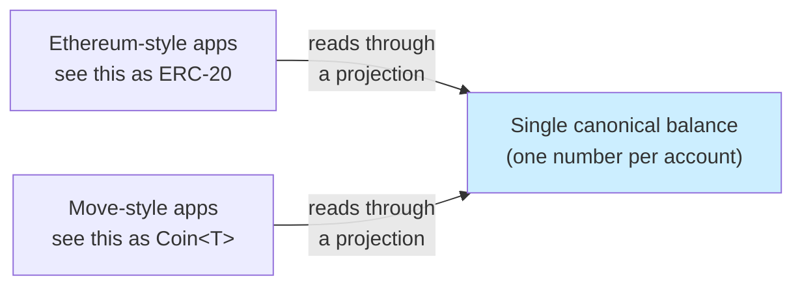
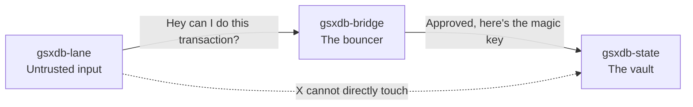
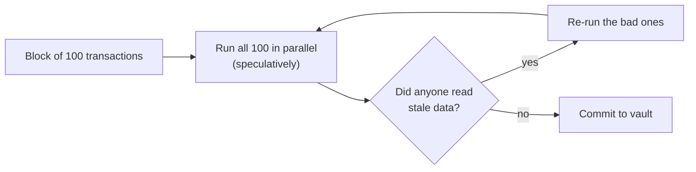
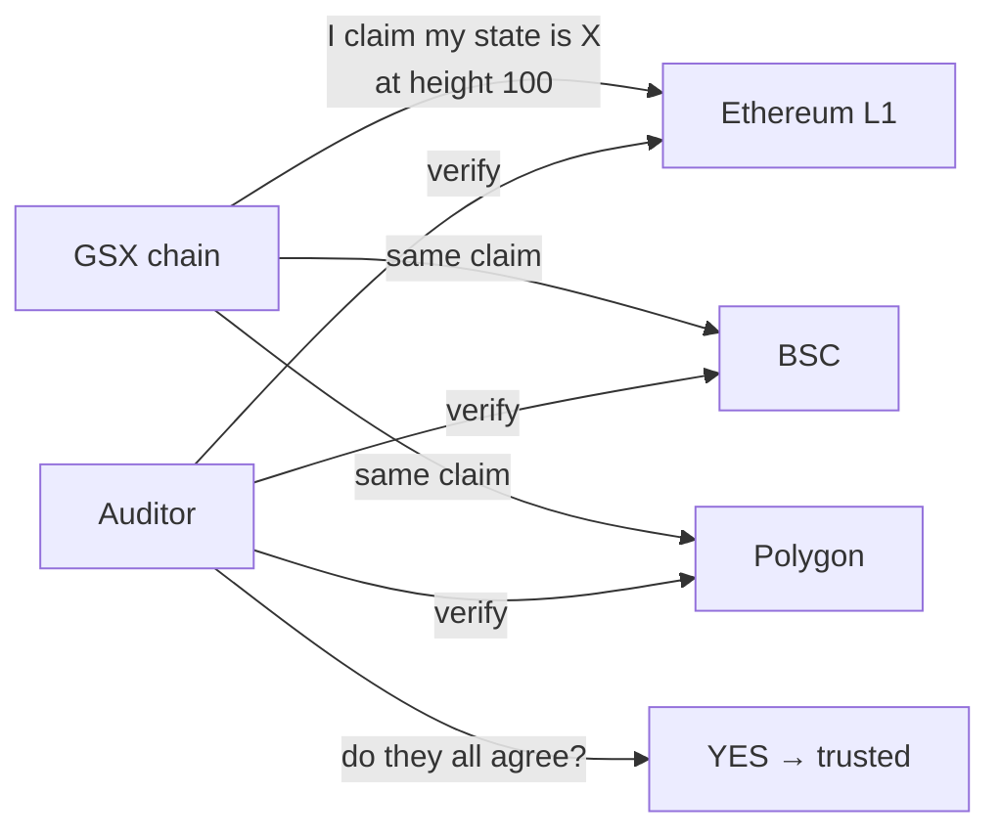
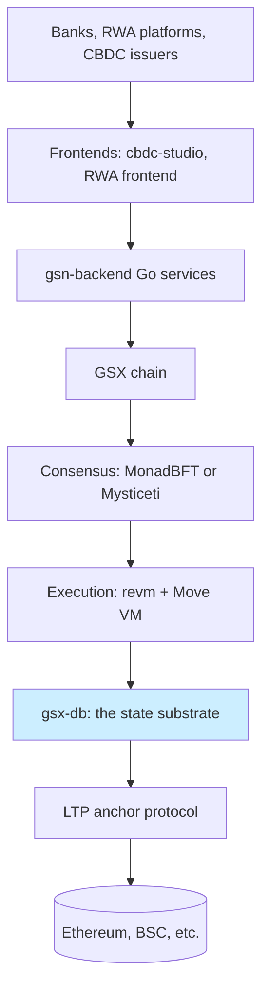

# GSX-DB, explained in plain English

Read this first if you have zero context. No jargon, no acronyms left
unexplained. If you want the technical version, go to
[architecture/README.md](architecture/README.md) afterwards.

## The big picture: what problem is this solving?

There's a new cryptocurrency chain being built called **GSX**. It's
designed for banks and regulated institutions to settle real-world
things like tokenized stocks, stablecoins, and central-bank digital
currency.

Banks have very specific needs:

- Every transaction must be **provably correct** — no "trust us"
  allowed
- It must **interoperate with existing crypto** (Ethereum-style apps
  and contracts) so banks can use existing tools
- It must also support **a safer kind of code** (called Move) for
  the high-value asset logic
- It must **never let two systems disagree** on who owns what

That last one is the killer. Every other chain that tried this has
lost billions of dollars when their two systems disagreed.

**GSX-DB is the database engine underneath this chain.** It's the
part that stores who owns what, processes transactions, and makes
sure nothing impossible can happen.

---

## The core trick: "one balance, two windows"



Every account has **one balance number** stored in the database.

When an Ethereum app asks "what does Alice own?", the database shows
it that one number wrapped in Ethereum's format.

When a Move app asks the same question, the database shows it the
**same number** wrapped in Move's format.

**There is no possible way for them to disagree, because there's
only one number.** Other chains have a bridge between two databases.
We have one database with two windows.

This is the whole reason GSX-DB exists. Other dual-VM chains lost
billions because their bridge broke. We removed the bridge.

---

## How the database is organized: three guarded rooms



The code is split into three Rust packages that act like three rooms
with locked doors:

1. **The lobby (`gsxdb-lane`)** — anyone can send transaction
   requests here. It's untrusted.
2. **The bouncer (`gsxdb-bridge`)** — the only one who can open the
   vault. Validates every transaction before applying it.
3. **The vault (`gsxdb-state`)** — holds the real money. Has a
   special lock that requires a "BridgeToken" key. **Only the
   bouncer crate can make BridgeTokens.** The compiler enforces
   this — it's physically impossible for lane code to forge one.

A script also checks this rule on every build: if anyone tries to
wire a direct path from the lobby to the vault, the build fails.

This is called the **"lane separation invariant."** It's the first
of 8 fundamental rules the database guarantees.

---

## The 8 fundamental rules

These are guarantees the database makes, and **each one is tested
10,000 times with random inputs** to make sure no edge case breaks
them:

| # | The rule | What it prevents |
|---|---|---|
| 1 | Only the bouncer can touch the vault | Lobby code accidentally rewriting balances |
| 2 | EVM view = Move view, always | The "$2 billion bridge hack" category of failure |
| 3 | Same logical op in either VM ⇒ same result | One VM seeing a different chain than the other |
| 4 | Multiple processors give same result as one | Parallel execution bugs |
| 5 | A multi-step operation either all happens or all doesn't | Half-completed bank transfers |
| 6 | Same state always produces the same "fingerprint" | Fingerprint tampering goes undetected |
| 7 | Multiple chains agree on what happened — or disagreement is obvious | Hidden forks |
| 8 | Replaying history from scratch produces the same database | Lost data during crashes |

These 8 are the **load-bearing claims** of the database. If any of
them ever fail, the bank using this chain has a real problem.

---

## How fast it works: parallel execution with a safety net



When a block of transactions comes in, the database does all of
them at once (in parallel). Then it checks: "did any of them work
with outdated information?" If yes, those get redone. Eventually
everyone is consistent. This is called **Block-STM** and it's the
same trick Aptos uses.

**Safety net (recent addition):** if 100 transactions are all
fighting over the same number (like everyone tipping the same fee
pool), running them in parallel just causes endless retries. The
database now notices this and switches to processing them
one-at-a-time, then tells the operator "address X is contested, fix
your contract."

---

## What's saved on disk

```mermaid
flowchart TB
    State[(Canonical state<br/>who owns what)]
    Tree[(State tree<br/>a "fingerprint" of the whole state)]
    Blocks[(Block log<br/>every transaction ever)]
    Anchors[(Cross-chain anchors<br/>commitments posted to other chains)]
    State --> Tree
    State --> Blocks
    Tree --> Anchors
```

Four things get persisted:

1. **The actual balances** — like a bank's account database
2. **A 32-byte "fingerprint" of the whole state** — like a
   tamper-evident seal on the vault door
3. **The full history of blocks** — so the database can rebuild
   from scratch if it crashes
4. **Cross-chain anchors** — commitments posted to other chains
   saying "as of this moment, this is what we say the state is"

The fingerprint (called a **state tree**) uses a 256-branch tree
structure that's ready to upgrade to fancier math (Verkle/IPA) when
that lands. Today it uses BLAKE3, which is fast but produces bigger
proofs. The trade-off: today's proofs are 163KB; the upgrade brings
them down to 200 bytes.

---

## Cross-chain: why it has to talk to other chains



GSX posts a tiny commitment (~1.6KB) to multiple other chains every
block. An auditor or regulator can independently check that the
chain didn't lie by reading the same commitment from any of those
other chains. If they all match, the chain is honest. If one
disagrees, alarms fire.

This is part of a separate protocol called **LTP (Lattice Transfer
Protocol)** documented in a companion academic paper. It uses
post-quantum cryptography (ML-KEM-768, ML-DSA-65) so the
commitments stay secure even when quantum computers arrive.

---

## What's actually built right now

The canonical sprint Gantt (with absorbed test counts and exit gates)
lives in [architecture/sprint-timeline.md](architecture/sprint-timeline.md).

- **8 phase-1 sprints**: closed. The substrate works.
- **270 tests pass**, 10,000 random inputs per rule.
- **S9, S10, S11, S12**: in flight. These swap mocks for the real
  thing.

**What's still mocked:** The Ethereum interpreter, the Move
interpreter, the fancy math for the fingerprint, the real signature
scheme. Each one has a documented "swap point" — one file changes
when the real version lands.

**What doesn't exist yet:** consensus (who decides the next block),
networking (how validators talk), wallets (how users connect),
fees, mempool. Those are separate sprints after S12.

---

## Where GSX-DB fits in the larger picture



GSX-DB is **one piece** of a much larger system. There are 34
repositories in the GlobalSettlementNetwork org. GSX-DB is the
database layer. Above it:

- **Consensus** (`gsxbft-consensus-only-demo`) — decides what blocks
  happen and in what order
- **Execution** (`gsx-revm`) — actually runs the smart contracts
- **Backend** (`gsn-backend`) — APIs for wallets and apps
- **Frontends** — user-facing CBDC and RWA tools
- **The two academic papers** — formal description of the whole
  design

Today, there are **two chains already live** in the GSN ecosystem
(a Besu testnet and an OP-Stack rollup), but they use stock
implementations, not GSX-DB. GSX-DB is the substrate the new
DAG-based chain will use when it launches.

---

## Why this is unusual

Most chain databases let any code touch them. Most dual-VM chains
have a bridge between two databases. Most chains use weak
primitives early and "promise" to upgrade later.

GSX-DB does the opposite:

- **The compiler itself** enforces that only the bouncer touches
  state
- **There is no bridge** — there's one database with two windows
- **Every weak primitive has a documented trait swap-point** so the
  upgrade is mechanical, not a rewrite

And **every single one of the 8 rules has 10,000 random test cases
hammering it.** That's more property-test coverage than Sui or
Aptos ship publicly.

---

## The recent hardening work, explained

Before mainnet we surveyed 14 known weaknesses that bit other
chains, and 6 are fixed in code today. Each fix is anchored to a
real disaster:

| Fix | Lesson learned from | What it prevents |
|---|---|---|
| `#![deny(deprecated)]` on the bouncer crate | Wormhole 2022 ($326M) | Future PR accidentally calling the old/broken version of a security function |
| `CommitmentScheme` trait around BLAKE3 | Ethereum Foundation Verkle audit | Math-upgrade requiring code surgery across the codebase |
| OCC hot-slot circuit breaker | Aptos Block-STM thrash | Operators mis-diagnosing contention as a liveness bug |
| Hard-coded 5/9 minimum quorum | KelpDAO/LayerZero $292M | Future config that drops verifier count below safe |
| 8 metrics + 5 single-shot alerts | KelpDAO, Aptos AIP-47 | Silent failure modes that surface only after the loss |
| HSM-only key custody spec | Avalanche enterprise guidance, Sui key incidents | Validator host compromise stealing signing keys |

The other 8 weaknesses have written specs saying which sprint
unblocks each one. Nothing is hand-waved.

---

## TL;DR for the impatient

- **It's a database** that powers a future cryptocurrency chain for
  banks.
- It lets Ethereum apps and Move apps **share one balance per
  account** with no possibility of disagreement.
- **Eight fundamental rules**, each verified 10,000 times against
  random inputs.
- **Phase-1 is done** (270 tests pass). The real Move VM, real
  Verkle math, real Solidity contract, and real cryptography land
  in sprints 9, 10, and 11.
- **It is not yet a chain.** No consensus, no networking, no
  wallets yet. Those land after sprint 12.

---

## Where to go next

| If you want to... | Read this |
|---|---|
| See diagrams of every part | [architecture/visual-index.md](architecture/visual-index.md) |
| Onboard as a backend engineer | [HANDOFF.md](HANDOFF.md) |
| Understand the chain ecosystem | [ECOSYSTEM-AUDIT.md](ECOSYSTEM-AUDIT.md) |
| See the formal rules and tests | [spec/README.md](spec/README.md) |
| See architectural decisions | [iq/README.md](iq/README.md) |
| See what other chains taught us | [HARDENING.md](HARDENING.md) |
| Update the academic paper | [paper-additions/README.md](paper-additions/README.md) |
