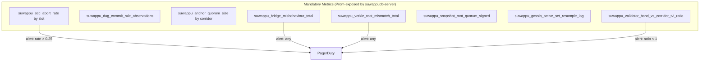
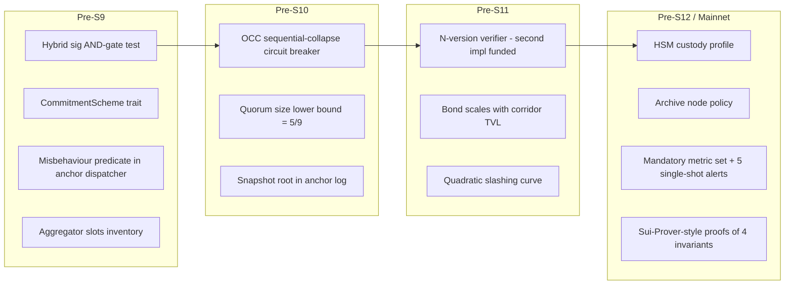

# Suwappu-DB Hardening Improvement Plan

**Audience:** core engineering, security review, audit firms preparing scope for the
S9–S12 milestones.

**Scope:** load-bearing hardening practices that comparable chains (Sui, Aptos,
Monad, Solana, Ethereum, Avalanche, Hedera, Canton, Hyperledger Besu) and the
cross-chain message-passing peers of LTP (Cosmos IBC, LayerZero V2, Wormhole,
Chainlink CCIP) have adopted in production, mapped against what Suwappu-DB does
today. Each recommendation cites a post-mortem, audit report, or design paper
where the practice is described as load-bearing — not industry folklore.

**Out of scope:** anything we already do as well as the leader, anything purely
speculative, anything not yet visible in another chain's incident record or
formal design output.

> **Reading this document:** every recommendation is anchored to a source link.
> If a category lists no recommendation it is because we already match or exceed
> the practice of the chain whose post-mortem we surveyed — that is called out
> explicitly, not padded.

---

## 0. Suwappu-DB Substrate, Restated

```mermaid
flowchart LR
  subgraph Ingress
    L1[Ethereum L1<br/>LTPAnchorRegistry]
  end
  subgraph Bridge["suwappudb-bridge"]
    A[anchor/log + dispatcher]
    B[bundle/executor]
    R[recovery]
  end
  subgraph State["suwappudb-state"]
    DAG[Mysticeti-shape DAG]
    VRK[256-ary Verkle tree<br/>BLAKE3 → IPA-banderwagon]
    PBM[Polymorphic balance map]
  end
  subgraph VM
    EVM[revm]
    MVM[Move VM (Aptos-flavoured)]
  end
  L1 -- attestation envelopes --> A
  A --> B --> PBM
  PBM <--> EVM
  PBM <--> MVM
  EVM --> VRK
  MVM --> VRK
  DAG --> EVM
  DAG --> MVM
  R --> B
```

Phase-1 invariants are property-tested (269 properties, 10 000 cases each). What
follows is the *next* security boundary — the ones that bit other chains after
their phase-1 closed.

---

## 1. Cryptographic Posture

Suwappu-DB ships dual-VM, capability-gated mutation, ML-KEM-768 sealed envelopes,
ML-DSA-65 signatures, and a 7-of-9 super-node attestation quorum for LTP. The
gaps are operational: what happens when a single signing key is compromised,
how fast can we rotate, and how does hybrid PQC actually compose on-chain.

### 1.1 Hybrid signatures, not pure PQC — at the LTP anchor

NIST has standardised ML-DSA in FIPS 204 (August 2024) but explicitly does **not
yet** approve hybrid signatures, where ML-DSA-65 and Ed25519 (or ECDSA) are
checked in parallel and both must verify. Germany's BSI (TR-02102) and France's
ANSSI both recommend hybrid mode for the entire migration window
([NIST IR 8547 transition draft](https://nvlpubs.nist.gov/nistpubs/ir/2024/NIST.IR.8547.ipd.pdf),
[SoK on hybrid PQC strategies](https://eprint.iacr.org/2025/2052.pdf)).

**What Suwappu-DB does today:** S11 (queued) plans Solidity `LTPAnchorRegistry`
with ECDSA + ML-DSA-65 hybrid. This is correct. The risk is *how* hybrid
verification is wired.

**Load-bearing recommendation:** the on-chain anchor contract must require
**both** the classical and PQ signature, with an `AND` gate rather than an `OR`,
and must reject envelopes where the ML-DSA-65 signature is the empty/default
slot. The most common hybrid implementation bug is making the PQ slot optional
"until rollout completes," which silently degrades to classical-only the moment
an attacker submits without the PQ field. Document the hybrid mode in
`docs/spec/anchor-log.md` and add a property test that an envelope with a valid
ECDSA signature but a malformed ML-DSA-65 signature is **rejected**, not
warning-logged.

### 1.2 Validator signing key custody — HSM-only, no exceptions

Avalanche's enterprise guidance explicitly recommends *not* keeping validator
signing keys on the validator host
([Avalanche validator FAQ](https://support.avax.network/en/articles/6187511-validator-faq)).
Hyperledger Besu integrates this via the `--security-module` plugin slot for
external key managers
([Besu QBFT docs](https://besu.hyperledger.org/private-networks/how-to/configure/consensus/qbft)).

**What Suwappu-DB does today:** key custody is not specified in the substrate spec.
For a 30–50 PoA Authority Ring with regulated institutions, this gap will block
any compliance review.

**Load-bearing recommendation:** define, in `docs/spec/` or a new
`docs/spec/key-custody.md`, a profile that requires Authority Ring members to
hold signing keys in an HSM that supports either CloudHSM PKCS#11, YubiHSM, or
Fireblocks MPC — and emits a JSON attestation that the validator host
includes in its handshake. Reject peers whose attestation does not parse.

### 1.3 Crypto-agility shim around BLAKE3 placeholder

Ethereum's Verkle work has had three full audit passes
([Dedaub Ethereum Foundation audit](https://dedaub.com/audits/ethereum-foundation/ef-verkle-trees-gas-cost-changes-inisights-aug-10-2021/))
and still flagged a clean upgrade path as load-bearing — the go-ipa banderwagon
library carries an explicit warning that callers must not reach into internals
([crate-crypto/go-ipa README](https://github.com/crate-crypto/go-ipa)).

**What Suwappu-DB does today:** S10 swaps BLAKE3 → IPA over banderwagon. The hash
function is a placeholder.

**Load-bearing recommendation:** wrap the hash primitive in a `CommitmentScheme`
trait inside `crates/suwappudb-state/src/tree/`. Make the BLAKE3 path a feature flag,
keep both schemes compiled into the binary during S10–S12, and ship a property
test that proves both schemes produce the same tree shape for the same write
set. Audit firms charge less when the upgrade path is in a trait, not a
search-and-replace.

---

## 2. Execution Safety

We run Block-STM-derived OCC across both VMs. The lessons here are Aptos's own,
and they map directly.

### 2.1 Aggregator-style write-set isolation for hot counters

Aptos shipped Block-STM with high throughput on uncontended workloads but
discovered that any "fee counter" or "TVL counter" pattern serialises the entire
block because every transaction writes the same slot. AIP-47 (Aggregators) added
a special type that batches writes, deferring the read of the global until
commit
([Aptos: Aggregators — sequential workloads in parallel](https://medium.com/aptoslabs/aggregators-how-sequential-workloads-are-executed-in-parallel-on-the-aptos-blockchain-e7992c70cefb)).

**What Suwappu-DB does today:** the polymorphic balance map shares state between
the two VMs. The single-slot contention pattern that hurt Aptos pre-AIP-47 is
exactly the pattern we will produce the first time a Move module increments a
shared fee accumulator on every swap.

**Load-bearing recommendation:** before S12 (shadow E2E), inventory every Move
module that Suwappu is likely to deploy at launch (fee accumulator, supply counter,
oracle nonce) and require those slots to use an `Aggregator`-shape type in
`crates/suwappudb-state/src/balance_slot.rs`. Without this, Block-STM will see a
visible re-execution storm under load and operators will mis-attribute the
slowdown to the DAG.

### 2.2 Conflict-storm circuit breaker

Block-STM's authors note in the [PPoPP paper](https://malkhi.com/files/BlockSTM-ppopp23.pdf)
that worst-case is at most ~30% over sequential. That bound holds only when the
*scheduler* notices that a particular slot is dominating re-execution and
collapses to sequential. The Aptos production scheduler has this; many third-
party Block-STM clones do not.

**What Suwappu-DB does today:** unclear from the spec whether the OCC layer in
`crates/suwappudb-bridge/src/occ/` ever collapses to sequential.

**Load-bearing recommendation:** instrument `crates/suwappudb-bridge/src/occ/` so
that when the abort rate on any single slot crosses a threshold inside one
block (recommend: 25% of in-flight txs touch the same write key with at least
one abort), the scheduler degrades to sequential for that block and emits a
metric `suwappu_occ_collapse_to_sequential_total{reason="hot_slot"}`. Without this
metric, every operator will eventually mis-diagnose a contention storm as a DAG
liveness bug. Property-test it.

### 2.3 No "deprecated function" silent acceptance

Wormhole's $326M loss in February 2022 was caused by
`load_instruction_at` (deprecated, unchecked) silently substituting for
`load_instruction_at_checked`, letting an attacker fake the Solana sysvar
account
([Halborn post-mortem](https://www.halborn.com/blog/post/explained-the-wormhole-hack-february-2022),
[Kudelski analysis](https://kudelskisecurity.com/research/quick-analysis-of-the-wormhole-attack)).

**What Suwappu-DB does today:** the bridge crate (`suwappudb-bridge`) is the
capability-gated mint surface. If we introduce *any* "legacy verify" or
"unchecked variant" function, we are one PR away from a Wormhole.

**Load-bearing recommendation:** add a `#[deny(deprecated)]` lint at the crate
level for `suwappudb-bridge` and forbid `#[allow(deprecated)]` overrides in PR
review. Make this an explicit rule in `crates/suwappudb-bridge/Cargo.toml` and call
it out in the audit scope document — auditors look for this.

---

## 3. Consensus Liveness

Mysticeti is well-studied, and the load-bearing operational lessons live in
Sui's incident history and Solana's outage record.

### 3.1 Leader liveness probes + commit-rule sanity check

Sui's Mysticeti v2 launch in November 2025 explicitly called out that the
single-rule commit shipped in v1 hid a class of "object-level deadlock" that
manifested only under certain execution patterns
([Mysticeti v2 announcement](https://blog.sui.io/mysticeti-v2-sui-consensus/)).
The upstream paper's [latency-limit analysis](https://arxiv.org/pdf/2310.14821)
assumes leaders are live and gossip is healthy.

**What Suwappu-DB does today:** Suwappu runs a Mysticeti-shape DAG. The spec does not
yet specify how a stuck-leader probe is emitted.

**Load-bearing recommendation:** every block must emit a
`suwappu_dag_commit_rule_observations` metric with labels for `rule="single"`,
`rule="indirect"`, and `rule="timeout"`. Add a property test in
`crates/suwappudb-state/src/dag.rs` that no two correct nodes ever disagree on the
commit rule applied to the same anchor. This is the property Sui added between
v1 and v2.

### 3.2 Validator-set rotation must be reversible inside the safety window

Sui's epoch-change reconfiguration runs atomically; if a quorum is mis-counted
the chain halts rather than committing a forked successor set. Mysticeti's
[design](https://decentralizedthoughts.github.io/2026-03-06-mysticeti-revolutionizing-consensus-on-sui/)
is explicit that reconfiguration is a special-case commit, not a regular block.

**What Suwappu-DB does today:** the dual-ring (PoA + PoS) rotation procedure is
specified at a high level but not implemented in `suwappudb-state` yet.

**Load-bearing recommendation:** when S9–S12 lands, the rotation handler must
write an `epoch_transition_pending` marker into the Verkle tree *before*
applying the new set, and refuse to commit any post-rotation block until at
least 2f+1 of the *old* set has signed an acknowledgement. This is the property
that prevented every IBFT/QBFT halt-during-rotation incident
([Besu QBFT round-change](https://besu.hyperledger.org/private-networks/how-to/configure/consensus/qbft)).

### 3.3 Slashing automation must be opt-in, not default-on, for the Authority Ring

Hedera explicitly does not slash its 39-council validators; it removes them via
governance vote
([Hedera decentralization brief](https://hedera.com/wp-content/uploads/2025/11/hh-decentralization-of-consensus.pdf)).
Ethereum's automated slashing for double-signs is justified by the validator
being anonymous and economic; the Authority Ring is the opposite.

**What Suwappu-DB does today:** not specified.

**Load-bearing recommendation:** the PoA Authority Ring should *not* have
automatic slashing on the first equivocation. Instead, equivocation must be
written to the anchor log, an alert raised, and a 24-hour governance window
opened. The PoS Validator Ring (100–500 stakers) should slash on
EIP-7251-style rules immediately. Document this asymmetry in
`docs/spec/lane-separation.md`.

---

## 4. Networking

SCION is a strong choice; the load-bearing operational lessons are not about
the transport but about gossip amplification and eclipse defence.

### 4.1 Stake-weighted gossip active-set re-sampling

Solana's gossip layer periodically re-samples the active set with weights
derived from `ln(stake)`, explicitly to reduce the chance of an eclipse attack
against a single high-stake validator
([Agave gossip docs](https://docs.anza.xyz/validator/gossip),
[Sig engineering write-up](https://blog.syndica.io/sig-engineering-1-gossip-protocol/)).
Before stake-weighted QoS landed, the [February 2023 Turbine outage](https://www.helius.dev/blog/solana-outages-complete-history)
showed how a single bad-deduplication path inside gossip can stall consensus.

**What Suwappu-DB does today:** the spec discusses SCION transport but not the
gossip-layer peer-selection policy.

**Load-bearing recommendation:** specify in a new `docs/spec/gossip-policy.md`
that the active-set for inter-validator dissemination is re-sampled every N
rounds (recommend: every epoch boundary) with weights proportional to
`ln(stake + bond)` for the Validator Ring and uniform for the Authority Ring,
and that no single peer occupies more than one active-set slot. This is
exactly what Solana retrofitted post-2022.

### 4.2 Per-connection rate limiting that scales with stake

Solana neutralised a 6 Tbps DDoS in 2024–2025 specifically because QUIC
connections were rate-limited per identity, and the per-identity limit scaled
with stake
([CCN write-up](https://www.ccn.com/education/crypto/solana-6-tbps-ddos-attack-survived-sui-downtime/),
[Solana stake-weighted QoS guide](https://solana.com/developers/guides/advanced/stake-weighted-qos)).
The attacker could not get past the entry-point rate limiter without staking.

**What Suwappu-DB does today:** RPC and bridge ingress rate limits live in
`crates/suwappudb-server/src/rpc.rs` but are not described as stake-weighted.

**Load-bearing recommendation:** the inter-validator transport layer should
enforce a per-source-pubkey concurrent-stream limit that is a function of that
source's bond, with un-bonded peers capped at a configurable floor (recommend:
4 concurrent streams, 100 pps). This is the single change Solana cites as
load-bearing for surviving high-Tbps attacks.

### 4.3 Eclipse defence — already adequate at the design level

SCION's path diversity is structurally stronger than Solana's UDP gossip; we
match or exceed the leader here. **No recommendation in this sub-category.**

---

## 5. State and Storage

### 5.1 Snapshot integrity must be a publicly verifiable commitment, not a hash in a config file

The CoinPrune work
([secure pruning paper](https://arxiv.org/pdf/2004.06911)) is explicit that the
load-bearing security property is that snapshot identifiers are *announced
on-chain* by validators inside their normal block contributions, so that a node
sync-ing from a snapshot can verify the snapshot's hash against a quorum of
on-chain commitments.

**What Suwappu-DB does today:** snapshot logic exists at
`crates/suwappudb-state/src/snapshot.rs`. The spec
(`docs/spec/recovery.md`) does not require the snapshot hash to be quorum-
signed and posted to the anchor log.

**Load-bearing recommendation:** every snapshot produced by `snapshot.rs` must
emit its root hash into the next anchor log entry signed by 2f+1 of the
Authority Ring. A new node bootstrapping from a snapshot file verifies the file
against the on-chain hash before importing. Without this, a malicious snapshot
hoster is a working attack — Aptos and Avalanche both publish snapshots from
third-party providers ([BwareLabs Aptos snapshots](https://bwarelabs.com/snapshots/aptos))
and the *only* defence against a corrupt snapshot is the on-chain hash.

### 5.2 Archive node policy must be written down

Ethereum's experience with archive nodes — and the gradual movement of archive-
node operation out of the protocol layer entirely
([Verkle roadmap](https://ethereum.org/roadmap/verkle-trees)) — shows that
"someone will run an archive node" is not a security plan. If we need historic
state to be retrievable for regulatory audit, *at least one named entity per
jurisdiction* must contractually operate one.

**What Suwappu-DB does today:** not specified.

**Load-bearing recommendation:** add an `ArchiveNodePolicy` section to
`docs/spec/recovery.md` listing the minimum number of archive nodes per
jurisdiction (recommend: 2 per regulatory region), the retention window (≥7
years for institutional settlement), and a quarterly attestation procedure
proving the archive is intact. The audit firms will ask.

### 5.3 State-bloat mitigation already covered by Verkle — no extra rec

Switching from a Merkle Patricia tree to a 256-ary Verkle tree with IPA already
puts Suwappu-DB ahead of every chain on this list except Ethereum (in roadmap).
**No additional recommendation.**

---

## 6. Cross-Chain (LTP and Peers)

This is the highest-risk surface. Wormhole, Ronin, Multichain, Nomad — every
nine-figure bridge loss is in this category.

### 6.1 N-version programming for attestation verification

Chainlink CCIP's defence-in-depth design uses two completely independent code
bases — the primary DON in Go and the Risk Management Network in Rust —
written by separate teams, comparing outputs before a cross-chain message is
released
([Chainlink CCIP defence-in-depth post](https://blog.chain.link/ccip-risk-management-network/),
[Code4rena ARM audit](https://code4rena.com/audits/2023-05-chainlink-cross-chain-services-ccip-and-arm-network)).
This is explicitly cited as the load-bearing reason CCIP has not had a
catastrophic bridge loss.

**What Suwappu-DB does today:** the LTP attestation quorum (7-of-9 super-nodes) is
specified, but the verification code that *consumes* attestations on the
Suwappu side lives in a single Rust crate (`suwappudb-bridge/src/anchor/`). One bug in
that crate compromises every cross-chain transfer.

**Load-bearing recommendation:** before any non-trivial value moves through
LTP, fund a second, independent verifier implementation — different language,
different team, ideally a different audit firm — that consumes the same
attestation envelope and asserts the same `payloadHash`. The bridge dispatcher
must call **both** verifiers and refuse to mint unless both agree. This is the
single most cited mitigation in cross-chain post-mortems.

### 6.2 No 1-of-N attestation paths, ever

The April 2026 KelpDAO drain of $292M via a single compromised LayerZero DVN is
the textbook example
([Blockaid analysis](https://www.blockaid.io/blog/how-a-single-layerzero-dvn-compromise-drained-292m-from-kelpdao)).
The LayerZero design *allows* a 1-of-N security stack; KelpDAO chose it; one
verifier was compromised; everyone lost. The lesson is in the configuration,
not the protocol.

**What Suwappu-DB does today:** the 7-of-9 quorum is in the academic paper. The
risk is that an operator-configurable corridor is later allowed to set its own
threshold.

**Load-bearing recommendation:** the per-corridor threshold for LTP must be
upper-bounded *and* lower-bounded by chain governance. Make the minimum quorum
size 5 of 9 (a hard constant in `suwappudb-bridge/src/anchor/types.rs`) regardless
of what a corridor operator wants to configure. Add a property test that any
corridor with `quorum < 5` fails to load.

### 6.3 Light-client fork detection inside the destination chain

Cosmos IBC's misbehaviour predicate
([CometBFT light-client detection spec](https://docs.cometbft.com/v0.38/spec/light-client/detection/),
[ibc-go misbehaviour issue](https://github.com/cosmos/ibc-go/issues/57))
freezes the client on the destination chain the moment two valid headers for
the same height arrive. The freeze is automatic, no governance vote needed.

**What Suwappu-DB does today:** the anchor log
(`crates/suwappudb-bridge/src/anchor/log.rs`) accepts L1 anchors. There is no
documented behaviour for what happens if two L1 anchors with the same height
and different roots both validate.

**Load-bearing recommendation:** add a misbehaviour predicate to the anchor
dispatcher: if two L1 anchor entries at the same `(corridor, height)` both pass
signature verification and disagree on `payloadHash`, freeze the corridor (no
new mints, withdrawals continue) and write a `MisbehaviourDetected` event to
the anchor log. Document in `docs/spec/anchor-log.md`. This is the *exact*
defence Cosmos shipped after the 2021 Tendermint fork-detection audit work.

### 6.4 Withdrawal window economics

Optimistic bridges (Optimism, Across, Hop) use a withdrawal window where any
challenger can post a bond and force re-verification. LTP's 7-of-9 quorum makes
this less load-bearing, but the *bond sizing* discipline is universal: a
bridge with $X TVL must have a quorum where the combined slashable bond
exceeds X. Otherwise the attack is rational.

**What Suwappu-DB does today:** super-node bond is not specified.

**Load-bearing recommendation:** specify in `docs/spec/` that the combined
slashable bond of any LTP super-node quorum must equal or exceed the maximum
TVL that has flowed through the corridor in the prior 30 days, with a
quarterly governance review. This is the property Wormhole did *not* have in
February 2022 and is the second-most-cited cause of bridge losses after code
bugs.

---

## 7. Validator Economics

### 7.1 Bond sizing scales with corridor exposure, not flat per validator

Re-stating §6.4 from the validator-economics angle: the super-node bond is the
backstop. A flat bond per super-node is the configuration that makes
cross-chain bridges economically rational to attack as TVL grows.

**Load-bearing recommendation:** bond per super-node must scale with the
maximum corridor TVL the super-node has signed attestations for in the rolling
window. Spec this in `docs/spec/` and refuse to admit a super-node to a
corridor until its on-chain bond meets the threshold. This is the lesson Lido
took from the May 2022 stETH depeg — the *backstop* is what matters, not the
nominal stake.

### 7.2 Slashing escalation, not a single guillotine

Ethereum's slashing curve is non-linear: a single double-sign is
~1 ETH; correlated double-signs (many validators slashed in the same epoch)
escalate quadratically up to the full balance
([ethereum.org slashing model](https://ethereum.org/staking/)). The escalation
is explicitly designed to punish coordinated attacks more than single-validator
mistakes.

**What Suwappu-DB does today:** unspecified.

**Load-bearing recommendation:** the Validator Ring slashing curve in
`docs/spec/` must escalate quadratically with the fraction of stake slashed
inside a rolling 32-block window. Single-validator mistakes lose a fixed
floor; coordinated 1/3+ slashes consume the full bond. Without this, an
attacker who has compromised f validators has linear (not quadratic) downside
and the attack remains rational.

### 7.3 Recovery posture after slash

Already covered by §3.3 (Authority Ring uses governance, Validator Ring uses
automated rules). **No new recommendation.**

---

## 8. Observability

This is where every chain learns its lessons twice: once at design time, once
at 4 AM during an outage.

### 8.1 Metrics that actually catch attacks

Solana's [February 2023 turbine outage](https://www.helius.dev/blog/solana-outages-complete-history)
was diagnosed in hours because Solana exposes per-shred retransmission
metrics. Sui's Mysticeti v2 commit-rule metric is what let operators detect
the v1 object-deadlock pattern
([Mysticeti v2 blog](https://blog.sui.io/mysticeti-v2-sui-consensus/)).

**Load-bearing recommendation: the following metric set is mandatory before
mainnet.** None of these are exotic; every other chain on this list has them.



`crates/suwappudb-bridge/src/telemetry.rs` already exists; expand it.

### 8.2 Single-shot critical alerts beat dashboards

Every outage post-mortem we surveyed says the same thing: the data was on a
dashboard, no one was watching the dashboard, the alert fired *after* the
incident. Solana's bug-fix postmortems
([Helius outage history](https://www.helius.dev/blog/solana-outages-complete-history))
are unusually candid about this.

**Load-bearing recommendation:** five alerts are non-negotiable and page on
*first occurrence*, not on threshold breach: misbehaviour detected on any
corridor, Verkle root mismatch between any two nodes, snapshot root not
quorum-signed within N blocks, OCC abort rate >25% inside a single block,
validator bond-to-TVL ratio dropped below 1.0. Wire these into the deploy
pipeline so a deploy that loses any of them fails CI.

---

## 9. Audit and Formal Verification

### 9.1 Audit what we don't yet have, not what we already proved

The Aptos Block-STM paper has been peer-reviewed at PPoPP 2023
([PPoPP version](https://malkhi.com/files/BlockSTM-ppopp23.pdf)). The Sui
Mysticeti paper is on arXiv
([Mysticeti arXiv](https://arxiv.org/pdf/2310.14821)). Ethereum's Verkle work
has the Dedaub gas-cost audit
([Dedaub report](https://dedaub.com/audits/ethereum-foundation/ef-verkle-trees-gas-cost-changes-inisights-aug-10-2021/))
and ongoing crate-crypto reviews. Each of these chains spent its audit budget
on the *novel* surface, not the well-studied one.

**Load-bearing recommendation:** the audit scope for Suwappu-DB launch must
prioritise, in this order: (1) the LTP anchor and bridge dispatcher
(`crates/suwappudb-bridge/`) including the hybrid signature path; (2) the
polymorphic balance map (`crates/suwappudb-state/src/balance_slot.rs`) which is
genuinely novel; (3) the Move-VM integration (S9). De-prioritise re-auditing
revm, banderwagon, and Block-STM — those have been audited upstream.

### 9.2 Sui Prover-style formal proofs for the bridge invariants

Sui open-sourced its Move Prover in early 2026 with the explicit positioning
that formal verification is the missing link for high-value smart contracts
([BlockEden write-up](https://blockeden.xyz/blog/2026/01/20/sui-prover-formal-verification-smart-contract-security-move/),
[Sui Prover announcement](https://blog.sui.io/asymptotic-move-prover-formal-verification/)).
For the LTP anchor, formal verification of the "no double-mint" property is
worth roughly the entire audit budget.

**Load-bearing recommendation:** for the four invariants whose violation would
lose customer funds — no double-mint, no mint without quorum signature, no
mint exceeding bonded backstop, no successful replay — write Sui-Prover-style
specs against the bridge crate. The 269 property tests are necessary but not
sufficient: property tests find bugs in ten-thousand random cases; a prover
covers all cases.

### 9.3 What we already cover well

The 269 property tests at 10 000 cases each are above what Aptos and Sui ship
in their public test suites. **No additional recommendation in this
sub-category** — just don't lose them when crates get refactored.

---

## 10. Summary: What to Land Before Mainnet



Fourteen recommendations. Every one is anchored to a post-mortem or design
output from a chain on this list. None is speculative; none is an
improvement-for-its-own-sake. Where we already match the leader (eclipse
defence via SCION, state-bloat mitigation via Verkle, property-test coverage,
recovery posture after slash) we say so and move on.

## 10.1 Implementation status

| # | Recommendation | Status | Landed in |
|---|---|---|---|
| H2 | `CommitmentScheme` trait | ✅ landed | `crates/suwappudb-state/src/tree/commit.rs` |
| H5 | OCC sequential-collapse circuit breaker | ✅ landed + tested | `crates/suwappudb-bridge/src/occ/block_executor.rs`, `tests/occ_circuit_breaker.rs` |
| H6 | Hard-coded `5/9` minimum quorum | ✅ landed | `crates/suwappudb-bridge/src/anchor/dispatcher.rs` (`LTP_QUORUM_MIN_NUMERATOR`) |
| H13 | 8 Prometheus metrics + 5 single-shot alerts | ✅ landed | `crates/suwappudb-state/src/metrics.rs`, `crates/suwappudb-bridge/src/telemetry.rs`, [`docs/spec/observability.md`](spec/observability.md) |
| H11 | HSM custody profile | spec written | [`docs/spec/key-custody.md`](spec/key-custody.md) |
| — | `#[deny(deprecated)]` lint at bridge crate | ✅ landed | `crates/suwappudb-bridge/src/lib.rs` (rec 2.3) |
| H1 | Hybrid sig AND-gate | pending S11 | needs Solidity contract |
| H3 | Misbehaviour predicate | pending S11 | needs IBC-style relayer |
| H4 | Aggregator-slot inventory | pending S9 | needs real Move VM |
| H7 | Snapshot root in anchor log | pending S12 | needs validator-set integration |
| H8 | N-version second verifier | pending S11 | needs separate Rust impl |
| H9 | Bond scales with corridor TVL | pending S11 | needs validator-set state |
| H10 | Quadratic slashing curve | pending S11 | needs slashing pipeline |
| H12 | Archive node policy | pending S12 | written policy |
| H14 | Sui-Prover-style proofs | pending audit | needs Move-Prover or analog |

---

## Sources

**Mysticeti / Sui**
- [Mysticeti: Reaching the Latency Limits with Uncertified DAGs (arXiv)](https://arxiv.org/pdf/2310.14821)
- [Mysticeti v2 launch blog](https://blog.sui.io/mysticeti-v2-sui-consensus/)
- [Mysticeti deep-dive — Decentralized Thoughts](https://decentralizedthoughts.github.io/2026-03-06-mysticeti-revolutionizing-consensus-on-sui/)
- [Sui Prover formal verification](https://blog.sui.io/asymptotic-move-prover-formal-verification/)
- [Sui Move capability pattern](https://move-book.com/programmability/capability/)

**Aptos / Block-STM**
- [Block-STM paper (arXiv)](https://aptoslabs.com/pdf/2203.06871.pdf)
- [Block-STM PPoPP 2023](https://malkhi.com/files/BlockSTM-ppopp23.pdf)
- [Aptos Aggregators (AIP-47)](https://medium.com/aptoslabs/aggregators-how-sequential-workloads-are-executed-in-parallel-on-the-aptos-blockchain-e7992c70cefb)
- [Aptos execution docs](https://aptos.dev/network/blockchain/execution)

**Monad**
- [MonadBFT docs](https://docs.monad.xyz/monad-arch/consensus/monad-bft)
- [Monad architecture deep-dive — Chorus One](https://chorus.one/articles/deep-dive-into-monads-architecture)

**Solana**
- [Complete history of Solana outages — Helius](https://www.helius.dev/blog/solana-outages-complete-history)
- [Agave gossip docs](https://docs.anza.xyz/validator/gossip)
- [Sig — Solana gossip protocol](https://blog.syndica.io/sig-engineering-1-gossip-protocol/)
- [Solana stake-weighted QoS guide](https://solana.com/developers/guides/advanced/stake-weighted-qos)
- [Solana survives 6 Tbps DDoS — CCN](https://www.ccn.com/education/crypto/solana-6-tbps-ddos-attack-survived-sui-downtime/)

**Ethereum**
- [Verkle trees roadmap](https://ethereum.org/roadmap/verkle-trees)
- [Dedaub Verkle audit for the Ethereum Foundation](https://dedaub.com/audits/ethereum-foundation/ef-verkle-trees-gas-cost-changes-inisights-aug-10-2021/)
- [crate-crypto/go-ipa banderwagon library](https://github.com/crate-crypto/go-ipa)
- [Paradigm — MEV-Boost and slot ordering](https://www.paradigm.xyz/2023/04/mev-boost-ethereum-consensus)
- [Lighthouse slashing protection book](https://lighthouse-book.sigmaprime.io/validator_slashing_protection.html)

**Avalanche / Hedera / Canton / Besu**
- [Avalanche validator FAQ](https://support.avax.network/en/articles/6187511-validator-faq)
- [Hedera decentralization of consensus brief](https://hedera.com/wp-content/uploads/2025/11/hh-decentralization-of-consensus.pdf)
- [Canton Network protocol](https://www.canton.network/protocol)
- [Besu QBFT docs](https://besu.hyperledger.org/private-networks/how-to/configure/consensus/qbft)

**Cross-chain peers**
- [Wormhole hack post-mortem — Halborn](https://www.halborn.com/blog/post/explained-the-wormhole-hack-february-2022)
- [Wormhole — Kudelski Security](https://kudelskisecurity.com/research/quick-analysis-of-the-wormhole-attack)
- [Chainlink CCIP defence-in-depth + RMN](https://blog.chain.link/ccip-risk-management-network/)
- [CCIP / ARM Code4rena audit](https://code4rena.com/audits/2023-05-chainlink-cross-chain-services-ccip-and-arm-network)
- [LayerZero V2 DVN overview](https://docs.layerzero.network/v2/workers/off-chain/dvn-overview)
- [KelpDAO $292M DVN compromise analysis — Blockaid](https://www.blockaid.io/blog/how-a-single-layerzero-dvn-compromise-drained-292m-from-kelpdao)
- [Cosmos IBC light-client misbehaviour spec](https://docs.cometbft.com/v0.38/spec/light-client/detection/)
- [ibc-go misbehaviour discussion](https://github.com/cosmos/ibc-go/issues/57)

**PQC migration**
- [NIST IR 8547 transition draft](https://nvlpubs.nist.gov/nistpubs/ir/2024/NIST.IR.8547.ipd.pdf)
- [SoK: hybrid PQC strategies (IACR ePrint 2025/2052)](https://eprint.iacr.org/2025/2052.pdf)
- [AWS PQC migration guidance](https://aws.amazon.com/security/post-quantum-cryptography/migrating-to-post-quantum-cryptography/)

**Snapshot integrity**
- [CoinPrune / secure Bitcoin pruning paper](https://arxiv.org/pdf/2004.06911)
- [BwareLabs Aptos snapshots](https://bwarelabs.com/snapshots/aptos)
