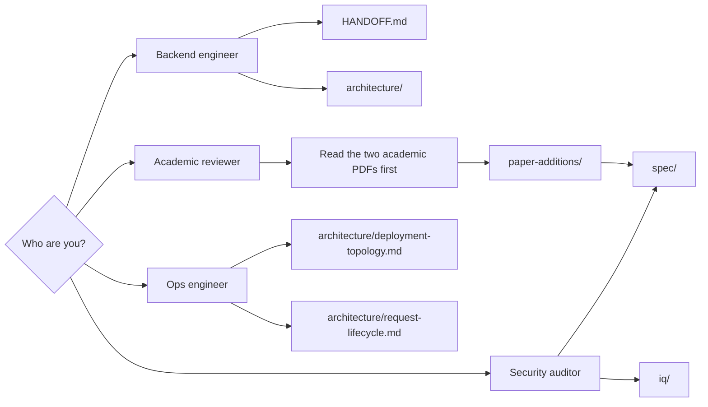
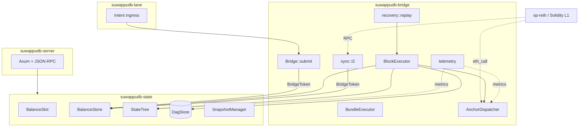
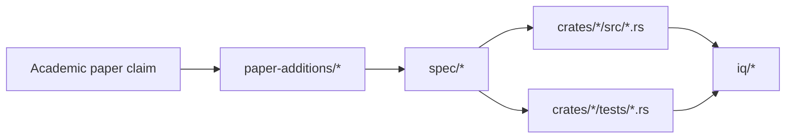

# Suwappu-DB documentation

State and execution substrate for the Suwappu DAG Layer 1, per the
academic paper [Suwappu DAG L1] (Natsagdorj, Calderon Jr., Mieskoski,
Kirkley; 2026).

> **Zero context?** Read [EXPLAINER.md](EXPLAINER.md) first —
> plain-language overview of what this is, why it exists, and how
> it fits together. ~10 minutes.

## Visuals

Presentation-ready diagrams and source formats live in the Suwappu DAG repo:

- [Suwappu Visual Index](../../suwappu-dag/docs/visuals/index.html)
- [Suwappu Ecosystem Atlas](../../suwappu-dag/docs/visuals/suwappu-ecosystem-atlas.html)
- [Suwappu DAG presentation](../../suwappu-dag/docs/visuals/suwappu-dag.html)
- [Suwappu DB presentation](../../suwappu-dag/docs/visuals/suwappu-db.html)
- [LTP presentation](../../suwappu-dag/docs/visuals/ltp.html)
- Mermaid sources: [Suwappu DAG](../../suwappu-dag/docs/visuals/mermaid/suwappu-dag.md), [Suwappu DB](../../suwappu-dag/docs/visuals/mermaid/suwappu-db.md), [LTP](../../suwappu-dag/docs/visuals/mermaid/ltp.md), [IQ-7 hybrid auth](../../suwappu-dag/docs/visuals/mermaid/iq7-hybrid-auth.md)
- Excalidraw sources: [Suwappu DAG](../../suwappu-dag/docs/visuals/excalidraw/suwappu-dag.excalidraw), [Suwappu DB](../../suwappu-dag/docs/visuals/excalidraw/suwappu-db.excalidraw), [LTP](../../suwappu-dag/docs/visuals/excalidraw/ltp.excalidraw)

## Where do I start?



### Reading orders

| Audience | Order |
|---|---|
| **Anyone wanting the 10-minute plain-language tour** | [EXPLAINER.md](EXPLAINER.md) |
| **Backend engineer joining cold** | [EXPLAINER.md](EXPLAINER.md) → [HANDOFF.md](HANDOFF.md) → [architecture/README.md](architecture/README.md) → [architecture/data-flow.md](architecture/data-flow.md) → `crates/suwappudb-state/src/lib.rs` |
| **Academic reviewer** | [paper-additions/README.md](paper-additions/README.md) → [architecture/dual-projection.md](architecture/dual-projection.md) → [architecture/state-tree.md](architecture/state-tree.md) → [iq/README.md](iq/README.md) |
| **Ops engineer deploying** | [architecture/deployment-topology.md](architecture/deployment-topology.md) → [architecture/request-lifecycle.md](architecture/request-lifecycle.md) → [ECOSYSTEM-AUDIT.md](ECOSYSTEM-AUDIT.md) |
| **Security auditor** | [HARDENING.md](HARDENING.md) → [iq/README.md](iq/README.md) → [spec/README.md](spec/README.md) → [paper-additions/dag-l1-section-11-empirical.md](paper-additions/dag-l1-section-11-empirical.md) → invariant tests under `crates/*/tests/` |

## High-level architecture



## Repository structure of `docs/`

```text
docs/
├── README.md                       this file
├── EXPLAINER.md                    plain-language 10-minute tour — start here if you have zero context
├── HANDOFF.md                      backend engineer onboarding
├── HARDENING.md                    14 hardening recs from Sui/Aptos/Monad/etc post-mortems
├── ECOSYSTEM-AUDIT.md              ecosystem map + production readiness
│
├── architecture/                   how the substrate works
│   ├── README.md                   architecture entry point + index
│   ├── overview.md                 three-crate split, capability gate
│   ├── data-flow.md                end-to-end pipeline with sequence diagrams
│   ├── dual-projection.md          BalanceSlot dual-projection invariant
│   ├── state-tree.md               256-ary trie shape, proofs, witness sizes
│   ├── sprint-map.md               sprint dependency DAG (phase-1)
│   ├── sprint-timeline.md          Gantt + S1..S12 timeline
│   ├── deployment-topology.md      live + target deployment shapes
│   ├── validator-rings.md          Authority Ring + Validator Ring (paper §5)
│   ├── ltp-lifecycle.md            LTP three-phase + six-layer security
│   ├── request-lifecycle.md        wallet RPC → state → response
│   ├── visual-index.md             every Mermaid diagram catalogued
│   ├── open-iqs.md                 launch-readiness backlog
│   ├── audit-plan.md, audit-ledger.md, engineering-standards.md
│   └── sprint-execution-checklist.md
│
├── spec/                           per-component specifications
│   ├── README.md                   spec index
│   ├── lane-separation.md          S1
│   ├── pbm-balance-slot.md         S2
│   ├── dual-vm-projectors.md       S3
│   ├── ce-mvcc-occ.md              S4
│   ├── cross-vm-intent-queue.md    S5
│   ├── verkle-state-tree.md        S6
│   ├── anchor-log.md               S7
│   └── recovery.md                 S8 + S8.5
│
├── iq/                             decision records (Important Questions)
│   ├── README.md                   IQ index + decision flow diagram
│   ├── IQ-1-redb-vs-rocksdb.md     state backend
│   ├── IQ-2-mock-vms-vs-real-vms.md
│   ├── IQ-3-move-vm-choice.md      defer → Aptos
│   ├── IQ-4-move-execution.md      address shape + nonce
│   ├── IQ-6-verkle-commitment.md   BLAKE3 → IPA over banderwagon
│   ├── IQ-7-anchor-parity.md       in-memory MAC → Solidity + ECDSA
│   ├── IQ-8-recovery-store-inmemory-vs-redb.md
│   └── IQ-9-s12-launch-hardening.md  snapshots + DAG + shadow E2E
│
├── research/                       competitive landscape + market research
│   └── chain-gap-analysis-2026-07.md  Tempo / Arc / Robinhood Chain vs the Suwappu stack + close-the-gap backlog
│
└── paper-additions/                proposed insertions to the two academic papers
    ├── README.md                   index with target sections
    ├── dag-l1-related-work.md
    ├── dag-l1-section-7-4.md       new §7.4 — State substrate: Suwappu-DB
    ├── dag-l1-section-11-empirical.md
    ├── dag-l1-section-12-row.md    new Table 1 rows
    ├── ltp-section-7-4.md          new §7.4 — Rust integration surface
    └── ltp-section-8-row.md        Table 2 extension
```

## Status snapshot

| Surface | Status | Reference |
|---|---|---|
| Phase-1 substrate (S1–S8) | ✅ closed; 8 invariants verified at 10k cases | [sprint-map.md](architecture/sprint-map.md) |
| Test count | 269 passing | `cargo test --workspace` |
| Real EVM via `suwappu-revm` | exists separately; not yet wired | [ECOSYSTEM-AUDIT.md](ECOSYSTEM-AUDIT.md) |
| Real Move VM (Aptos) | decision binding; integration pending | [IQ-3](iq/IQ-3-move-vm-choice.md) |
| Real Verkle commitments | decision binding; IPA wiring pending | [IQ-6](iq/IQ-6-verkle-commitment.md) |
| LTPAnchorRegistry.sol | merged via PR #2 | `contracts/src/LTPAnchorRegistry.sol` |
| Consensus integration (Mysticeti / suwappubft) | not started; `BlockBuilder` trait is the seam | [deployment-topology.md](architecture/deployment-topology.md) |

## How the docs cross-reference

Every load-bearing claim in the academic papers maps to a spec doc,
which maps to a property test, which references the IQ that
sanctioned the design choice. Pick any node in the chain and you
can walk to the others without context loss.



## Diagram inventory

See [visual-index.md](architecture/visual-index.md) for the full
catalog of 50+ Mermaid diagrams across these docs. Every diagram
links back to the prose that explains it.

## Verifying claims

```bash
cargo test --workspace                                  # 269 tests
PROPTEST_CASES=10000 cargo test --workspace --release   # exit-gate strength
cargo clippy --workspace --all-targets -- -D warnings
./scripts/check-lane-separation.sh
./scripts/cross-parity.sh
./scripts/bootstrap.sh smoke
```

If a doc claim doesn't match what you can verify with one of the
above commands, the doc is wrong. Fix it in the same PR that
notices.
