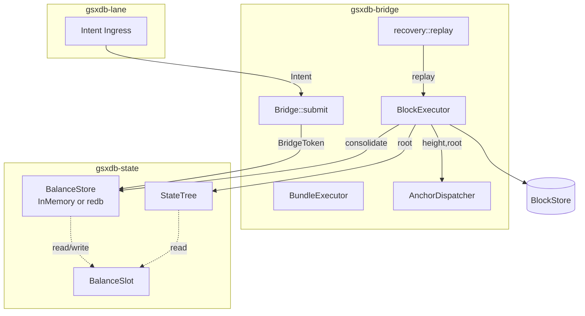

# GSX-DB architecture

Phase-1 closed. This directory is a tour of the substrate at the
end of phase-1: what's where, what flows through it, and why.

## Quick links

- [Overview](overview.md) — what the chain is, the three crates, the
  capability-gated mutation path
- [Data flow](data-flow.md) — Intent submission, block execution,
  state-tree update, anchor dispatch, block store
- [Dual-projection invariant](dual-projection.md) — why EVM and Move
  agree by construction, not by reconciliation
- [State tree](state-tree.md) — 256-ary trie shape, commitment scheme,
  proof structure
- [Sprint map](sprint-map.md) — phase-1 sprint dependency DAG
- [Sprint timeline](sprint-timeline.md) — Gantt + S1..S12 timeline + test-count growth chart
- [Deployment topology](deployment-topology.md) — what's live now, shadow option, target full L1
- [Validator rings](validator-rings.md) — Authority Ring + Validator Ring (academic paper §5)
- [LTP lifecycle](ltp-lifecycle.md) — commit-lattice-materialize, six-layer security
- [Request lifecycle](request-lifecycle.md) — wallet RPC → state → response
- [Visual index](visual-index.md) — every Mermaid diagram catalogued
- [Open IQs](open-iqs.md) — launch-readiness backlog with cross-refs
- [Placeholder audit plan](audit-plan.md) — line-by-line process for finding and resolving deferred/stale facts
- [Audit ledger](audit-ledger.md) — line-level inventory of placeholders/deferred facts and sprint owners
- [Engineering standards](engineering-standards.md) — enterprise + academic quality gates and repo structure contract
- [Sprint execution checklist](sprint-execution-checklist.md) — standards-driven tracker for S8.5-S12

## High-level shape

## The substrate in one paragraph

GSX-DB is the state and storage layer for a chain that runs EVM and
Move side by side over a single canonical state. A `BalanceSlot` is
one canonical value with two projections (EVM `balanceOf`, Move
`Coin::value`); they can't disagree because there's nothing to
disagree about. State mutations enter only through the bridge under
a capability token. Block execution is parallel (Aptos Block-STM in
shape), atomic per cross-VM bundle, commits to a 256-ary tree (Verkle-
shaped), gets anchored to multiple chains for cross-chain parity, and
is durable enough to replay from genesis to recover.

## What's not yet here (launch-readiness backlog)

- Real Move VM (per [IQ-3](../iq/IQ-3-move-vm-choice.md))
- Real Verkle commitments (per [IQ-6](../iq/IQ-6-verkle-commitment.md))
- Solidity `LTPAnchorRegistry` + ECDSA signatures (per [IQ-7](../iq/IQ-7-anchor-parity.md))
- Persistent block storage (per [IQ-8](../iq/IQ-8-recovery-store-inmemory-vs-redb.md))

These are tracked in IQs because the **trait surfaces are stable** —
swap is mechanical when launch readiness lands.

## How to read these docs

- Each diagram is the load-bearing claim. Prose around it explains
  what's invariant and what's swappable.
- Mermaid renders on GitHub. View raw markdown for ASCII fallback if
  rendering fails.
- Cross-references to spec docs and IQs are linked inline.
