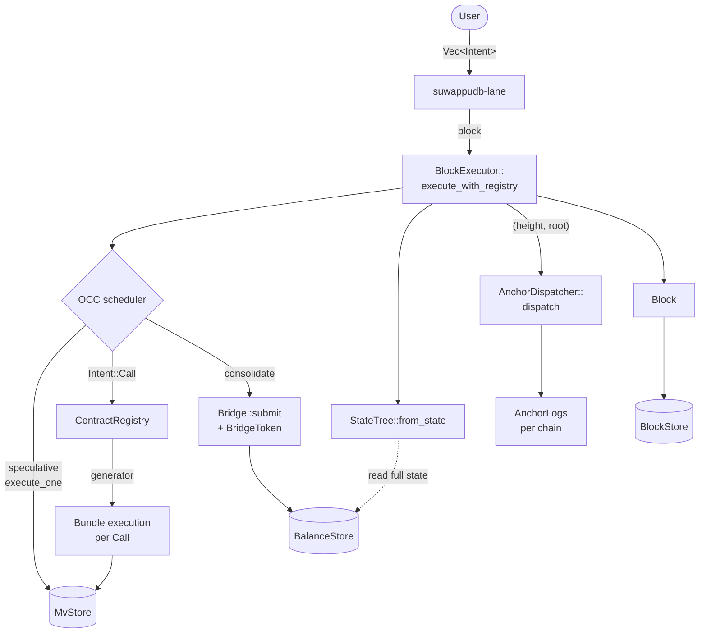
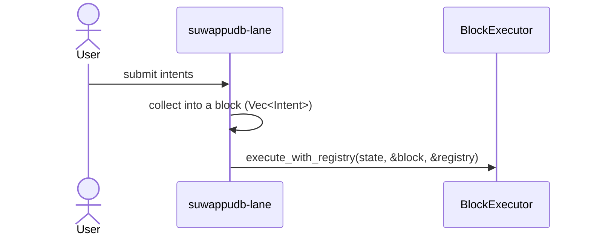
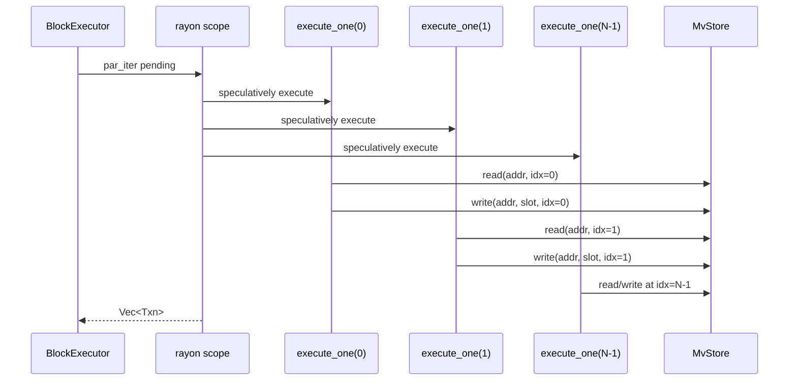
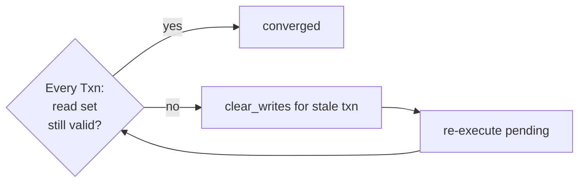
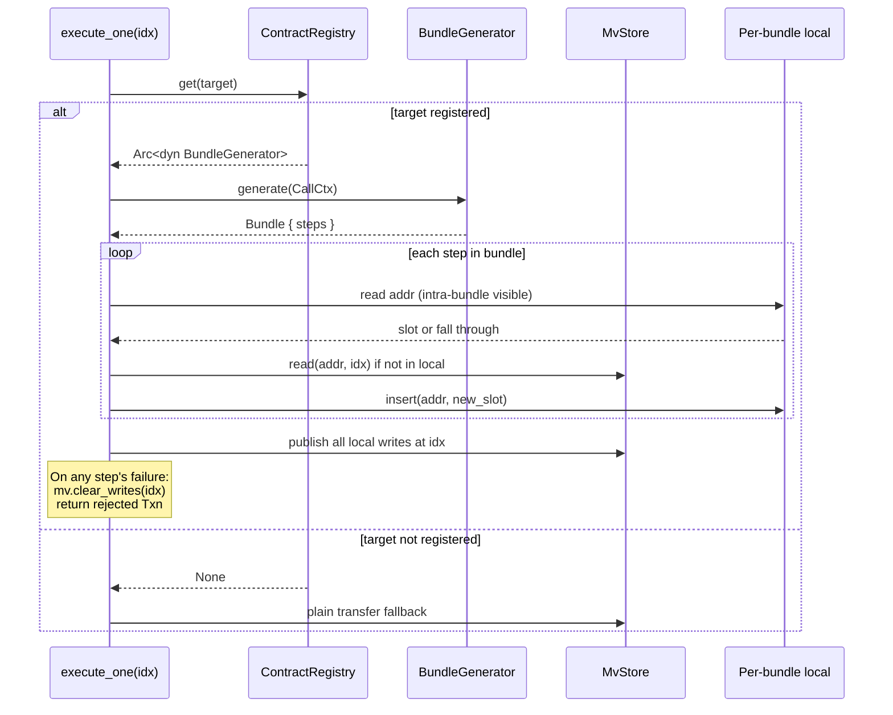
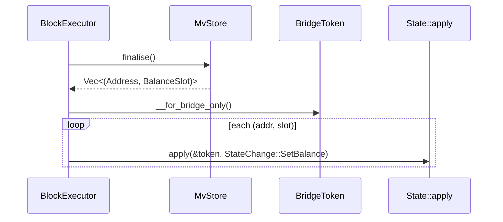
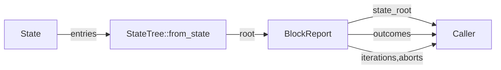
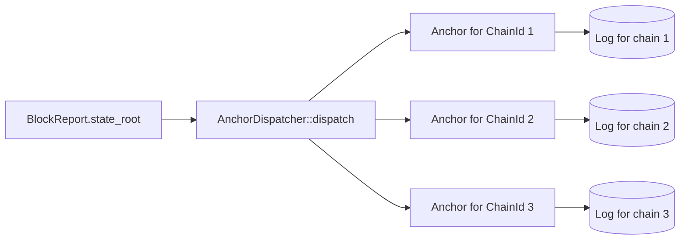
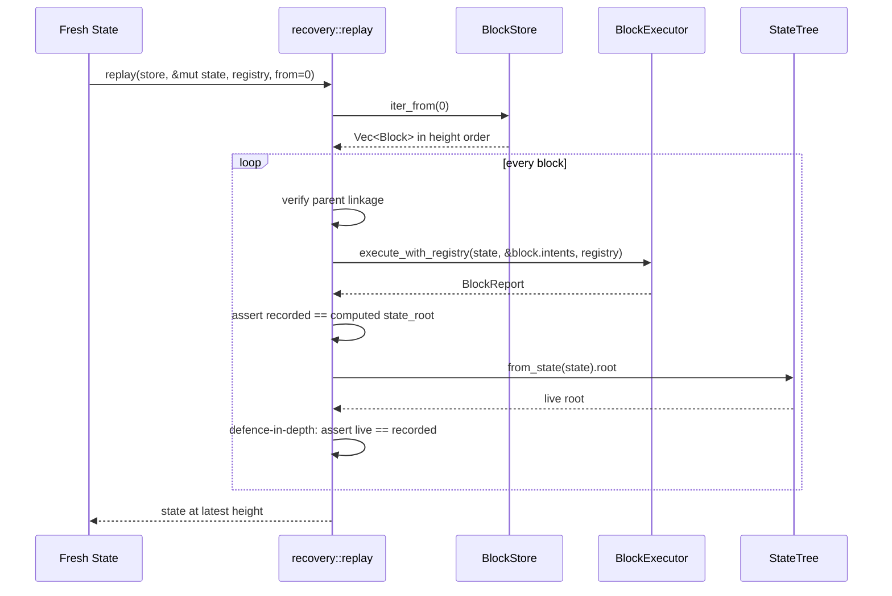

# Data flow

End-to-end: from a user submitting an `Intent` to the chain
committing post-block state, anchoring it, and persisting the block.

## The full pipeline



## Step-by-step

### 1. Intent submission (lane → bridge)



A block is just `Vec<Intent>`. Lane code accumulates intents in
whatever way it wants (per round, per timer, per length); the block
executor doesn't care.

### 2. Speculative parallel execution (OCC)



Every txn writes its own version into `MvStore` keyed by `TxnIdx`.
Reads return the highest-versioned write strictly below the
reader's index, falling through to canonical state.

### 3. Sequential validation + retry



Block-STM proves logarithmic iterations under random workloads. Cap
is `2 * block_len + 4`; exceeding it panics as an algorithmic bug.

### 4. Cross-VM bundle dispatch (when Intent::Call)



The per-bundle local accumulator is the critical fix from S5. The MV
store deliberately excludes same-idx reads (OCC validation
correctness); bundles need step-N+1 to see step-N writes, so the
executor maintains an in-bundle map consulted before MV.

### 5. Consolidation through BridgeToken



This is the only path through which speculative writes reach
canonical state. The capability gate is the single mutation entry
point.

### 6. State tree + block report



Phase-1 rebuilds the tree from full state per block. S6.5 / S8 will
introduce incremental updates without changing the trait surface.

### 7. Anchor dispatch



One anchor per chain, MAC'd under that chain's key, linked to the
previous anchor on that chain. `parity_check(height)` reads all logs
and returns `Agreed` iff every chain matches.

### 8. Block persistence

```mermaid
flowchart LR
    BlockBuild[Build Block { height, parent, state_root, intents }] --> BlockHash[block.hash]
    BlockHash --> BlockPut[BlockStore::put]
    BlockPut --> BS[(BlockStore)]
```

Block hash is BLAKE3 of canonical encoding (height | parent |
state_root | intent_count | each intent with type tag). Block store
indexes by hash and by height.

### 9. Recovery via replay



Replay is the determinism property's stress test. Any mismatch
surfaces as `RecoveryError::StateRootMismatch` — either the store
was tampered or the executor isn't deterministic (which would be a
serious S4 regression).

## Invariants enforced at every step

| Layer | Invariant | Verified by |
|---|---|---|
| Type | `EvmBalance == MoveCoinValue` for any slot | `projections_always_agree` (S2) |
| In-memory store | Same op sequence ⇒ same state | `op_replay_is_deterministic` (S2) |
| Persistent store | Round-trip through redb preserves slot | `redb_preserves_dual_projection` (S2) |
| Block executor | Parallel ≡ sequential | `parallel_equals_sequential` (S4) |
| Bundle | Atomic — fail step ⇒ no state change | `bundle_atomicity` (S5) |
| Tree | Same state ⇒ same root | `cross_tree_root_agreement` (S6) |
| Anchors | Same root ⇒ Agreed across all chains | `cross_chain_parity_holds` (S7) |
| Recovery | Replay ≡ live execution | `recover_matches_live_state` (S8) |

Each row is a 10,000-case property test in dev or release.
