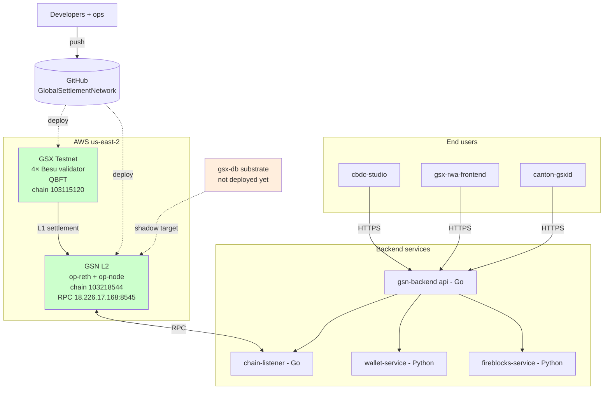
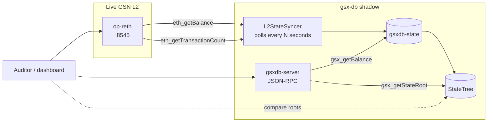
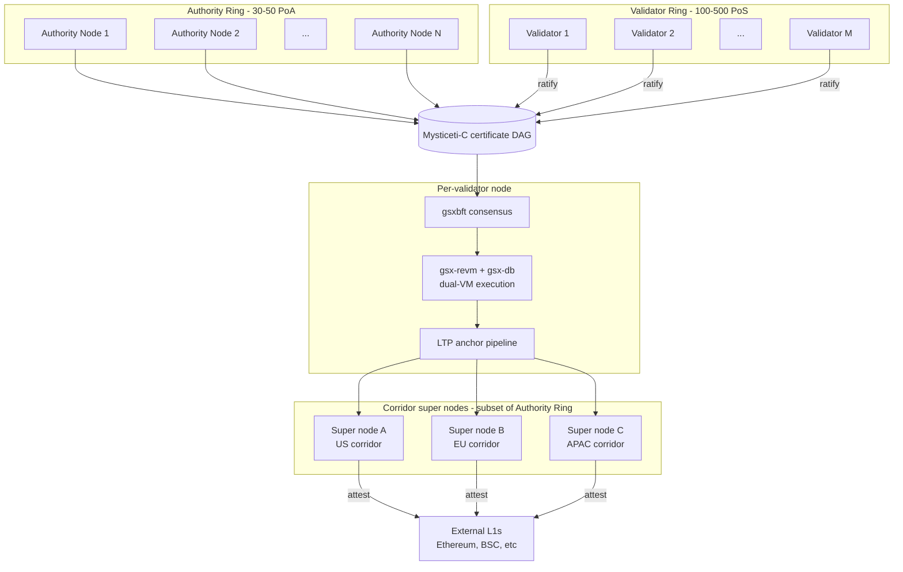
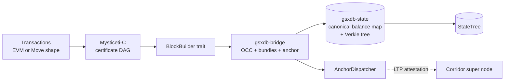

# Deployment topology

What runs where, today (phase-1 substrate live, chain not yet) and
at launch (full GSX DAG L1 per the academic paper).

## Today (phase-1 substrate + live experiments)

**Status:**
- Besu testnet + OP rollup are live; backend services deployed
- `gsx-db` is the candidate substrate but **not deployed against any
  live chain yet**

## Option A — Shadow deployment (1–2 weeks; pre-launch)

Cross-validation layer. gsx-db consumes published RPC state; any
divergence between gsx-db and op-reth surfaces in the auditor view.

## Target — full GSX DAG L1 (per the academic paper)

Refer to the academic paper §4 (architecture) and §10 (LTP
integration) for the formal description.

## Network specifics (per paper §13 hardware envelope)

| Param | Value |
|---|---|
| Validators in benchmark | 100 (30 PoA + 70 PoS) |
| Network | 100 Gbps dual-port LACP per node |
| RAM | 512 GB per node |
| GPU | NVIDIA H100-80GB per node |
| Throughput (simple transfer) | 72,000 TPS |
| Throughput (full DEX-load) | 17,000 TPS |
| Throughput (extrapolated full PoA) | 114,000 TPS |
| Inter-validator transport | SCION (BGP-class attack-resistant) |
| Block propagation | RaptorQ erasure coding (RFC 6330) |

## What gsx-db owns in the target topology

gsx-db owns the boxed-out execution and state surfaces. The
consensus layer (above) is `gsxbft-consensus-only-demo` or the full
`gsx-bft` repository; the LTP attestation pipeline (below) is
documented in the LTP companion paper.
