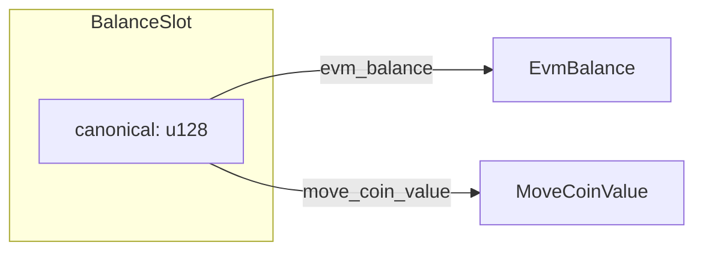
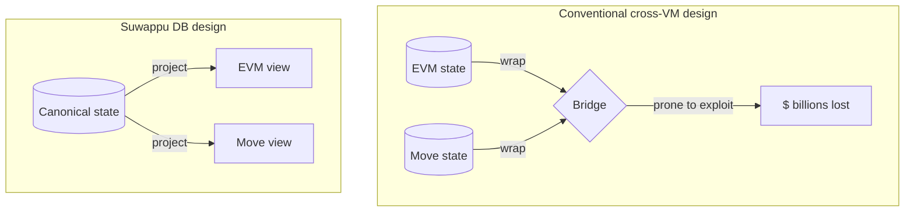
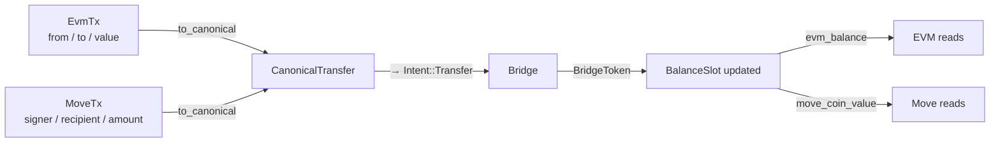
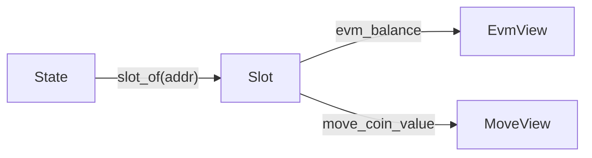

# Dual-projection invariant

The chain's load-bearing claim. EVM and Move agree on every balance
because they're projections of the same canonical field — not because
some reconciliation process keeps them in sync.

## The shape



`BalanceSlot` is a single `u128`. Two projections expose it in the
shape each VM expects:

```rust
pub struct BalanceSlot { canonical: u128 }

impl BalanceSlot {
    pub fn evm_balance(&self) -> EvmBalance { EvmBalance(self.canonical) }
    pub fn move_coin_value(&self) -> MoveCoinValue { MoveCoinValue(self.canonical) }
}
```

There is no path by which `evm_balance().to_u128()` and
`move_coin_value().to_u128()` can disagree. The compiler enforces it.
Property tests (S2) verify it under arbitrary mutations at three
layers: type, in-memory storage, persistent (redb) storage.

## Why this matters



Conventional cross-VM chains keep separate state per VM and bridge
between them. Bridges have been the locus of the largest hacks in
crypto history. Suwappu DB eliminates the category for intra-chain
cross-VM operations: there's no bridge, because there's nothing to
bridge.

## How VM-shaped transactions reach canonical state



Both transaction shapes flatten to the same canonical intent. The
write goes through one path. The reads come back through projections.

This is what `cross_vm_parity::interleaved_evm_move_preserves_invariant`
verifies at 10k cases: any random mix of EVM-shape and Move-shape
transactions produces post-state where both projections agree on
every address.

## Reads through `EvmProjector` / `MoveProjector`



```rust
pub trait EvmProjector  { fn balance_of(&State, &Address) -> EvmBalance; }
pub trait MoveProjector { fn coin_value(&State, &Address) -> MoveCoinValue; }
```

Both default impls delegate to `State::slot_of(addr)`. Trait surface
is identical; only the projection differs.

## What stays true under any swap

The invariant is structural, not behavioural. It survives:

- Storage backend swap (`InMemoryBalanceStore` → `RedbBalanceStore` →
  RocksDB at S8.5)
- Executor swap (`MockEvm`/`MockMove` → revm + real Move VM at launch)
- Tree commitment swap (BLAKE3 → IPA over banderwagon at launch)
- Anchor authentication swap (MAC → ECDSA at launch)

Because the only thing that could break it is two projections of the
same `u128` returning different values. The compiler doesn't allow
that.

## What this leaves for VMs to disagree about

Phase-1 covers balance only. VMs *can* still disagree about:

- **Storage slots** — EVM contracts have arbitrary `(addr, slot) →
  uint256` storage. Move resources have a typed shape. Phase-1
  doesn't unify these; the reserved tables (`evm_storage`,
  `move_resources` in the redb backend) are placeholders.
- **Nonces** — EVM has them, Move's signing is different. Per
  [IQ-5](../iq/IQ-3-move-vm-choice.md) (placeholder), deferred to launch.
- **Address shape** — phase-1 uses 20-byte. Aptos Move is 32. Per
  [IQ-4](../iq/IQ-4-move-execution.md) (placeholder), deferred.

These don't break the dual-projection invariant for balances; they
expand the surface where the dual-projection idea applies. Each one
is an architectural decision when the dialect is chosen.
