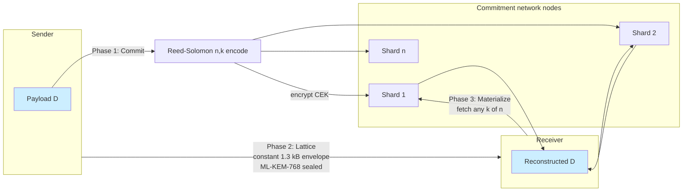
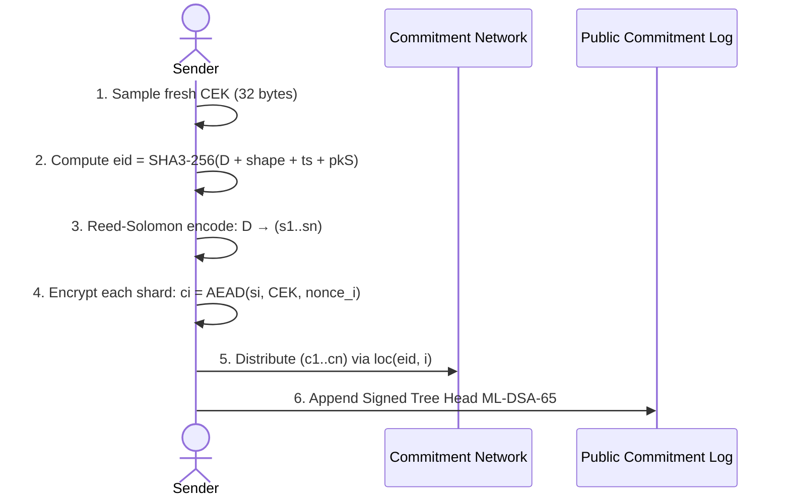
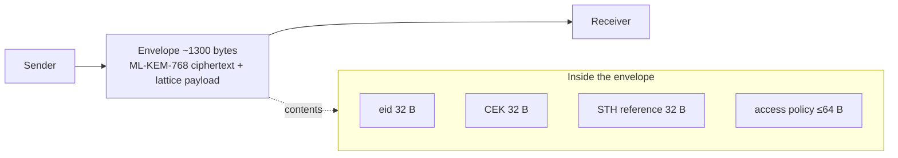
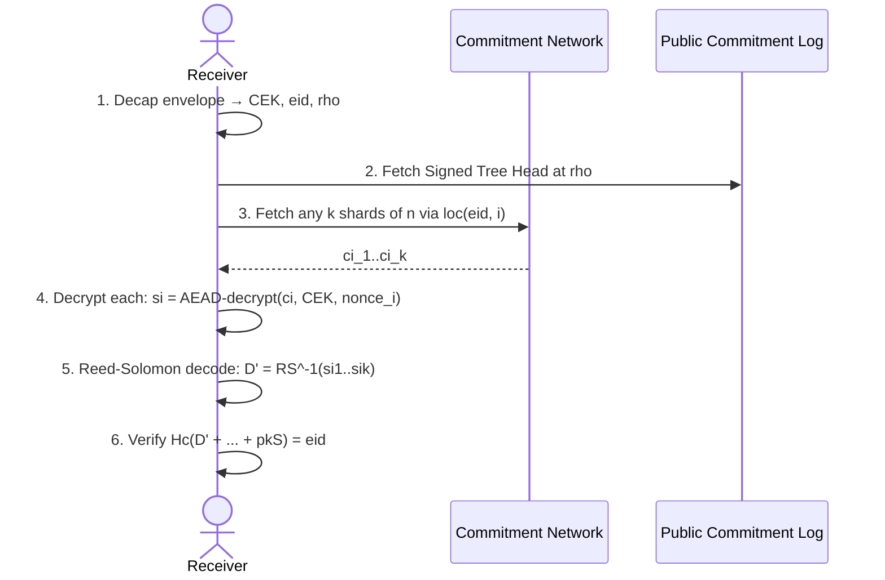
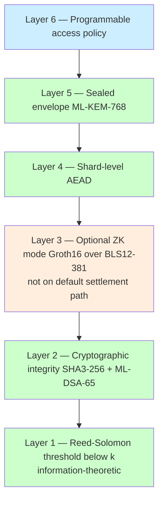
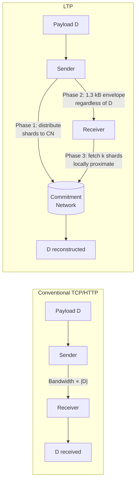
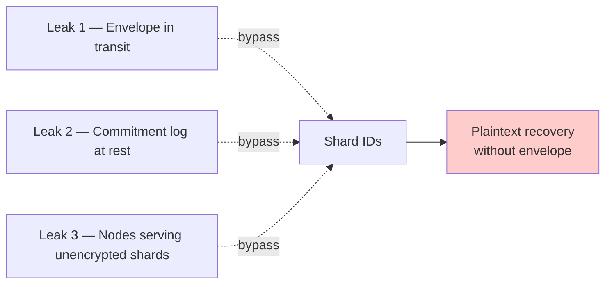
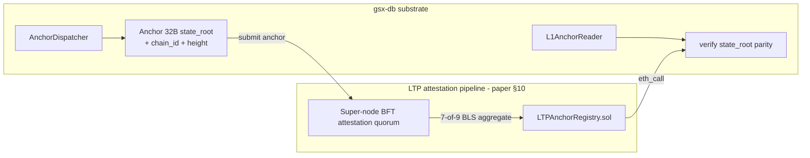

# LTP three-phase lifecycle

Per the LTP companion paper. GSX-DB integrates with LTP as both
**producer of anchors** (outbound, via `AnchorDispatcher`) and
**consumer of attestations** (inbound, via `L1AnchorReader`).

## The three phases

### Phase 1 — Commit

Sender encrypts and erasure-codes the payload, distributes shards
across the commitment network, anchors a Signed Tree Head on-chain:

### Phase 2 — Lattice (the constant-bandwidth phase)

Sender transmits a constant-size sealed envelope to the receiver,
independent of payload size:

After this transmission the sender may disconnect entirely. The
receiver has everything needed to reconstruct.

### Phase 3 — Materialize

Receiver unseals the envelope, fetches any k of n shards from the
geographically nearest nodes, decodes, and verifies:

## Six-layer security stack

Each layer addresses one threat surface; compromise of any single
layer leaves the others intact.

The plaintext-indistinguishability theorem (paper §5.2) relies on
Layers 1, 4, 5. Layers 2, 3, 6 strengthen orthogonal surfaces
without weakening the central confidentiality argument.

## Bandwidth profile

**The wire-cost of the sender-to-receiver path is constant.** Bandwidth
proportional to `|D|` is distributed across the commitment network
at commit time and reconstructed receiver-side at materialize time.

## The February 2026 critical finding

The original protocol design exposed shard identifiers in three
independent locations:

The fix (Option C in paper §6.2): encrypted shards with derivable
metadata. Receiver derives shard locations from the entity
identifier alone via `loc(eid, i)`; shard identifiers live only as
Merkle leaves in the commitment record. The lattice key shrank from
~869 B to ~160 B and closed all three leakage points.

## How gsx-db integrates

GSX-DB's anchor is a small input (`Anchor` ≈ 96 B) to the LTP
attestation pipeline. The LTP commitment on the base chain
(constant ~1,600 B per anchor) compresses regardless of payload
complexity.
