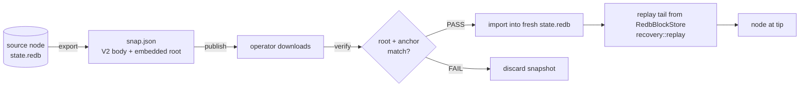

# Node bootstrap — snapshot export / import / verify

Operator flow for standing up a node from a state snapshot instead
of full genesis replay (gap item G5 in
[`../research/chain-gap-analysis-2026-07.md`](../research/chain-gap-analysis-2026-07.md);
peer practice: Tempo ships daily snapshots + a downloader, Arc
bootstraps new nodes snapshot-first).

The machinery is the S12.2 `StateSnapshot` (see
[`../spec/recovery.md`](../spec/recovery.md)); the
**`suwappudb-snapshot`** CLI packages it for operators:

```sh
cargo build --release -p suwappudb-server   # builds both binaries
target/release/suwappudb-snapshot --help
```

## Flow



### 1. Export (snapshot producer)

```sh
suwappudb-snapshot export \
    --db /var/lib/suwappudb/state.redb \
    --height 120000 \
    --out snapshot-120000.json \
    --anchor <64-hex>          # optional: anchor hash at that height
```

Reads the redb store, encodes the V2 body (balances + bytes column,
sorted by address, byte-idempotent per S12.5), recomputes the
state-tree root, and embeds it. Pass `--anchor` so downloaders can
cross-check the snapshot against the on-chain
`LTPAnchorRegistry` record for that height.

### 2. Verify (before it touches your node)

```sh
suwappudb-snapshot verify snapshot-120000.json --anchor <64-hex>
```

Restores into a scratch in-memory state and recomputes the tree
root. A snapshot whose JSON envelope is intact but whose body was
tampered with fails here with `state-root mismatch` (covered by
`crates/suwappudb-server/tests/snapshot_cli.rs`). Non-zero exit on
any failure, so it scripts cleanly.

Trust model: the embedded root is self-consistent, not
self-authenticating — a malicious producer can embed a root matching
tampered data. The root only becomes trustworthy when checked
against an external record: the `--anchor` hash (verified on-chain
via `LTPAnchorRegistry`) or a root obtained from a source you
already trust. Same model as every peer chain's snapshot
distribution; Arc/Tempo snapshots are trusted because the operator
publishes them over TLS, ours adds the anchor cross-check.

### 3. Import (fresh node)

```sh
suwappudb-snapshot import \
    --snapshot snapshot-120000.json \
    --db /var/lib/suwappudb/state.redb
```

Applies every snapshot entry into the (normally fresh) redb store
and re-verifies the root against the imported state. Importing into
a non-empty store is allowed but warned about: snapshot addresses
overwrite, other entries are left in place (`restore_into_state`
semantics — reset the store first for a hard restore).

### 4. Replay the tail

A snapshot is state-at-height, not the tip. Bring the node to the
tip by replaying blocks `height+1..` from the block log
(`RedbBlockStore` + `recovery::replay` — deterministic per
[`../spec/recovery.md`](../spec/recovery.md)). The server wiring for
"start from snapshot, then replay" is part of the v0.2.0 extended
bridge surface (Phase D); today the two steps are run by the
operator.

## Cadence + publication (not yet automated)

Peer practice is a daily published snapshot. `SnapshotManager`
already carries the policy knobs (`snapshot_interval`,
`max_snapshots`, `max_age_secs`); wiring it to a public artifact
bucket + checksum manifest is deliberately left until there is a
public network to serve (tracked as the remainder of G5).

## Commitment-scheme caveat

Roots are computed with the build's active scheme — BLAKE3 by
default, banderwagon+IPA under `production-verkle`. Producer and
verifier must run binaries built with the same feature set, or the
root check fails spuriously.
