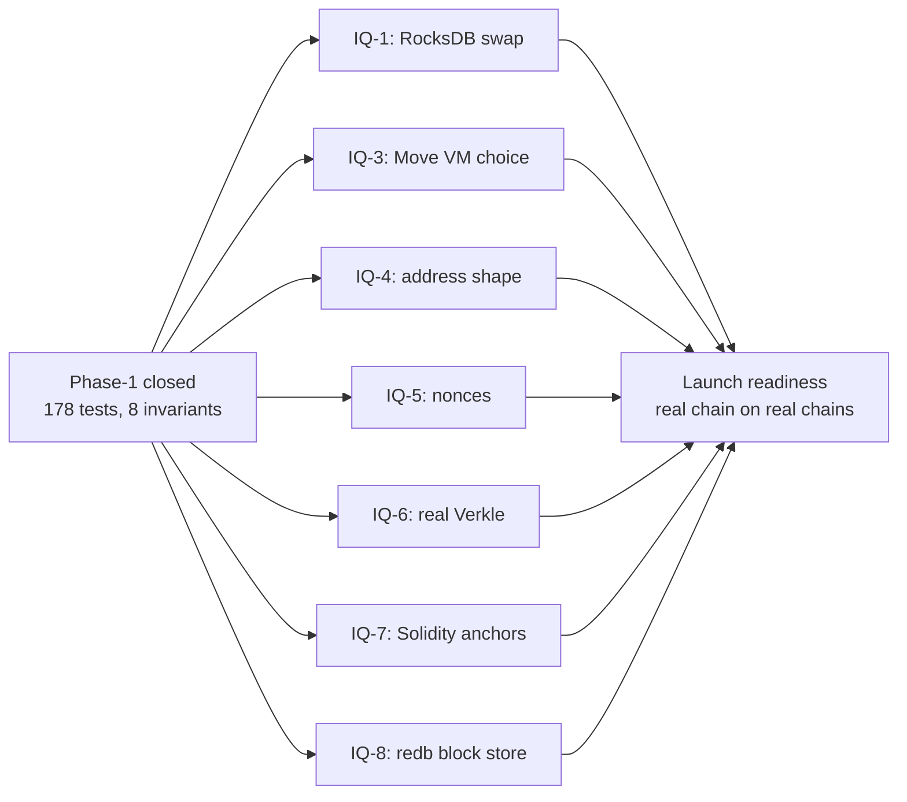
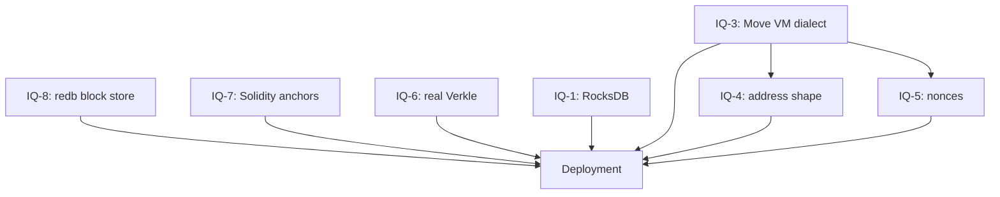
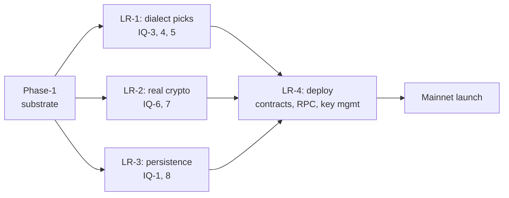

# Open IQs — launch-readiness backlog

Phase-1 deferred several decisions to launch readiness. Each is a real
piece of work; each has a swap point already wired so the swap is
mechanical when the time comes.

## Deferred decisions

## What each one swaps

| IQ | What's there now | What launch ships | Swap point |
|---|---|---|---|
| [IQ-1](../iq/IQ-1-redb-vs-rocksdb.md) | redb state backend | RocksDB | `BalanceStore` trait + feature flag |
| [IQ-3](../iq/IQ-3-move-vm-choice.md) | `MockMove` | a chosen Move VM (Aptos / Sui / hand-rolled / new) | `BundleGenerator` registry entry |
| IQ-4 (placeholder) | 20-byte address | likely 32-byte (Aptos Move) or 20-padded | `Address` newtype shape |
| IQ-5 (placeholder) | no nonces | EVM nonces + signing | new field on `Intent` + bridge validation |
| [IQ-6](../iq/IQ-6-verkle-commitment.md) | BLAKE3 256-ary | IPA over banderwagon | `tree::commit::commit_node` |
| [IQ-7](../iq/IQ-7-anchor-parity.md) | in-memory log + MAC | Solidity contract + ECDSA | `Anchor::compute_mac` + `AnchorLog::append` storage |
| [IQ-8](../iq/IQ-8-recovery-store-inmemory-vs-redb.md) | `InMemoryBlockStore` | `RedbBlockStore` | `BlockStore` trait |

## Decision graph — what unblocks deployment

This view is deployment-focused. For the Phase-1 → IQ cascade (different
framing), see [iq/README.md#decision-flow](../iq/README.md#decision-flow).

IQ-3 (Move VM dialect) unblocks IQ-4 and IQ-5 — the dialect choice
constrains the address shape and nonce semantics. Everything else
parallelises.

## Launch readiness as its own sprint

Phase-1 closed the substrate. Launch readiness is a separate
multi-sprint effort:

The phase-1 property tests guarantee structural invariants stay
verified through every swap. That's the value the trait abstractions
were buying — they convert "swap the Move VM" from a major rewrite
into a single-module change.

## What's NOT in any IQ (yet)

These are real launch concerns we haven't surfaced as IQs because
phase-1 didn't reach them:

- **Validator set / consensus.** Phase-1 has no notion of "who can
  produce a block." `BlockExecutor` accepts any `Vec<Intent>` from
  any caller.
- **Fee market.** No gas, no priority fees, no MEV.
- **Mempool.** Phase-1 doesn't model pending transactions across
  blocks.
- **Networking layer.** No P2P, no gossip, no sync protocol.
- **JSON-RPC / EVM-compatible API.** No external query layer.
- **Genesis / chain configuration.** Phase-1 starts from `State::default()`.
- **Reorg handling.** Linear chain only; multi-parent DAG is sketched
  but not implemented.

Each of these will probably surface its own IQ when picked up.

## Reading order for the backlog

If you're picking up launch readiness, suggested order:

1. **IQ-3 first** — Move VM dialect cascades into IQ-4 and IQ-5
2. **IQ-1, IQ-8** in parallel — both are "swap to durable storage"
3. **IQ-6** — real Verkle is straightforward once you've picked an impl
4. **IQ-7** — needs validator-set design first; bigger sprint than the others

Then the not-yet-IQ'd items above (consensus, fees, mempool, RPC,
networking, reorg) — each its own sprint.
