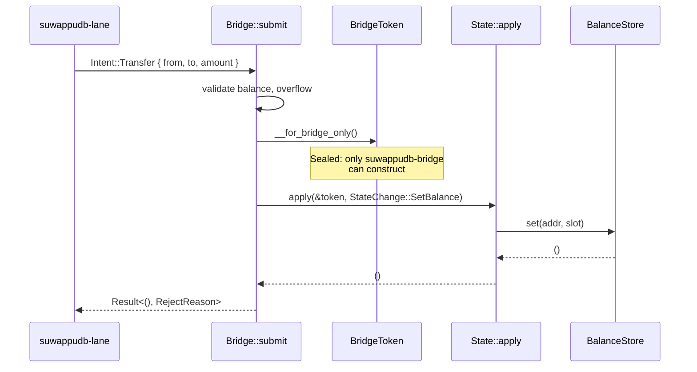
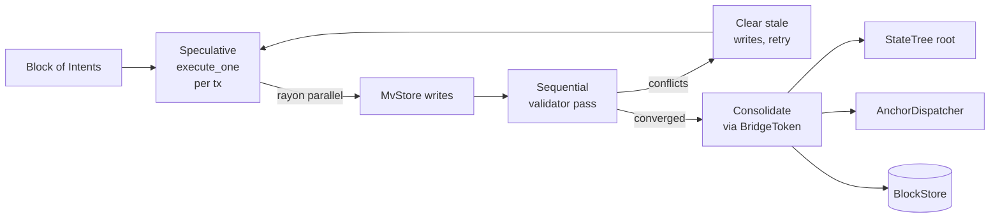

# Overview

## Why this exists

Most cross-VM chain designs synchronize EVM and Move state through a
bridge. Bridges have lost the industry tens of billions of dollars.
Suwappu-DB takes the opposite approach: **one canonical state, two
projections, no internal bridge**.

EVM `balanceOf(addr)` and Move `Coin::value(&Coin)` for the same
address are projections of a single `BalanceSlot`. They cannot
disagree because there is nothing for them to disagree about.

## The three crates

```mermaid
flowchart LR
    Lane[suwappudb-lane<br/>untrusted ingest]
    Bridge[suwappudb-bridge<br/>capability gate +<br/>block execution]
    State[suwappudb-state<br/>canonical state +<br/>tree + storage]
    Lane -- Intent --> Bridge
    Bridge -- BridgeToken --> State
    Lane -. cannot import .-X State
```

| Crate | What it owns | Who can mutate it |
|---|---|---|
| `suwappudb-lane` | Untrusted ingest of `Intent`s | nothing — read-only data layer |
| `suwappudb-bridge` | Validation, OCC scheduler, bundle atomicity, anchor dispatch, recovery | itself, by minting `BridgeToken`s |
| `suwappudb-state` | `BalanceSlot`, `BalanceStore`, `StateTree`, the canonical state | only callers holding a `BridgeToken` |

The lane crate is **structurally forbidden** from importing
`suwappudb-state`. This is enforced two ways:

1. **At the type level** — `State::apply` requires a `BridgeToken`,
   whose constructor is named `__for_bridge_only` and is callable
   only from `suwappudb-bridge` (lane code that imports it gets a sealed
   token).
2. **At build time** — `scripts/check-lane-separation.sh` searches
   the lane crate for any path leading to `suwappudb-state` and fails
   the build on violation.

## The capability-gated mutation path



No path to `Store::set` exists outside this flow. The compiler
enforces it.

## What runs in parallel, what runs sequentially



Aptos Block-STM in shape. Per-tx-index ordering. Outcomes depend only
on the input intent order, not the rayon thread schedule. Verified at
10k cases by `parallel_equals_sequential` and the recovery-replay
tests (S4 + S8).

## What the chain commits to per block

After every block:

1. **Canonical state** is updated through the bridge gate.
2. **State tree** root is recomputed (256-ary, BLAKE3 per
   [IQ-6](../iq/IQ-6-verkle-commitment.md), Verkle-shaped for
   future swap).
3. **Anchor** is dispatched to every registered chain (one per chain,
   MAC'd under that chain's key, linked via `parent_anchor`).
4. **Block** is appended to `BlockStore` (in-memory in phase-1, redb
   in S8.5 per [IQ-8](../iq/IQ-8-recovery-store-inmemory-vs-redb.md)).

All four steps are deterministic functions of the same input
(seeded state + ordered intents). Recovery via `replay` reproduces
all four bit-for-bit.

## What's swappable, what's structural

| Layer | Phase-1 impl | Production swap | Swap point |
|---|---|---|---|
| State backend | redb | RocksDB | `BalanceStore` trait |
| EVM execution | `MockEvm` | revm | `BundleGenerator` registry entry |
| Move execution | `MockMove` | Aptos Move VM adapter (S9 decision gate per IQ-3) | `BundleGenerator` registry entry |
| Tree commitment | BLAKE3 hash | IPA over banderwagon | `tree::commit::commit_node` |
| Anchor auth | BLAKE3 keyed-MAC | ECDSA / EdDSA | `Anchor::compute_mac` |
| Anchor storage | in-memory | Solidity `LTPAnchorRegistry` | `AnchorLog` trait surface |
| Block store | in-memory | redb | `BlockStore` trait |

The trait surfaces are the load-bearing structure. Every property
test runs against the trait, not the impl, so all 178 phase-1 tests
stay green under any of the swaps above.
