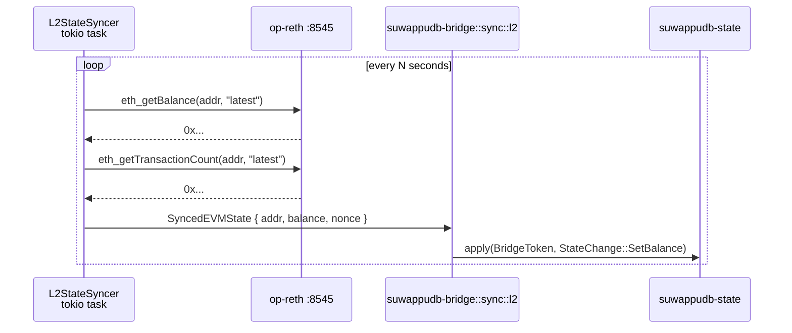
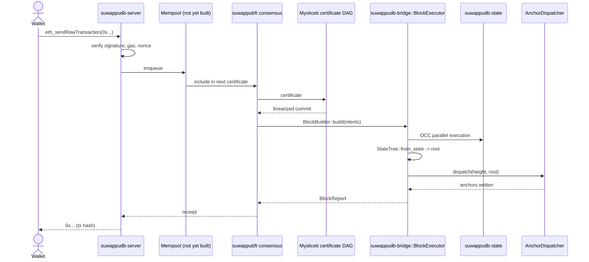
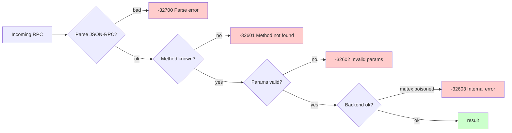

# Request lifecycle

What happens between a wallet calling an RPC method and getting a
response back. Covers the read path (`suwappu_getBalance`,
`suwappu_getStateRoot`) today and the write path
(`suwappu_sendTransaction` / `eth_sendRawTransaction`) at launch.

## Read path (live in phase-1)

```mermaid
sequenceDiagram
    actor Wallet
    participant Server as suwappudb-server (Axum)
    participant Lock as Arc&lt;Mutex&lt;State&gt;&gt;
    participant State as suwappudb-state
    participant Tree as StateTree
    Wallet->>Server: HTTP POST /<br/>{method: "suwappu_getBalance",<br/> params: [addr]}
    Server->>Server: parse JSON-RPC envelope
    Server->>Lock: lock.lock().await
    Lock-->>Server: &State guard
    Server->>State: state.balance_of(&addr)
    State-->>Server: Balance(u128)
    Server-->>Wallet: { jsonrpc: "2.0",<br/>  result: "0x...",<br/>  id: N }
```

The mutex serialises reads against writes; concurrent readers
contend only on the lock acquisition. Phase-1 uses a single
`Arc<Mutex<State>>` — production swaps to `Arc<RwLock<State>>` or a
read-only snapshot strategy when the read-write ratio justifies it.

## State-root query (cross-chain verification)

```mermaid
sequenceDiagram
    actor Auditor
    participant Server as suwappudb-server
    participant State as suwappudb-state
    participant Tree as StateTree
    Auditor->>Server: suwappu_getStateRoot
    Server->>State: state.entries()
    State-->>Server: Vec<(Address, BalanceSlot)>
    Server->>Tree: StateTree::from_entries(...)
    Tree-->>Server: tree
    Server->>Tree: tree.root()
    Tree-->>Server: Commitment([u8; 32])
    Server-->>Auditor: { result: "0x..." }
```

Phase-1 rebuilds the tree per query. S6.5 introduces incremental
caching with explicit dirty marks — same `tree.root()` API.

## L2 shadow sync (Option A deployment)



The shadow path is the only place where on-chain data enters
suwappu-db state via the bridge's capability gate; lane code never
touches op-reth directly.

## Write path (target — launch)

At launch, wallets submit `eth_sendRawTransaction` against
suwappu-db's RPC endpoint, which lifts the tx into the consensus layer:



Missing pieces today (each its own sprint):

| Component | Status |
|---|---|
| `eth_*` RPC method handlers | not implemented |
| Mempool | not implemented |
| Mysticeti consensus integration | via `BlockBuilder` trait, not yet wired |
| Gas / fee market | not implemented |

## Error surface



Standard JSON-RPC 2.0 error codes. suwappudb-server adds one extension
code `-32100` for "state not yet synchronized" used when the shadow
syncer hasn't caught up.

## Latency budget

Per the academic paper §6.1 target:

| Stage | Target latency |
|---|---|
| Certificate production | 500 ms |
| Reliable broadcast | 500 ms |
| DAG round advance | 500 ms |
| Leader commit | 500 ms |
| Network delay variance | 1,000 ms |
| **End-to-end p95 finality** | **~3 s** |

Fast-path lane (single-owner objects, paper §6.4) compresses to
**100–200 ms p95**.

Phase-1 substrate's contribution to this budget:

| Stage | Phase-1 cost |
|---|---|
| Block execution (10–50 txs) | <50 ms |
| Tree rebuild + root commit | <20 ms |
| Anchor dispatch (in-memory) | <1 ms |
| Block put → redb | ~5 ms |

So the substrate is comfortably below the consensus envelope per
the §13 evaluation numbers (72,000 TPS simple transfer, paper §13.2).
