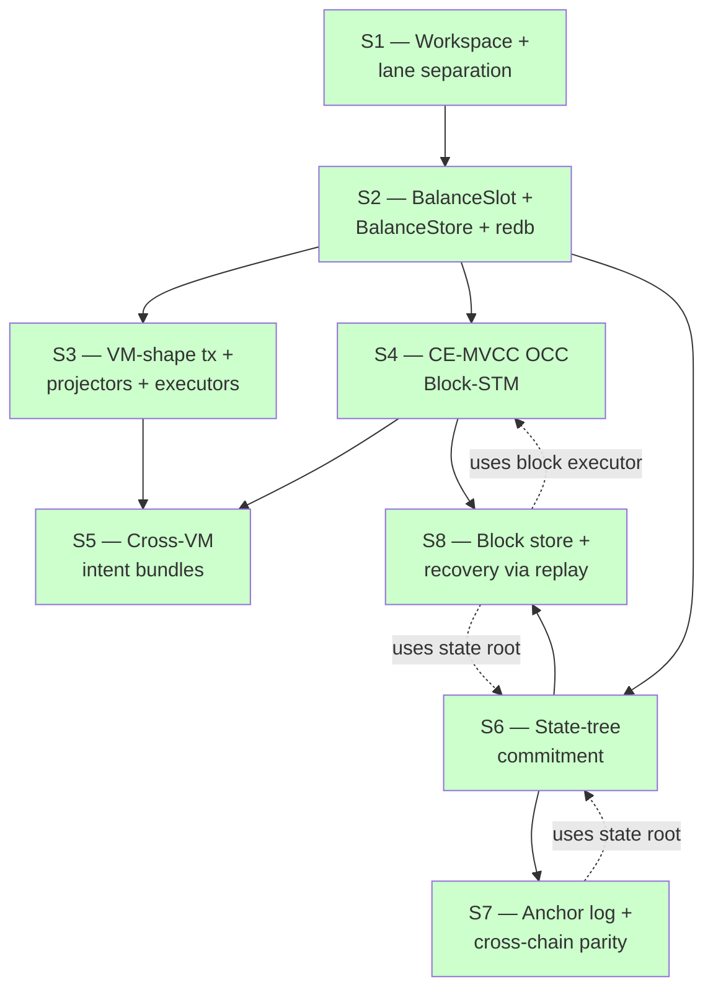
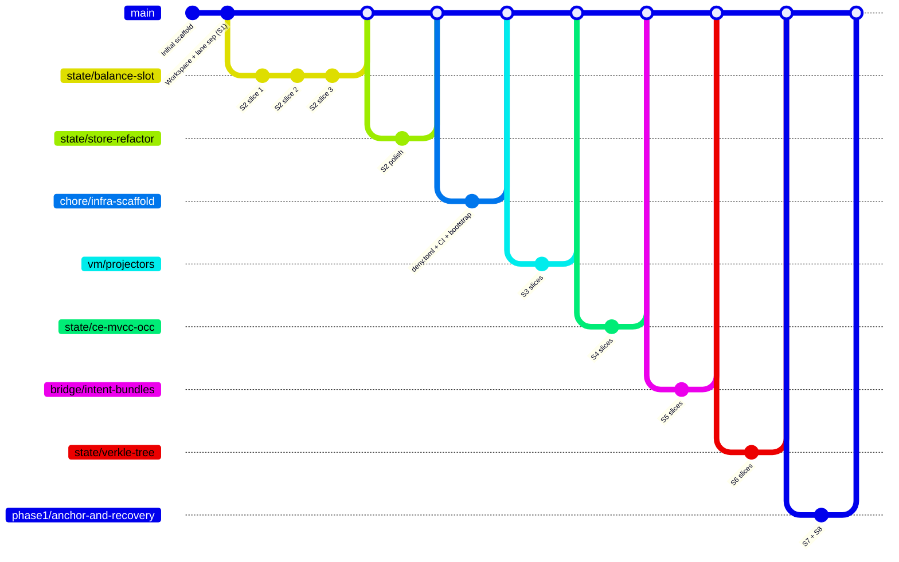

# Sprint map

Phase-1 sprint dependency DAG, what each sprint introduced, and which
property test closes it.

## Dependency graph



All 8 closed (green). Every sprint's exit gate is a 10,000-case
property test.

## What each sprint introduced

| Sprint | Crate | Module | Key types |
|---|---|---|---|
| S1 | gsxdb-state, gsxdb-bridge, gsxdb-lane | (workspace) | `Address`, `Balance`, `BridgeToken`, `State`, `Bridge` |
| S2 | gsxdb-state | `balance_slot`, `store`, `redb_store` | `BalanceSlot`, `EvmBalance`, `MoveCoinValue`, `BalanceStore`, `InMemoryBalanceStore`, `RedbBalanceStore` |
| S3 | gsxdb-state, gsxdb-bridge | `vm`, `vm::executor` | `EvmTx`, `MoveTx`, `EvmProjector`, `MoveProjector`, `EvmView`, `MoveView`, `MockEvm`, `MockMove` |
| S4 | gsxdb-bridge | `occ` | `MvStore`, `Txn`, `Validator`, `BlockExecutor`, `BlockReport`, `TxOutcome` |
| S5 | gsxdb-bridge | `bundle` | `Bundle`, `BundleStep`, `BundleExecutor`, `ContractRegistry`, `BundleGenerator`, `CallCtx`, `Intent::Call` |
| S6 | gsxdb-state | `tree` | `Node`, `Commitment`, `Proof`, `ProofStep`, `StateTree` |
| S7 | gsxdb-bridge | `anchor` | `ChainId`, `AnchorHash`, `Anchor`, `AnchorLog`, `AnchorDispatcher`, `ParityResult` |
| S8 | gsxdb-bridge | `recovery` | `Block`, `BlockHash`, `BlockStore`, `InMemoryBlockStore`, `replay`, `RecoveryError` |

## Exit gates

| Sprint | Exit-gate test | File |
|---|---|---|
| S1 | `check-lane-separation.sh` (script + capability gate) | `scripts/check-lane-separation.sh` |
| S2 | `redb_preserves_dual_projection` | `crates/gsxdb-state/src/redb_store.rs` |
| S3 | `interleaved_evm_move_preserves_invariant` | `crates/gsxdb-bridge/tests/cross_vm_parity.rs` |
| S4 | `parallel_equals_sequential` | `crates/gsxdb-bridge/tests/block_executor.rs` |
| S5 | `bundle_atomicity` | `crates/gsxdb-bridge/tests/cross_vm_bundles.rs` |
| S6 | `cross_tree_root_agreement` | `crates/gsxdb-state/tests/state_tree.rs` |
| S7 | `cross_chain_parity_holds` | `crates/gsxdb-bridge/tests/cross_parity.rs` |
| S8 | `recover_matches_live_state` | `crates/gsxdb-bridge/tests/recovery.rs` |


## Step-by-step execution plan (post phase-1)

The next delivery sequence is intentionally linear to reduce integration risk.
Each sprint has explicit implementation steps, verification steps, and a hard
exit gate.

### S8.5 — RedbBlockStore + replay persistence hardening (IQ-8) ✅ CLOSED

Landed in PR #2 (`Merge PR #2: redb-backed BlockStore + LTPAnchorRegistry + replay hardening`).

Delivered:
1. `RedbBlockStore` under `gsxdb-bridge::recovery::store` behind the existing
   `BlockStore` trait — no caller API changes.
2. Append + get_by_hash + get_by_height + latest + iter_from with deterministic
   height ordering. Tables: `blocks_by_hash` (`[u8;32] -> &[u8]`) and
   `height_to_hash` (`u64 -> [u8;32]`).
3. Block metadata persisted: `height`, `parent`, `state_root`, full intent list.
   Versioned encoding (`BLOCK_ENCODING_VERSION = 1`); unknown versions and
   truncated payloads reject without panic.
4. Replay path verified across restart simulations (execute → drop → reopen →
   verify identical state).
5. Fault-injection tests: `redb_corrupt_payload_is_rejected_without_panic` and
   `redb_aborted_write_txn_leaves_no_partial_state` cover the typed-error path
   and write-txn isolation.

Exit gate met: 12 redb-specific tests + 7 replay tests + 5 in-memory tests all
green in `cargo test -p gsxdb-bridge --lib recovery`. The pre-existing 10k-case
`recover_matches_live_state` invariant continues to hold with the persistent
backend.

### S9 — Real Move VM + address-shape + nonce semantics (IQ-3/4/5)

1. Select and freeze Move VM dialect + runtime interface (documented in IQ update).
2. Introduce a VM adapter trait boundary so mock and real Move VMs can be swapped in
   tests and benchmarks without changing executor code.
3. Add canonical address conversion policy (20-byte EVM ↔ 32-byte Move) with strict
   validation and deterministic normalization rules.
4. Define nonce model across EVM/Move paths (source of truth, increment rules,
   rejection behavior) and wire it through OCC execution.
5. Add cross-VM conformance tests for mixed address forms and nonce edge cases
   (replay, duplicate nonce, gap nonce, malformed address).
6. Exit gate: cross-VM parity properties remain green at 10k with real Move VM path
   enabled in the matrix.

### S10 — Real Verkle commitments + IPA witnesses (IQ-6)

1. Keep `StateTree` API stable; swap commitment backend from BLAKE3 placeholder to
   real Verkle commitment primitives.
2. Implement witness generation and verification for inclusion proofs with explicit
   domain separation and transcript binding.
3. Add deterministic vector tests and differential tests against a reference
   implementation (`go-ipa` parity harness).
4. Benchmark prover/verifier performance and memory at realistic key counts; publish
   limits and target budgets in docs.
5. Harden serialization format for commitments/proofs with versioning for forward
   compatibility.
6. Exit gate: `cross_tree_root_agreement` plus inclusion-proof differential parity
   pass at target scale (including large-N runs).

### S11 — Solidity `LTPAnchorRegistry` + ECDSA parity (IQ-7)

1. Implement Solidity contract surface for registry transitions matching Rust FSM
   exactly (same states, guards, and error classes).
2. Add ECDSA signing + verification pipeline for anchors (domain tag, chain id,
   height, root, replay protection).
3. Build shared parity fixtures used by both Solidity tests and Rust tests to avoid
   drift in accepted/rejected cases.
4. Add 36-pair conformance matrix tests and fuzz invalid signatures, bad transitions,
   and malformed payloads.
5. Integrate `scripts/cross-parity.sh` into CI so parity failures block merges.
6. Exit gate: full 36-pair parity matrix green with signature verification enabled.

### S12 — DAG store + snapshots + telemetry + shadow E2E (IQ-9)

1. Define DAG block data model (multi-parent links, canonicalization policy, and
   deterministic replay ordering).
2. Add snapshot/checkpoint mechanism to bound replay time and support fast startup.
3. Implement telemetry for execution/replay latency, conflict rate, anchor lag, and
   snapshot health.
4. Run long-horizon chaos scenarios (restart storms, delayed anchors, chain forks)
   and verify invariant preservation under stress.
5. Stand up testnet shadow mode and compare live-vs-shadow state roots continuously.
6. Exit gate: shadow E2E stability window completed with zero invariant violations and
   replay recovery within SLO.

## IQ decision points across sprints

```mermaid
flowchart LR
    S2 -- IQ-1 --> Backend[redb dev / RocksDB prod]
    S3 -- IQ-2 --> Mock[Mock VMs ship in S3<br/>real VMs fold into S5]
    S5 -.IQ-3.-> Move[Move VM dialect deferred to launch]
    S6 -- IQ-6 --> Verkle[BLAKE3 now / IPA at launch]
    S7 -- IQ-7 --> Anchor[in-memory + MAC now / Solidity + ECDSA at launch]
    S8 -- IQ-8 --> Store[in-memory now / redb at S8.5]
    S3 -.IQ-3 dissolved S3.5.-> X[real VM swap → S5]
```

Three IQs deferred for launch readiness: address shape (IQ-4),
nonces (IQ-5), and the broader Verkle/Solidity/Move VM choices.

## Test count per sprint (lib + integration)

| Sprint | Tests added | Cumulative |
|---|---|---|
| S1 | 6 | 6 |
| S2 | 30 | 36 |
| S3 | 16 | 52 |
| S4 | 27 | 79 |
| S5 | 25 | 104 |
| S6 | 30 | 134 |
| S7 | 23 | 157 |
| S8 | 21 | 178 |

(Some sprints also added tests to existing modules; the breakdown is
approximate but the cumulative is exact.)

## Branch history



Each merge preserves the per-slice commit structure under a
`--no-ff` merge commit. Sprint boundaries are visible in
`git log --oneline --graph`.

## Phase-1 invariants — full list

The chain enforces these at every block:

1. **Lane separation** (S1) — only `gsxdb-bridge` can mutate state
2. **Dual-projection** (S2) — EVM == Move for any balance, structurally
3. **Cross-VM canonical equivalence** (S3) — same logical op in both
   VM shapes ⇒ same canonical state
4. **Parallel = sequential** (S4) — block execution is deterministic
   independent of thread schedule
5. **Bundle atomicity** (S5) — a failed step ⇒ bundle as if never ran
6. **Tree determinism** (S6) — same state ⇒ same root
7. **Cross-chain parity** (S7) — anchored chains agree on root or
   disagreement is detectable
8. **Replay equivalence** (S8) — recovery ≡ live execution

Each is a 10k-case property test. Every IQ swap (real Move VM, real
Verkle, Solidity anchors, RocksDB store, redb block store) preserves
all eight.
