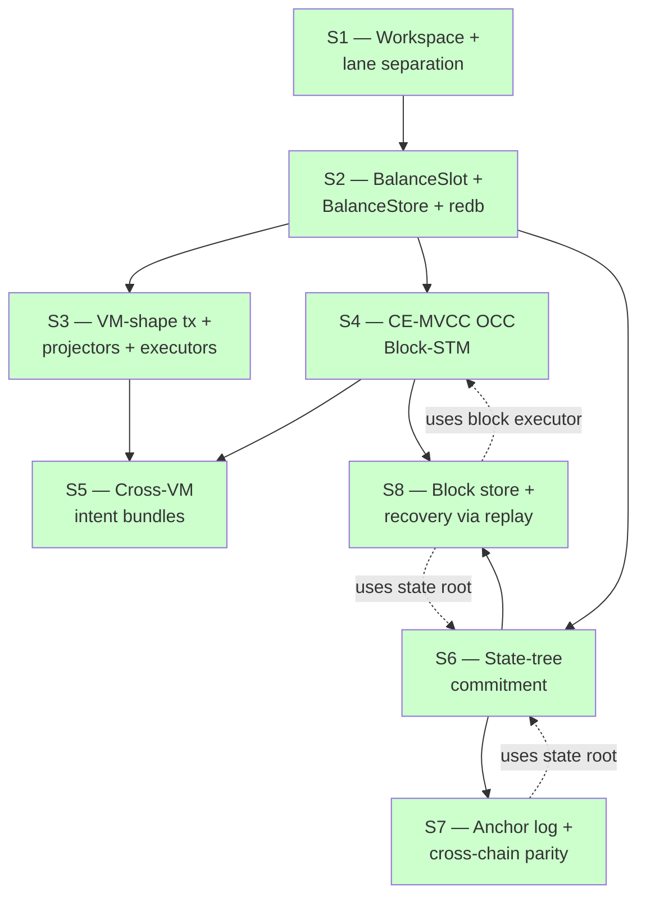
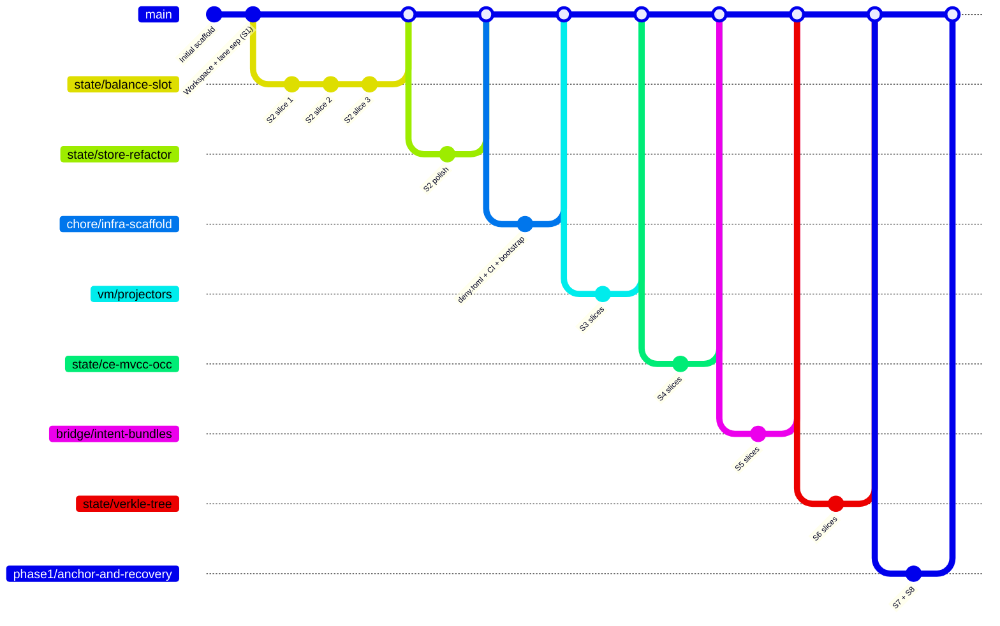

# Sprint map

Phase-1 sprint dependency DAG, what each sprint introduced, and which
property test closes it.

## Dependency graph



All 8 closed (green). Every sprint's exit gate is a 10,000-case
property test.

## What each sprint introduced

| Sprint | Crate | Module | Key types |
|---|---|---|---|
| S1 | gsxdb-state, gsxdb-bridge, gsxdb-lane | (workspace) | `Address`, `Balance`, `BridgeToken`, `State`, `Bridge` |
| S2 | gsxdb-state | `balance_slot`, `store`, `redb_store` | `BalanceSlot`, `EvmBalance`, `MoveCoinValue`, `BalanceStore`, `InMemoryBalanceStore`, `RedbBalanceStore` |
| S3 | gsxdb-state, gsxdb-bridge | `vm`, `vm::executor` | `EvmTx`, `MoveTx`, `EvmProjector`, `MoveProjector`, `EvmView`, `MoveView`, `MockEvm`, `MockMove` |
| S4 | gsxdb-bridge | `occ` | `MvStore`, `Txn`, `Validator`, `BlockExecutor`, `BlockReport`, `TxOutcome` |
| S5 | gsxdb-bridge | `bundle` | `Bundle`, `BundleStep`, `BundleExecutor`, `ContractRegistry`, `BundleGenerator`, `CallCtx`, `Intent::Call` |
| S6 | gsxdb-state | `tree` | `Node`, `Commitment`, `Proof`, `ProofStep`, `StateTree` |
| S7 | gsxdb-bridge | `anchor` | `ChainId`, `AnchorHash`, `Anchor`, `AnchorLog`, `AnchorDispatcher`, `ParityResult` |
| S8 | gsxdb-bridge | `recovery` | `Block`, `BlockHash`, `BlockStore`, `InMemoryBlockStore`, `replay`, `RecoveryError` |

## Exit gates

| Sprint | Exit-gate test | File |
|---|---|---|
| S1 | `check-lane-separation.sh` (script + capability gate) | `scripts/check-lane-separation.sh` |
| S2 | `redb_preserves_dual_projection` | `crates/gsxdb-state/src/redb_store.rs` |
| S3 | `interleaved_evm_move_preserves_invariant` | `crates/gsxdb-bridge/tests/cross_vm_parity.rs` |
| S4 | `parallel_equals_sequential` | `crates/gsxdb-bridge/tests/block_executor.rs` |
| S5 | `bundle_atomicity` | `crates/gsxdb-bridge/tests/cross_vm_bundles.rs` |
| S6 | `cross_tree_root_agreement` | `crates/gsxdb-state/tests/state_tree.rs` |
| S7 | `cross_chain_parity_holds` | `crates/gsxdb-bridge/tests/cross_parity.rs` |
| S8 | `recover_matches_live_state` | `crates/gsxdb-bridge/tests/recovery.rs` |

## IQ decision points across sprints

```mermaid
flowchart LR
    S2 -- IQ-1 --> Backend[redb dev / RocksDB prod]
    S3 -- IQ-2 --> Mock[Mock VMs ship in S3<br/>real VMs fold into S5]
    S5 -.IQ-3.-> Move[Move VM dialect deferred to launch]
    S6 -- IQ-6 --> Verkle[BLAKE3 now / IPA at launch]
    S7 -- IQ-7 --> Anchor[in-memory + MAC now / Solidity + ECDSA at launch]
    S8 -- IQ-8 --> Store[in-memory now / redb at S8.5]
    S3 -.IQ-3 dissolved S3.5.-> X[real VM swap → S5]
```

Three IQs deferred for launch readiness: address shape (IQ-4),
nonces (IQ-5), and the broader Verkle/Solidity/Move VM choices.

## Test count per sprint (lib + integration)

| Sprint | Tests added | Cumulative |
|---|---|---|
| S1 | 6 | 6 |
| S2 | 30 | 36 |
| S3 | 16 | 52 |
| S4 | 27 | 79 |
| S5 | 25 | 104 |
| S6 | 30 | 134 |
| S7 | 23 | 157 |
| S8 | 21 | 178 |

(Some sprints also added tests to existing modules; the breakdown is
approximate but the cumulative is exact.)

## Branch history



Each merge preserves the per-slice commit structure under a
`--no-ff` merge commit. Sprint boundaries are visible in
`git log --oneline --graph`.

## Phase-1 invariants — full list

The chain enforces these at every block:

1. **Lane separation** (S1) — only `gsxdb-bridge` can mutate state
2. **Dual-projection** (S2) — EVM == Move for any balance, structurally
3. **Cross-VM canonical equivalence** (S3) — same logical op in both
   VM shapes ⇒ same canonical state
4. **Parallel = sequential** (S4) — block execution is deterministic
   independent of thread schedule
5. **Bundle atomicity** (S5) — a failed step ⇒ bundle as if never ran
6. **Tree determinism** (S6) — same state ⇒ same root
7. **Cross-chain parity** (S7) — anchored chains agree on root or
   disagreement is detectable
8. **Replay equivalence** (S8) — recovery ≡ live execution

Each is a 10k-case property test. Every IQ swap (real Move VM, real
Verkle, Solidity anchors, RocksDB store, redb block store) preserves
all eight.
