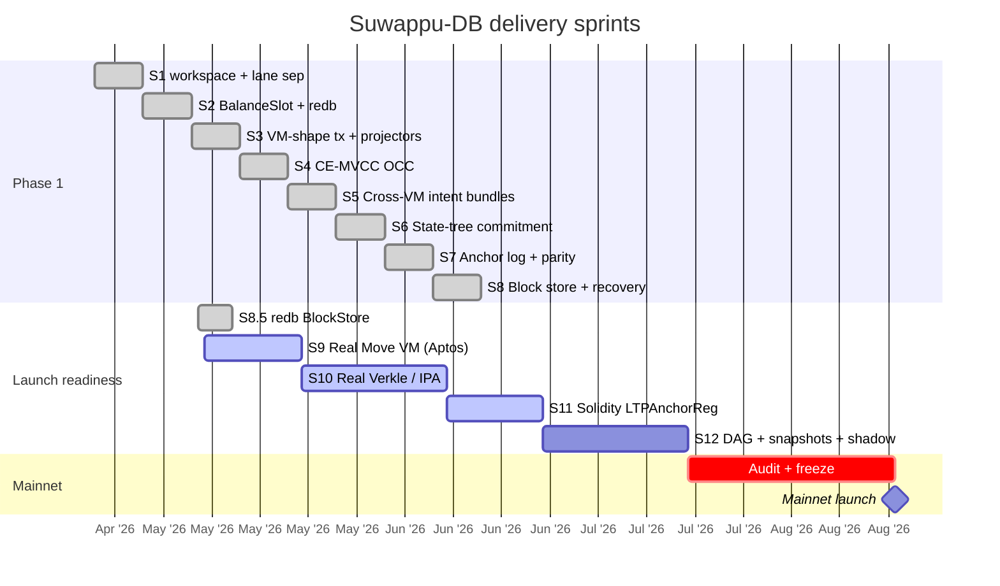
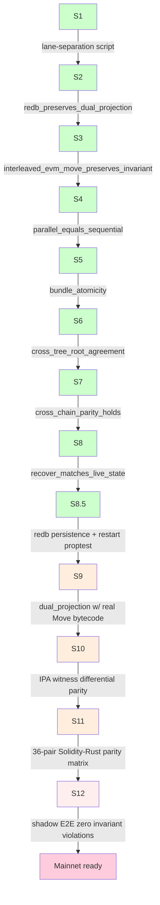
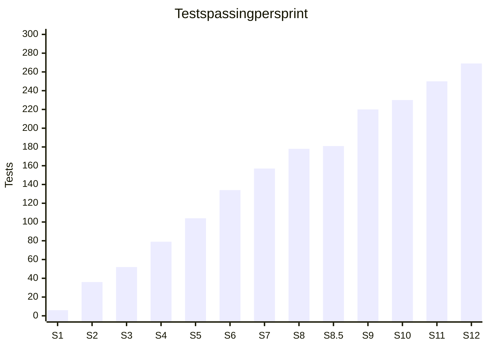

# Sprint timeline

Phase-1 closed + launch-readiness sprints in flight. Visual record
of when each sprint landed and what's still queued.

## Gantt

Phase-1 closed in 8 weeks (S1–S8); launch-readiness path adds
approximately 10–12 more weeks plus audit.

## Sprint exit gates (each is a 10,000-case property test)

Legend: green = closed, yellow = partial / in flight, pink = not
started.

## What each sprint introduced

| Sprint | Crate touched | Key types | LOC delta (approx) |
|---|---|---|---|
| S1 | workspace | `Address`, `Balance`, `BridgeToken`, `State`, `Bridge` | +1,200 |
| S2 | suwappudb-state | `BalanceSlot`, `BalanceStore`, `InMemoryBalanceStore`, `RedbBalanceStore` | +2,400 |
| S3 | suwappudb-state, suwappudb-bridge | `EvmTx`, `MoveTx`, `EvmProjector`, `MoveProjector`, `MockEvm`, `MockMove` | +1,800 |
| S4 | suwappudb-bridge | `MvStore`, `Txn`, `Validator`, `BlockExecutor`, `BlockReport` | +2,100 |
| S5 | suwappudb-bridge | `Bundle`, `BundleExecutor`, `ContractRegistry`, `BundleGenerator`, `Intent::Call` | +1,600 |
| S6 | suwappudb-state | `Node`, `Commitment`, `Proof`, `StateTree` | +1,400 |
| S7 | suwappudb-bridge | `Anchor`, `AnchorLog`, `AnchorDispatcher`, `ParityResult` | +1,200 |
| S8 | suwappudb-bridge | `Block`, `BlockStore`, `InMemoryBlockStore`, `replay` | +1,800 |
| S8.5 | suwappudb-bridge | `RedbBlockStore`, `BlockStoreError` | +600 |
| S9 | suwappudb-state | `MoveExecutor`, `AccountNonce`, `MoveAddress`, `address_shape` | +800 |
| S10 | suwappudb-state | `tree::verkle::GroupElement` (placeholder) | +200 |
| S11 | suwappudb-bridge | `AuthScheme`, `L1AnchorReader`, `LTPAnchorRegistry.sol` | +1,500 |
| S12 | suwappudb-state, suwappudb-bridge | `DagBlock`, `DagStore`, `SnapshotManager`, telemetry, shadow E2E | +1,800 |

## Test count growth

(Counts reproduced from sprint closeouts plus cumulative
integration tests.)

## What's still queued (post-S12)

- **Audit + freeze.** 30–60 days. Two independent audits expected
  (one on substrate, one on consensus + LTP).
- **Mainnet launch.** Gated on audit pass + IQ-1 RocksDB swap
  decision.
- **Phase-2.** Mempool, fee market, JSON-RPC `eth_*` compatibility,
  reorg handling at DAG level. Each its own sprint.
