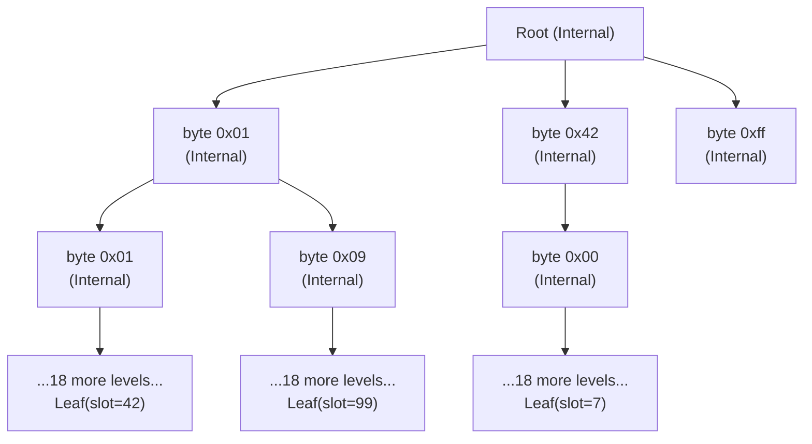
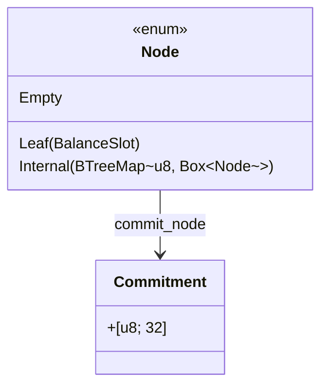
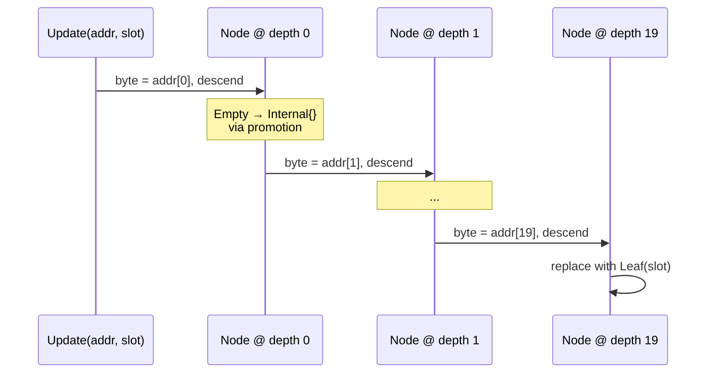
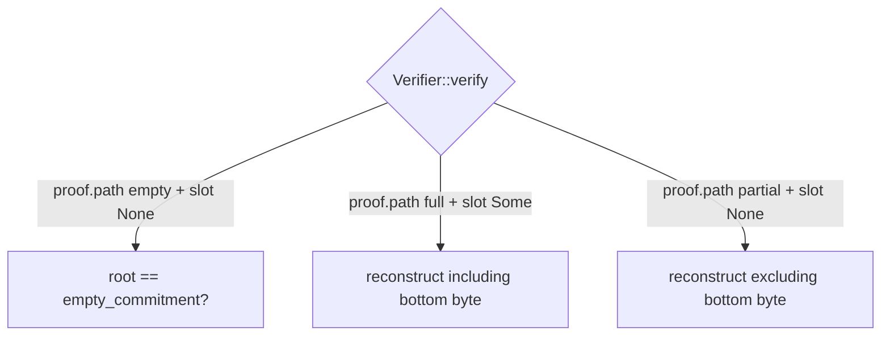
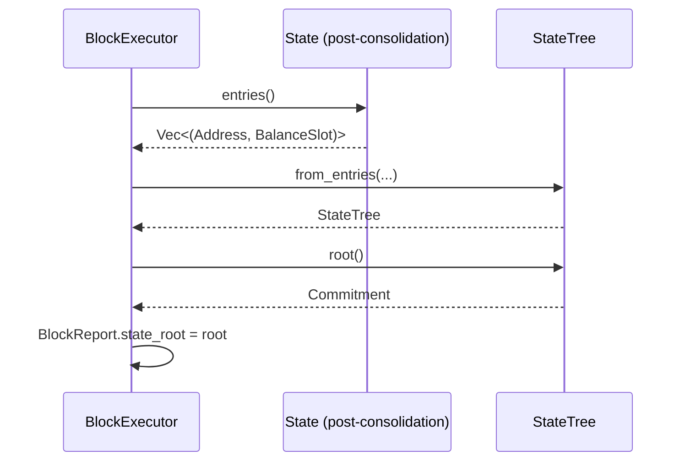

# State tree

Per-block commitment to the canonical state. 256-ary trie shape
(Verkle-aligned). Hash-based commitments now (BLAKE3 per
[IQ-6](../iq/IQ-6-verkle-commitment.md)); polynomial
commitments at launch.

## Tree shape



- **256-ary**: each internal node has up to 256 children, keyed by
  one byte of the address path
- **Depth 20**: address is 20 bytes; leaf depth is exactly the
  address length
- **Sparse**: `BTreeMap<u8, Box<Node>>` per internal node — only
  populated children take memory, ordered keys give deterministic
  commitment input
- **Empty subtrees collapse**: an unallocated subtree is `Node::Empty`
  with a fixed precomputed commitment

## Node types



## Commitment scheme

```
empty_commitment       = BLAKE3("Suwappudb-TREE/EMPTY")
commit(Empty)          = empty_commitment
commit(Leaf(slot))     = BLAKE3("Suwappudb-TREE/LEAF_" | slot.canonical().to_be_bytes())
commit(Internal(kids)) = BLAKE3("Suwappudb-TREE/INT__"
                                | for (byte, child) in sorted(kids):
                                    byte (1B) | commit(child) (32B))
```

Domain-separated tags (`EMPTY`, `LEAF_`, `INT__`) prevent cross-type
collisions. Internal nodes iterate via `BTreeMap` for deterministic
ordering — same logical state always produces the same commitment
regardless of how children were inserted.

## Insert path



Updates allocate intermediate `Internal` nodes lazily as the path
descends. Empty subtrees promote to `Internal({})` on first write.

## Proof shape

Two flavours: inclusion (full depth) and absence (early termination).

### Inclusion proof (depth 20, slot = Some)

```mermaid
flowchart LR
    Root --> Step0[ProofStep<br/>byte=addr0<br/>siblings={...}]
    Step0 --> Step1[ProofStep<br/>byte=addr1<br/>siblings={...}]
    Step1 --> Stepn[...]
    Stepn --> Step19[ProofStep<br/>byte=addr19<br/>siblings={}]
    Step19 --> Leaf[Leaf(slot)]
```

The bottom step's byte contributes the leaf commitment to its
parent's reconstruction. Verifier walks root → leaf, rebuilding each
internal commitment from `current` + `siblings`.

### Absence proof — early termination (depth K < 20, slot = None)

```mermaid
flowchart LR
    Root --> Step0[ProofStep<br/>byte=addr0<br/>siblings={1: c1, 5: c5}]
    Step0 --> Stepk[ProofStep at depth K<br/>byte=addrK<br/>NO CHILD AT byte]
    Stepk -.terminates here.-> X[no further<br/>steps recorded]
```

The proof terminates at the first depth where `addr_byte` has no
child. Verifier excludes that byte from the parent's reconstructed
commitment (which is what the actual tree did).

### Absence proof in empty tree

`path` is empty. Verifier checks `root == empty_commitment`. Done.

## Why three flavours



Distinguishing them was the bug found mid-S6: an absence proof
that pads to full depth ends up adding phantom (byte, computed)
entries to parent commitments, breaking verification. Variable-
length proofs + an `include_self_in_parent` flag at the bottom
step is the fix.

## Block-level integration



Phase-1 rebuilds the entire tree from full state every block. S6.5
will introduce incremental updates touching only changed paths;
trait surface unchanged.

## Witness size — phase-1 vs launch

| Case | Phase-1 (BLAKE3) worst case | Launch Verkle (IPA) |
|---|---|---|
| Inclusion | 20 levels × 255 sib × 32B = ~163KB | ~200B |
| Absence (early term) | depth × 255 × 32B, depth ≤ 20 | ~200B |
| Empty tree | 0B | 0B |

Stateless light clients are gated on the swap to real Verkle. Per
IQ-6, this is a launch-readiness item — the property tests
(`cross_tree_root_agreement`, `tampered_slot_rejected`, etc.) stay
green under the swap because they test commitment semantics, not
witness size.

## What gets verified at 10k cases

- Determinism: same state ⇒ same root, regardless of insert order
- Sensitivity: any state change ⇒ different root
- Inclusion: every inserted address has a verifying proof
- Absence: every uninserted address has a verifying absence proof
- Tamper resistance: bumped-slot claims are rejected
- Cross-tree agreement: sequential vs from-effective-map produce the
  same root and both verify all inclusions
