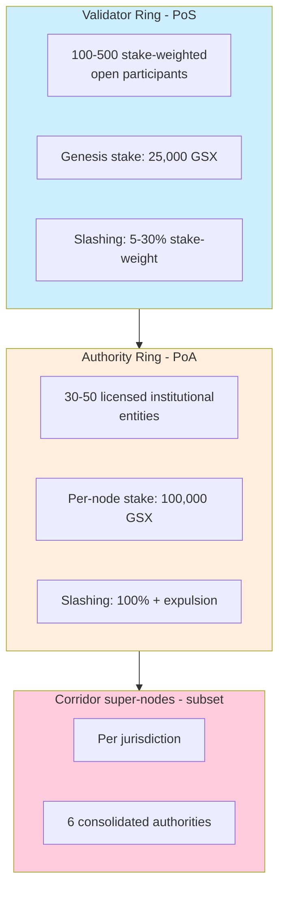
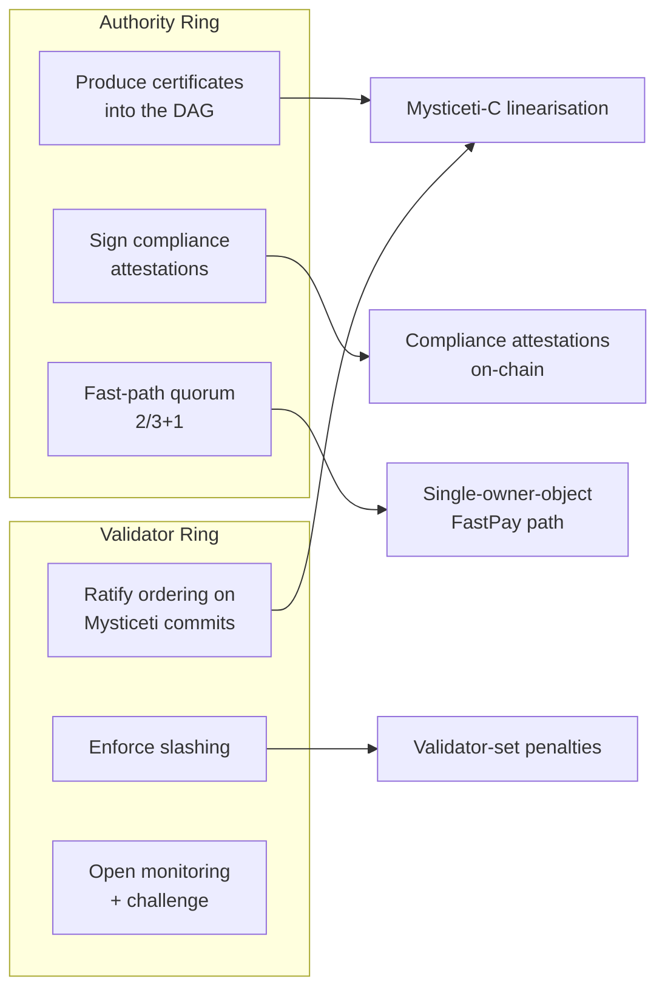
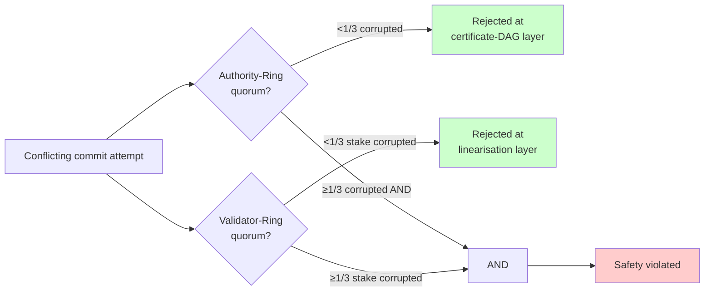
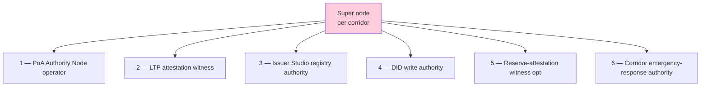
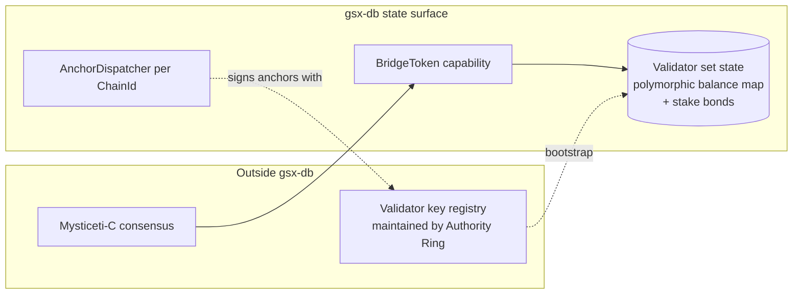

# Dual-ring validator set

Per the GSX DAG L1 paper §5: the validator set is decomposed into
two concentric quorums with independent admission gates and
independent corruption profiles.

## The two rings

## What each ring does

## Why two rings (paper §5.3)

A single-ring chain forces a choice between:

- **Closed validator set** — compliance trust at the cost of
  distributed economic security
- **Open validator set** — economic security at the cost of
  identifiable regulated counterparties

The dual-ring construction sidesteps this by separating the
functions across two quorums whose admission gates and corruption
profiles are independent.

## Safety theorem (paper §11, Theorem 2)

A safety violation requires Byzantine corruption of **both** ring
quorums **simultaneously**. The AND-gate is the structural property
institutional counterparties demand.

## Why the corruption events are independent (paper §11)

| Independence axis | Authority Ring | Validator Ring |
|---|---|---|
| Admission gate | regulatory licensure (KYC, jurisdiction) | open stake (any party with 25,000 GSX) |
| Operator population | licensed institutions | open market participants |
| Slashing incentive | per-Authority-Node 100% + expulsion | stake-weighted 5–30% |
| Geographic distribution | concentrated in regulated jurisdictions | unbounded (any IP) |

These independencies justify multiplying corruption probabilities
when bounding the joint attack probability.

## Super-node consolidated role (paper §9)

A super node is a **single permissioned legal entity** that holds,
for an assigned jurisdictional corridor, all six authorities
simultaneously:

### Why consolidation

Aligns cryptographic, economic, and legal accountability surfaces —
the same legal entity that operates an Authority Node also signs
issuer-registry writes, issues DID credentials, and serves as LTP
attestation witness for its corridor. Eliminates the categorical
class of attacks that exploit divergence between bridge operators
and identity authorities.

### Concentration risk (paper §9)

A super-node compromise propagates across all six authority surfaces
simultaneously. Bounded by four mitigations:

1. **Quorum tolerance** — 7-of-9 LTP attestation quorum tolerates
   sub-quorum minority of compromised witnesses
2. **Dual-bond posture** — base-chain PoS stake + LTP corridor bonds
   sized to 5% of 90-day average attestation notional
3. **Recovery posture** — corridor-scoped suspension within 72 hours,
   fail-closed registered-issuer precompile, corridor reconstitution
   under fresh keys
4. **Governance staging** — from Phase G3 forward, super-node
   admission moves under Concord Council binding authority

## How gsx-db sees the validator set

gsx-db's substrate doesn't enforce ring membership — that's the
consensus layer's job. The substrate holds the validator-set state
(stake bonds, slashing balances, attestation keys) in the same
polymorphic balance map as every other on-chain field. Ring-specific
behaviour (admission, slashing, ratification) sits in the consensus
crate (`gsxbft`).
