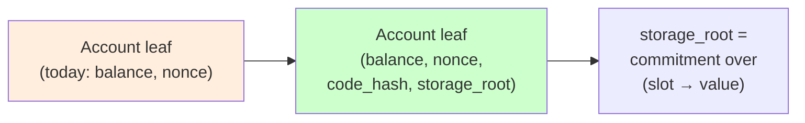

# IQ-10: EVM contract state in the verkle state root

**Status:** Accepted (design)
**Date:** 2026-05-27
**Sprint context:** Real EVM (post-`production-evm-executor`) — contract
execution increment (unit 3). Follows IQ-2 (mock→real VMs) and IQ-6
(state-tree commitment).



---

## Question

The real EVM executor (`production-evm-executor`) now runs contract
bytecode and persists code + storage in suwappu-db's EVM-only `evm_code` /
`evm_storage` / `evm_account_code` stores. But the state root
(`StateTree`, IQ-6) commits only `Address → BalanceSlot` (balance +
nonce). **Contract code and storage are not committed in the root**, so
two validators can agree on every balance yet silently diverge on
contract state — a consensus break. How do we commit EVM-only code +
storage in the root while preserving the dual-projection (Proposition 1)
invariant and determinism?

## Decision

> **Revised 2026-05-27 (implementation).** The original draft extended the
> per-account *leaf* to bind `(balance, nonce, code_hash, storage_root)`.
> Implementing that revealed it changes the **IQ-6 inclusion-proof format**:
> a contract leaf can no longer be verified from a `BalanceSlot` alone — the
> proof must also carry `code_hash` + `storage_root` — reworking a tested,
> stateless-client-facing interface. The decision below keeps the same core
> property (EVM code + storage committed in the root, outside the
> dual-projection) with a much smaller blast radius.

**Commit EVM state as a second sub-tree, combined into the root:**

```
state_root = H( "SUWAPPUDB-STATE-ROOT" || balance_tree_root || evm_state_root )
```

- `balance_tree_root` — the **existing** `StateTree` over `Address →
  BalanceSlot` (IQ-6), **unchanged**: leaves, proofs, and tests untouched.
- `evm_state_root` — a new commitment over EVM-only state. For each EVM
  account (sorted by address): `H(addr || code_hash || storage_root)`,
  where `storage_root = H(sorted (slot || value))` over that account's
  storage. Accounts with neither code nor storage don't contribute.
- `H` is BLAKE3 in phase-1 (matching IQ-6's phase-1 scheme); the
  `production-verkle` swap tracks IQ-6 as a follow-on.

### Why two sub-trees combined (not a single extended leaf)

The single-leaf design is Ethereum-faithful but reworks the
consensus-critical balance tree **and its proof format** (every contract
inclusion proof must carry code_hash + storage_root). The combined design
is **additive**: the balance tree + its IQ-6 proofs are untouched, EVM
code/storage live in a separate sub-tree, and the two are bound at the
top. Same security (the root is a deterministic function of *all* state,
incl. EVM code + storage); far smaller blast radius. **Open tension:**
Ethereum Verkle uses a single flattened tree; revisit at the mainnet
Verkle decision.

### Dual-projection (Proposition 1) is unaffected

`EvmView::balance_of` and `MoveView::coin_value` still read the canonical
`BalanceSlot` balance; `code_hash`/`storage_root` are **EVM-only state,
committed in the root for consensus but never projected**. The Move VM
has no code or storage, so projection equality continues to govern
balances (and nonce) only. The leaf grows, the projection does not.

### This is a state-root recipe change

Like IQ-6's V1→V2, binding the EVM sub-tree into the root changes every
root. **No mainnet state exists; testnet wipes on re-genesis.** The cutover
is a hard fork at the substrate-state-root level and must land atomically
across validators (consistent with the substrate-cutover constraint in
suwappu-dag).

## Implementation surface

- `suwappudb-state` — `State::evm_state_root()` commits EVM-only state from
  `evm_account_code` / `evm_code` / `evm_storage` (sorted
  `addr || code_hash || storage_root`; `storage_root` = sorted
  `slot || value`). `State::state_root()` returns
  `BLAKE3("SUWAPPUDB-STATE-ROOT" || balance_tree_root || evm_state_root)` — the
  consensus root.
- `tree/` (IQ-6) — **unchanged**; the balance tree + its proofs are reused
  as-is.
- suwappu-dag `SuwappuDbSubstrate::state_root` switches to `State::state_root()` so
  the checkpoint commits contract state (consumption step, suwappu-dag side).

## Properties to verify (10k, + 1M stress)

- **Determinism:** same `(balances, nonces, code, storage)` ⇒ same root,
  order-independent (extend `cross_tree_root_agreement`).
- **Sensitivity:** any storage-slot or code change ⇒ different root.
- **EOA invariance baseline:** a state with no contracts produces a root
  that is a pure function of the balance/nonce set (no spurious storage
  mixing).
- **Dual-projection preserved:** existing `cross_vm_parity` /
  `aptos_move_vm_parity` gates stay green (balances unaffected).
- **Storage proof round-trip** (inclusion / absence within an account).

## Trade-offs

- **Recompute cost.** Two-level commitment; per-block rebuild grows with
  touched-account storage. Incremental updates (IQ-6 open item) become
  more valuable.
- **Proof shape.** A storage proof is account-proof + storage-sub-proof;
  the stateless-client witness budget (IQ-6) must account for both.
- **Verkle divergence.** Ethereum Verkle uses a single flattened tree; the
  per-account sub-root is the pre-Verkle (Merkle-Patricia) shape. Revisit
  at the mainnet Verkle decision.

## What stays open

- Incremental storage-trie updates (ties to IQ-6 / S6.5).
- Persistent storage-trie + code store in redb (the reserved
  `evm_storage` table) — currently in-memory; ties to IQ-8 recovery.
- Self-destruct / account deletion semantics in the commitment.
- The flatten-vs-sub-root reconsideration if/when Verkle lands at mainnet.

## Propagation checklist

- [x] `State::evm_state_root()` over `evm_account_code` / `evm_code` / `evm_storage`
- [x] `State::state_root()` = `H(balance_tree_root || evm_state_root)`
- [x] Determinism + sensitivity + EOA-baseline tests in `suwappudb-state`
- [x] `cross_tree_root_agreement` + 1M stress extended to contract state (`contract_state_root_agreement`)
- [ ] suwappu-dag `SuwappuDbSubstrate::state_root` → `State::state_root()` (consumption)
- [ ] Re-genesis note in the substrate-cutover runbook
