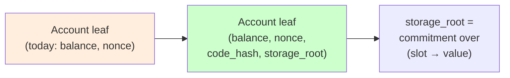

# IQ-10: EVM contract state in the verkle state root

**Status:** Accepted (design)
**Date:** 2026-05-27
**Sprint context:** Real EVM (post-`production-evm-executor`) — contract
execution increment (unit 3). Follows IQ-2 (mock→real VMs) and IQ-6
(state-tree commitment).

---

## Question

The real EVM executor (`production-evm-executor`) now runs contract
bytecode and persists code + storage in gsx-db's EVM-only `evm_code` /
`evm_storage` / `evm_account_code` stores. But the state root
(`StateTree`, IQ-6) commits only `Address → BalanceSlot` (balance +
nonce). **Contract code and storage are not committed in the root**, so
two validators can agree on every balance yet silently diverge on
contract state — a consensus break. How do we commit EVM-only code +
storage in the root while preserving the dual-projection (Proposition 1)
invariant and determinism?

## Decision

**Extend the per-account leaf commitment to bind `(balance, nonce,
code_hash, storage_root)`**, where `storage_root` is a commitment — under
the *same* scheme as the main tree (BLAKE3 in phase-1, IPA/banderwagon
under `production-verkle`, per IQ-6) — over that account's storage
entries `(32-byte slot → 32-byte value)`.

- The main tree stays keyed by `Address`; only the **leaf payload** grows
  from `BalanceSlot` to an account record `{ balance, nonce, code_hash,
  storage_root }`.
- `storage_root` is a **per-account storage sub-commitment**: a 256-ary
  sub-trie (or canonical sorted-encode commitment) over the account's
  `(slot, value)` pairs, committed with `commit_node` so phase-1 BLAKE3
  and launch IPA both work with no second mechanism.
- **EOAs and non-contract accounts** carry `code_hash = KECCAK_EMPTY` and
  `storage_root = <empty-commitment>`, so their leaf is a deterministic
  function of `(balance, nonce)` plus two constants.

### Why per-account storage sub-root (not flatten `(addr, slot)` into the main tree)

| | per-account sub-root (**chosen**) | flatten into main tree |
|---|---|---|
| Account proof scope | one account, bounded | drags address space + storage together |
| Mirrors | Ethereum account/storage-trie split | Ethereum **Verkle** (single tree) |
| Recompute | two-level (account + its storage) | one-level |
| Witness | account proof + storage proof | single proof |

We choose the sub-root: it bounds a balance/existence proof to the
account leaf without materializing all of its storage, and it keeps the
main tree's address-keyed shape (and its IQ-6 proofs) unchanged. The cost
is two-level recompute. **Open tension:** Ethereum's Verkle flattens; if
gsx-db tracks that at mainnet, revisit (noted below).

### Dual-projection (Proposition 1) is unaffected

`EvmView::balance_of` and `MoveView::coin_value` still read the canonical
`BalanceSlot` balance; `code_hash`/`storage_root` are **EVM-only state,
committed in the root for consensus but never projected**. The Move VM
has no code or storage, so projection equality continues to govern
balances (and nonce) only. The leaf grows, the projection does not.

### This is a state-root recipe change

Like IQ-6's V1→V2, changing the leaf commitment changes every root. **No
mainnet state exists; testnet wipes on re-genesis.** The cutover is a hard
fork at the substrate-state-root level and must land atomically across
validators (consistent with the substrate-cutover constraint in gsx-dag).

## Implementation surface

- `tree/types.rs` — the leaf carries an account record (balance, nonce,
  code_hash, storage_root) rather than a bare `BalanceSlot`.
- `tree/ops.rs` — `StateTree::from_entries` (and `update`) take per-account
  code_hash + storage; build the storage sub-commitment per contract
  account.
- `tree/commit.rs` / `tree/verkle_scheme.rs` — the leaf commitment folds in
  `code_hash` + `storage_root`; the storage sub-trie reuses `commit_node`.
- `State` — expose an iterator over `(Address, BalanceSlot, code_hash,
  storage)` (or feed the tree from `evm_code`/`evm_account_code`/`evm_storage`)
  so the root reflects contract state. Behind the existing BLAKE3-default /
  `production-verkle` schemes.

## Properties to verify (10k, + 1M stress)

- **Determinism:** same `(balances, nonces, code, storage)` ⇒ same root,
  order-independent (extend `cross_tree_root_agreement`).
- **Sensitivity:** any storage-slot or code change ⇒ different root.
- **EOA invariance baseline:** a state with no contracts produces a root
  that is a pure function of the balance/nonce set (no spurious storage
  mixing).
- **Dual-projection preserved:** existing `cross_vm_parity` /
  `aptos_move_vm_parity` gates stay green (balances unaffected).
- **Storage proof round-trip** (inclusion / absence within an account).

## Trade-offs

- **Recompute cost.** Two-level commitment; per-block rebuild grows with
  touched-account storage. Incremental updates (IQ-6 open item) become
  more valuable.
- **Proof shape.** A storage proof is account-proof + storage-sub-proof;
  the stateless-client witness budget (IQ-6) must account for both.
- **Verkle divergence.** Ethereum Verkle uses a single flattened tree; the
  per-account sub-root is the pre-Verkle (Merkle-Patricia) shape. Revisit
  at the mainnet Verkle decision.

## What stays open

- Incremental storage-trie updates (ties to IQ-6 / S6.5).
- Persistent storage-trie + code store in redb (the reserved
  `evm_storage` table) — currently in-memory; ties to IQ-8 recovery.
- Self-destruct / account deletion semantics in the commitment.
- The flatten-vs-sub-root reconsideration if/when Verkle lands at mainnet.

## Propagation checklist

- [ ] Leaf account record in `tree/types.rs`
- [ ] `from_entries` / `update` take code_hash + storage; storage
  sub-commitment in `tree/ops.rs`
- [ ] Leaf commitment folds code_hash + storage_root (`commit.rs` /
  `verkle_scheme.rs`)
- [ ] `State` feeds contract state into the tree
- [ ] `cross_tree_root_agreement` + 1M stress extended to contract state
- [ ] Storage proof round-trip test
- [ ] Re-genesis note in the substrate-cutover runbook
