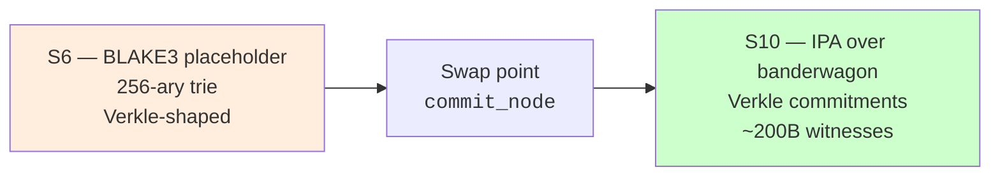

# IQ-6: State-tree commitment — BLAKE3 in phase-1, IPA Verkle at launch

**Status:** Accepted (Phase-1 BLAKE3 / S10 binding IPA decision)
**Phase-1 date:** 2026-04 (S6 closeout)
**Revised date:** 2026-05-09 (S10 commitment scheme)
**Sprint context:** S6 (placeholder) → S10 (real Verkle)



---

## Part 1 — Phase-1 BLAKE3 (S6)

### Question

S6 calls for a Verkle state tree. Real Verkle uses polynomial
commitments (IPA over the banderwagon curve), yielding ~200-byte
witnesses regardless of how many keys are proven. The heavy crypto
dep tree mirrors IQ-1 (storage) and IQ-3 (Move VM): pulling
production cryptography into phase-1 is high cost for a property
not yet load-bearing.

### Phase-1 decision

**Hash-based 256-ary trie with BLAKE3 commitments.** Tree shape,
traversal, and proof format Verkle-aligned. The single function that
changes when real Verkle lands is `commit_node`.

### Properties verified at 10k cases

- Determinism: same state ⇒ same root, order-independent
- Sensitivity: any state change ⇒ different root
- Inclusion / absence proofs verify
- Tamper resistance (bumped slots rejected)

### Witness-size cost

| Proof type | Phase-1 (BLAKE3) | Launch (IPA) |
|---|---|---|
| Inclusion (worst) | ~163 KB | ~200 B |
| Absence (early term) | depth × 255 × 32 B | ~200 B |
| Empty tree | 0 B | 0 B |

Stateless light clients gated on the swap.

---

## Part 2 — S10 commitment scheme (binding)

### Decision

- **Curve:** banderwagon (Verkle's standard, derived from Bandersnatch)
- **Polynomial commitment:** IPA (Inner Product Argument)
- **Hash for transcript:** Poseidon2 (preferred) or SHA3-256
  (audit fallback)
- **Witness format:** standard Verkle witness — `n` IPA folding
  layers ≈ 8 elements for our 256-ary depth-20 tree

### Why these

- Banderwagon is the de facto Verkle curve; Ethereum's Verkle work
  uses it. Tooling (rust-verkle, ipa-multipoint) exists and is
  audited.
- IPA folds witness size to O(log n) without trusted setup.
- Poseidon2 is fastest in-circuit; SHA3-256 is the FIPS-compliant
  alternative the LTP paper requires on settlement-path artifacts.

### Implementation surface (S10)

Files added in S10:
- `crates/gsxdb-state/src/tree/verkle.rs` — `GroupElement`,
  `commit_polynomial`, `verify_witness`
- `production-verkle` feature gate; default off so phase-1 tests
  stay fast

```rust
// What changes at the swap point
pub fn commit_node(node: &Node) -> Commitment {
    #[cfg(feature = "production-verkle")]
    return verkle::commit_node(node);

    // Phase-1 BLAKE3 path (default)
    blake3_commit(node)
}
```

### Tests added in S10

- Differential parity vs reference (`go-ipa`)
- Witness verification round-trip
- Witness size budget (worst-case inclusion ≤ 250 B at depth 20)
- 10k-case `cross_tree_root_agreement` under the feature

### Trade-offs

- **Build time.** IPA prover adds significant compile time.
  Mitigated by feature gate and Docker layer caching.
- **Spec churn.** Verkle is post-Pectra; we track upstream updates.
- **Audit surface.** IPA implementations have known bug classes
  (folding edge cases, transcript collisions); third-party audit
  required before mainnet.

### What stays open

- Incremental tree updates (S6.5) — phase-1 rebuilds per block;
  production needs incremental.
- Persistent tree storage — tied to S8 recovery; tree could live in
  a redb table alongside canonical state.
- Snapshot checkpoints (IQ-9).

### Propagation checklist

- [x] `tree/verkle.rs` scaffold + `GroupElement` placeholder
- [x] `production-verkle` feature gate
- [x] Real IPA + banderwagon arithmetic (S10.1-S10.4 —
  `tree/verkle_scheme.rs` wires `BanderwagonIpaScheme` over
  `ipa-multipoint::DefaultCommitter` and `CRS::default()` with
  per-step opening prover/verifier in `prove_opening` /
  `verify_opening`)
- [x] Witness-size budget test (S10.5 —
  `verkle_inclusion_witness_within_per_step_budget` asserts
  ≤ 14 KB per inclusion at depth 20 under the per-step opening
  format; ~609 B per opening × 21 openings)
- [ ] `go-ipa` differential parity harness (deferred — single-impl
  parity holds via Rust ↔ Rust round-trips; cross-impl
  differential testing follows mainnet decision)
- [ ] Compact multipoint IPA witness (~200 B target) — the
  per-step format is sound but 65× larger than the
  multipoint-aggregated witness. Multipoint optimization is
  required before the witness-size benefit fully materializes.
- [ ] Third-party audit on the IPA implementation
