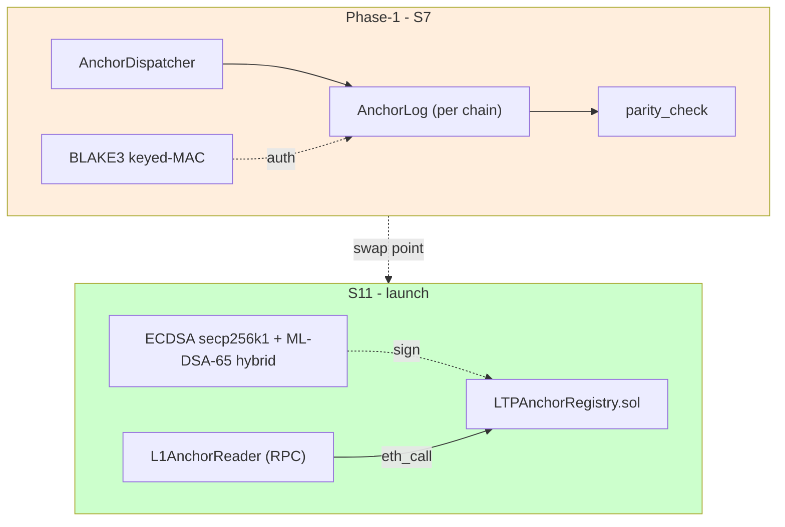
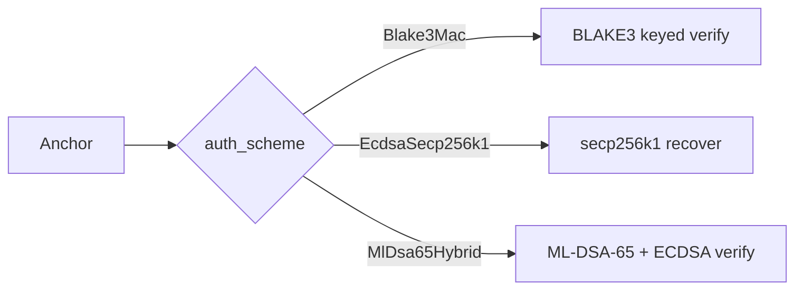
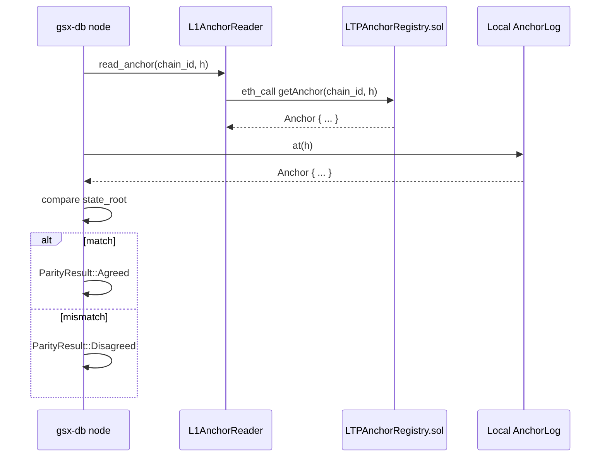

# IQ-7: Cross-chain anchor parity — in-memory MAC in phase-1, Solidity + ECDSA at launch

**Status:** Accepted (Phase-1 MAC / S11 Solidity binding)
**Phase-1 date:** 2026-04 (S7 closeout)
**Revised date:** 2026-05-09 (S11 contract decision)
**Sprint context:** S7 (placeholder) → S11 (Solidity LTPAnchorRegistry)



---

## Part 1 — Phase-1 in-memory MAC (S7)

### Decision

In-memory `AnchorLog` per chain + BLAKE3 keyed-MAC authentication.
`AnchorDispatcher` writes one anchor per registered chain;
`parity_check` reads from in-memory logs.

### Properties verified at 10k cases

- Cross-chain parity holds for honest dispatches
- Tampering with any chain's log is detected
- Anchor chain linkage (parent hashes) holds

### What this leaves open

- Real Solidity `LTPAnchorRegistry` on L1
- ECDSA / ML-DSA-65 signatures
- Persistent anchor logs across node restart
- Cross-chain time/height mapping
- Slashing for divergent anchors

---

## Part 2 — S11 LTPAnchorRegistry + parity (binding)

### Decision

The Solidity contract `LTPAnchorRegistry.sol` (deployed on GSX L1
testnet chain ID 103,115,120) is the authoritative on-chain anchor
record. Rust substrate (`gsxdb-bridge::anchor`) maintains a mirror
log and verifies parity against the contract via `L1AnchorReader`.

### Contract surface

| Method | Purpose |
|---|---|
| `acceptAnchor(Anchor, Signature)` | Append a new anchor after validation |
| `getAnchor(chainId, height) → Anchor` | Read an anchor for parity check |
| `verifyMac(Anchor, key) → bool` | Pure MAC verification (Keccak256) |
| `lastHeight(chainId) → uint64` | Latest height per chain |

Five validation rules at submission time, mirroring the Rust
substrate exactly:

1. Replay rejection (`anchoredAt != 0`)
2. Signer authorization
3. Sequence monotonicity
4. Temporal expiry
5. State-transition validity

### Authentication: hybrid

| Surface | Algorithm | Phase |
|---|---|---|
| Anchor authentication on-chain | ECDSA secp256k1 + ML-DSA-65 hybrid | S11 (launch) |
| Phase-1 substrate MAC | BLAKE3 keyed-MAC | S7 → swapped in S11 |
| LTP corridor super-node | ML-DSA-65 + BLS12-381 aggregation | LTP paper §10 |

The hybrid composition is binding on both components: either
component breaking does not compromise the other.

### Rust integration surface

```rust
// gsxdb-bridge::anchor::types
pub enum AuthScheme {
    Blake3Mac,         // phase-1 substrate
    EcdsaSecp256k1,    // launch L1 path
    MlDsa65Hybrid,     // post-quantum surface
}

pub struct Anchor {
    pub chain_id:    ChainId,
    pub height:      u64,
    pub state_root:  Commitment,
    pub parent:      AnchorHash,
    pub mac:         [u8; 32],     // or sig digest for ECDSA path
    pub auth_scheme: AuthScheme,
}
```

The verifier dispatches on `auth_scheme`:



### Parity check semantics



### Tests added in S11

- `tests/solidity_anchor_parity.rs` — 8 tests + property tests of
  Solidity-Keccak-MAC compatibility
- Cross-implementation parity matrix covering all 36 entity-state
  transitions (mirrors LTP paper §7.3)

### Trade-offs

- **Operational coupling.** Live L1 must be reachable for parity
  checks. Mitigated by caching + fallback to last known good state.
- **Gas cost.** Each anchor submission costs gas on L1. Bounded by
  the constant-size on-chain commitment (~1,600 B per LTP paper).
- **Migration risk.** Future PQC algorithm changes require contract
  upgrades; UUPS proxy pattern allows it under multisig+timelock.

### What stays open

- Cross-chain time/height mapping (different chains have different
  block times; logical-height alignment requires a per-corridor
  policy)
- Slashing for divergent anchors (detection is implemented; punishment
  needs validator-set semantics from the DAG L1 paper §5)

### Propagation checklist

- [x] `crates/gsxdb-bridge/src/anchor/types.rs` — `AuthScheme` enum
- [x] `crates/gsxdb-bridge/src/anchor/l1_reader.rs` — Mock + RPC backends
- [x] `tests/solidity_anchor_parity.rs` — 8 fixture tests
- [x] `contracts/src/LTPAnchorRegistry.sol`
- [ ] Mainnet contract deployment
- [ ] ECDSA signing pipeline (currently MAC; swap is mechanical)
- [ ] Slashing policy via validator-set governance
