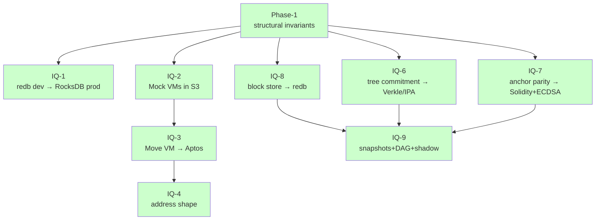

# Important Questions (IQs) — decision records

Every architectural decision that affects more than one file lives
here. Format: question, options considered, decision, trade-offs,
propagation checklist.

## Index

| # | Topic | Status | Sprint context |
|---|---|---|---|
| [IQ-1](IQ-1-redb-vs-rocksdb.md) | State backend (storage primitive) | Accepted | S2 dev, S8.5/launch swap |
| [IQ-2](IQ-2-mock-vms-vs-real-vms.md) | Mock VMs in phase-1, real VMs at launch | Accepted | S3 closure |
| [IQ-3](IQ-3-move-vm-choice.md) | Move VM dialect | Accepted (Aptos selected in S9) | S3.5 dissolved → S9 |
| [IQ-4](IQ-4-move-execution.md) | Address shape (EVM 20B vs Move 32B) | Accepted | S9 |
| [IQ-6](IQ-6-verkle-commitment.md) | Tree commitment scheme | Accepted (Verkle/IPA in S10) | S6 placeholder → S10 |
| [IQ-7](IQ-7-anchor-parity.md) | Cross-chain anchor parity | Accepted (Solidity+ECDSA in S11) | S7 placeholder → S11 |
| [IQ-8](IQ-8-recovery-store-inmemory-vs-redb.md) | Block store backend | Accepted (redb in S8.5) | S8 → S8.5 |
| [IQ-9](IQ-9-s12-launch-hardening.md) | Snapshots + DAG + shadow E2E | Accepted | S12 |
| [IQ-10](IQ-10-evm-contract-state-root.md) | EVM contract code + storage in the state root | Accepted (design) | real-EVM (post-S12) |

IQ-5 (nonce semantics) was folded into IQ-3 Part 2 — see that doc.

## Decision flow

All 8 IQs accepted. Each one has Part 1 (phase-1 placeholder
reasoning) and Part 2 (launch-readiness binding decision) where
applicable.

## Writing a new IQ

Copy [IQ-3](IQ-3-move-vm-choice.md) as the template. Sections:

1. **Status / dates / sprint context**
2. **Diagram** of the decision (mermaid, optional but encouraged)
3. **Question** — what's being decided
4. **Options considered** — table form
5. **Decision** — binding choice
6. **Trade-offs** — what you accept
7. **Implementation surface** — files / modules / features touched
8. **Consequences** — downstream effects
9. **What stays open** — cross-references to other IQs
10. **Propagation checklist** — actionable boxes
