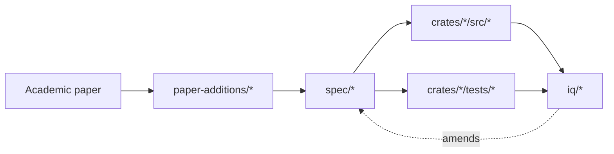

# GSX-DB specifications

Per-component formal specs, one per phase-1 sprint. Each documents
the types, invariants, storage layout, failure model, and tests for
one surface. Specs evolve with the code; when an [IQ](../iq/)
decision changes semantics, the IQ's "Propagation checklist"
includes updating the relevant spec doc.

## Index

| Sprint | File | Surface | Exit-gate test |
|---|---|---|---|
| S1 | [lane-separation.md](lane-separation.md) | capability gate + crate boundary | `scripts/check-lane-separation.sh` |
| S2 | [pbm-balance-slot.md](pbm-balance-slot.md) | `BalanceSlot` + storage + dual-projection | `redb_preserves_dual_projection` |
| S3 | [dual-vm-projectors.md](dual-vm-projectors.md) | `EvmProjector`, `MoveProjector`, mock VMs | `interleaved_evm_move_preserves_invariant` |
| S4 | [ce-mvcc-occ.md](ce-mvcc-occ.md) | Aptos Block-STM scheduler | `parallel_equals_sequential` |
| S5 | [cross-vm-intent-queue.md](cross-vm-intent-queue.md) | `Intent::Call`, `Bundle`, atomic dispatch | `bundle_atomicity` |
| S6 | [verkle-state-tree.md](verkle-state-tree.md) | 256-ary trie + commitments | `cross_tree_root_agreement` |
| S7 | [anchor-log.md](anchor-log.md) | multi-chain anchor log + parity | `cross_chain_parity_holds` |
| S8 + S8.5 | [recovery.md](recovery.md) | block store + deterministic replay | `recover_matches_live_state` |

## Cross-reference flow



## Convention

Each spec doc has the structure:

```
# <Title>

## Goal
One paragraph: what does this component do, and why is it part of the
phase-1 design?

## Types and invariants
The Rust types it introduces, and the invariants those types enforce
(structurally where possible, by property test where not).

## Storage layout
For storage-touching components: what tables / column families / on-disk
representations exist. Encodings.

## Failure model
What can go wrong, what gets reported, what gets retried, what gets logged.

## Tests
The exit-gate test that closes the sprint, and the property tests that
guard the invariants under change.

## Open questions
IQ candidates surfaced during implementation that didn't block the sprint.
```

Drafts are fine — keep specs accurate to the shipped code, not to the
original sketch.
