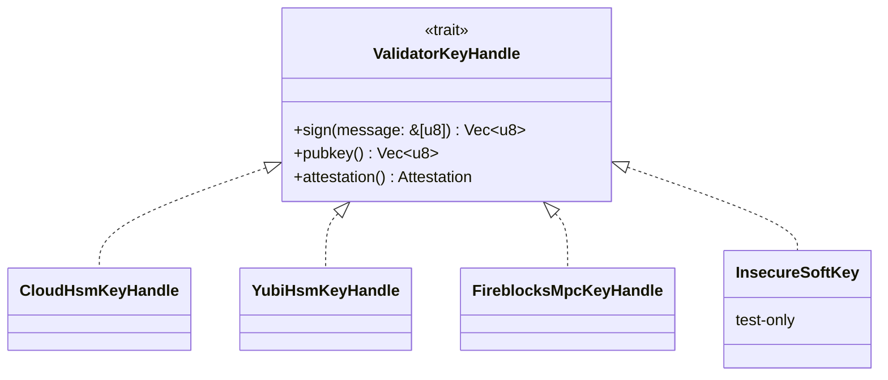

# Validator key custody — HSM-only profile

**Sprint context:** S11 (Solidity LTPAnchorRegistry + ECDSA), reinforced
in S12 (shadow E2E).
**Source for the practice:** Avalanche validator FAQ, Hyperledger Besu
`--security-module` plugin, Sui validator key incident history.

## Why this exists

The 30–50 PoA Authority Ring members are licensed institutions
operating under regulatory licensure. Compliance review will block
any deployment where signing keys live on the validator host
filesystem. Avalanche's enterprise guidance is explicit on this
point:

- [Avalanche validator FAQ](https://support.avax.network/en/articles/6187511-validator-faq)
  — "Do not keep the signing key on the validator host."
- [Besu QBFT docs](https://besu.hyperledger.org/private-networks/how-to/configure/consensus/qbft)
  — `--security-module` integrates an external key manager.

GSX-DB needs an analogue and a written profile.

## Profile (binding)

An Authority Node MUST:

1. Hold its validator signing key in one of:
   - AWS CloudHSM (PKCS#11 interface)
   - YubiHSM 2 (with FIPS 140-2 mode enabled)
   - Fireblocks MPC (with policy-based approval)
2. Emit a **key-attestation JSON** in its handshake that proves the
   key is in such a module. Required fields:
   - `module_type`: `"cloudhsm" | "yubihsm" | "fireblocks-mpc"`
   - `module_id`: opaque module identifier (operator-chosen)
   - `attestation_signature`: signature over the module ID by the
     module's hardware-rooted attestation key
3. Reject peers whose attestation fails to parse or whose
   `module_type` is not in the accepted set.

## Trait surface

`InsecureSoftKey` exists only for `#[cfg(test)]` — the production
build gates it behind a feature flag that defaults off, and the CI
build rejects production binaries that linked it in.

## Failure modes

| Mode | Detection | Response |
|---|---|---|
| HSM unreachable at startup | Module returns error on `sign()` probe | Refuse to start node |
| HSM key revoked mid-flight | First failed `sign()` after success | Halt block production, raise alert, request governance rotation |
| Attestation expired in peer handshake | Verifier rejects expired signature | Drop the connection |
| Counterparty advertises insecure module | `module_type` not in accepted set | Drop the connection |

## Migration

The phase-1 substrate uses no real validator keys — it's a substrate,
not a chain. Real key handles enter when S11 ships the Solidity
contract. Until then the trait surface is the spec; implementations
are S11 scope.

## Open questions

- **Multi-region disaster recovery.** A single HSM provider per
  jurisdiction may concentrate failure. The corridor super-node §9
  in the paper handles geographic diversity at the legal-entity
  level; individual HSM redundancy is operator-scoped.
- **Hybrid composition with ML-DSA-65.** When S11 lands hybrid
  signatures, both the classical key (ECDSA) and the PQ key
  (ML-DSA-65) must live in HSM-grade modules. Some PQ algorithms
  don't have HSM support yet — track NIST's PQC implementation
  inventory.
