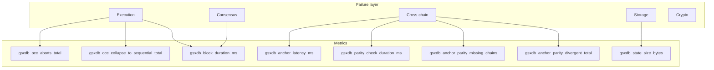

# Observability — metrics + alerts

HARDENING rec 8. Eight Prometheus metrics + five single-shot alerts.
Each one anchored to a peer-chain post-mortem that identified the
metric as load-bearing.

## The eight metrics

| Metric | Type | Source for the practice |
|---|---|---|
| `gsxdb_block_height` | gauge | standard |
| `gsxdb_block_duration_ms` | histogram | standard |
| `gsxdb_anchor_latency_ms` | histogram | LTP §10 budget |
| `gsxdb_parity_check_duration_ms` | histogram | standard |
| `gsxdb_occ_collapse_to_sequential_total` | counter | Aptos AIP-47 (Aggregators) |
| `gsxdb_occ_aborts_total` | counter | Block-STM PPoPP §6 |
| `gsxdb_anchor_parity_missing_chains` | gauge | KelpDAO/LayerZero compromise |
| `gsxdb_anchor_parity_divergent_total` | counter | KelpDAO/LayerZero compromise |

All eight emit even when zero so absence of the metric is itself
an alert condition.

## Implementation

```mermaid
flowchart LR
    Block[BlockExecutor::execute] --> R1[BlockReport]
    R1 --> RT[record_block_metrics]
    Anchor[AnchorDispatcher::parity_check] --> R2[ParityResult]
    R2 --> RP[record_parity_metrics]
    State[State::entries] --> RS[record_state_metrics]
    RT --> M[(Metrics)]
    RP --> M
    RS --> M
    M --> P[/prometheus_text]
    P -.scrape.-> Prom[Prometheus]
    Prom --> Graf[Grafana]
    Prom --> Alert[Alertmanager]
```

The `record_*` functions are pure — they take a `&Metrics` and the
relevant result type, and emit. No side effects beyond updating the
metric atomics.

## The five single-shot alerts

These page on **first** occurrence, not on a sustained rate. They
indicate a structural failure mode that no operator should ever see
in production.

### Alert 1 — `OccCollapseSpike`
```yaml
expr: increase(gsxdb_occ_collapse_to_sequential_total[1m]) > 0
for: 30s
labels: { severity: page }
annotations:
  summary: "OCC dropped to sequential — hot-slot contention"
  runbook: "Identify hot addr from logs; deploy Aggregator-style slot"
```

### Alert 2 — `ParityMissingChain`
```yaml
expr: gsxdb_anchor_parity_missing_chains > 0
for: 1m
labels: { severity: page }
annotations:
  summary: "Anchor parity check is missing one or more chains"
  runbook: "Verify L1AnchorReader RPC health for each chain"
```

### Alert 3 — `ParityDivergence`
```yaml
expr: increase(gsxdb_anchor_parity_divergent_total[5m]) > 0
for: 0s
labels: { severity: critical }
annotations:
  summary: "Cross-chain anchor divergence detected"
  runbook: "DO NOT roll forward. Capture state, page security."
```

### Alert 4 — `BlockExecutionStall`
```yaml
expr: rate(gsxdb_block_duration_ms_sum[1m]) / rate(gsxdb_block_duration_ms_count[1m]) > 3000
for: 2m
labels: { severity: page }
annotations:
  summary: "Block execution p50 over 3 seconds"
  runbook: "Check OCC abort rate; check disk for redb; check leader"
```

### Alert 5 — `AnchorLatencyBudgetExceeded`
```yaml
expr: histogram_quantile(0.95, rate(gsxdb_anchor_latency_ms_bucket[5m])) > 500
for: 5m
labels: { severity: page }
annotations:
  summary: "Anchor submission p95 exceeded 500ms"
  runbook: "Check L1 RPC health and gas market"
```

## Coverage matrix



If a layer has no metric pointing at it, no alert can fire for it.
Crypto-layer alerts (L5) are intentionally absent in phase-1 — they
land when validator-key custody (`docs/spec/key-custody.md`) is wired.

## Why these specific metrics

Each metric exists because **another chain had an incident that this
metric would have caught**:

- `gsxdb_occ_collapse_to_sequential_total` — Aptos had hot-counter
  storms before AIP-47. Without this metric they couldn't separate
  Block-STM thrashing from real liveness issues.
- `gsxdb_anchor_parity_missing_chains` — KelpDAO's $292M loss happened
  because a single missing verifier didn't surface in dashboards.
- `gsxdb_occ_aborts_total` paired with `gsxdb_blocks_committed` —
  the abort-rate is the Block-STM PPoPP paper's primary parallel-vs-
  sequential indicator.

## Test surface

```rust
#[test]
fn metrics_emit_after_block() {
    let metrics = Metrics::new();
    // ... execute a block ...
    record_block_metrics(&metrics, &report);
    assert!(metrics.blocks_committed.get() > 0);
    // ...
}
```

A property-style integration test in `tests/observability.rs` (S12
deliverable) verifies that no normal-operation block path leaves
any of the eight metrics un-incremented over a 100-block sample.
